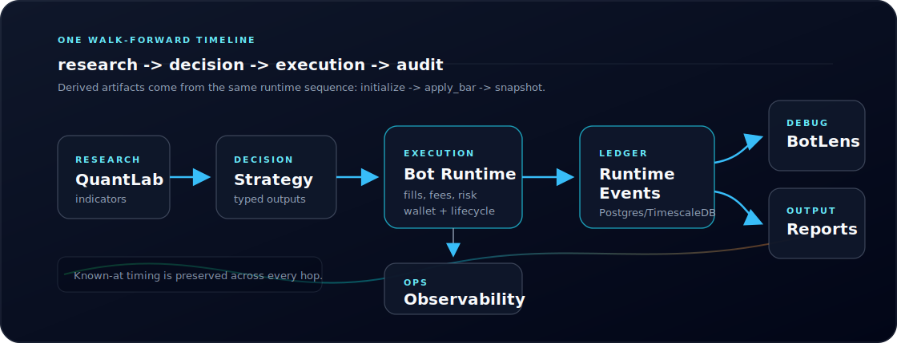

# Quant-Trad

Quant-Trad is a deterministic trading research, paper execution, and runtime
inspection platform.

It is built around one question:

> **What happened during a trade, and why?**

Use it to run research/backtests, operate provider-backed paper runs, inspect
runtime behavior in BotLens, and compare reports from the same walk-forward
runtime timeline.

## Quick Start

### Prerequisites

- Docker
- GNU Make
- Python 3.12+ for local tooling outside Docker

### Create Local Env

```bash
cp secrets.env.example secrets.env
```

Fill the local values required by the stack:

```bash
POSTGRES_DB=quanttrad
POSTGRES_USER=quanttrad
POSTGRES_PASSWORD=<local-db-password>
PGADMIN_DEFAULT_PASSWORD=<local-pgadmin-password>
```

If you plan to save provider credentials, also set a credential encryption key:

```bash
QT_SECURITY_PROVIDER_CREDENTIAL_KEY=<fernet-key>
```

Generate one with:

```bash
python -c "from cryptography.fernet import Fernet; print(Fernet.generate_key().decode())"
```

Provider API keys should be saved through the encrypted provider credential
store, not committed to docs, configs, plans, logs, or strategy files.

### Start Core Services

```bash
make up BUILD=1 STACK_PROFILES=core
```

Open:

- Frontend: `http://localhost:5173`
- Backend API: `http://localhost:8000`
- TimescaleDB: `localhost:15432`
- pgAdmin: `http://localhost:8080`

### Add Coinbase Credentials

Coinbase Direct is the active provider-backed paper/streaming path. Backtests
from local or cached data do not require Coinbase credentials, but provider
streaming and authenticated provider calls do.

After the core stack is running and `QT_SECURITY_PROVIDER_CREDENTIAL_KEY` is
set, store Coinbase credentials with:

```bash
qt providers credentials schema --provider COINBASE --venue COINBASE_DIRECT
qt providers credentials add --provider COINBASE --venue COINBASE_DIRECT
```

Required Coinbase credential fields:

```text
COINBASE_API_KEY
COINBASE_API_SECRET
```

For non-interactive setup, map short-lived shell env vars into the credential
store:

```bash
qt providers credentials add \
  --provider COINBASE \
  --venue COINBASE_DIRECT \
  --secret-env COINBASE_API_KEY=LOCAL_COINBASE_KEY \
  --secret-env COINBASE_API_SECRET=LOCAL_COINBASE_SECRET \
  --no-input
```

### Add Observability

```bash
make up BUILD=1 STACK_PROFILES=all
```

Open:

- Grafana: `http://localhost:3000`
- Loki: `http://localhost:3100`

## Entry Points

| Surface | Use it for |
| --- | --- |
| `qt` CLI | Canonical workflow and operation entrypoint for bots, runs, providers, reports, exports, comparisons, and experiments. |
| `qt mcp serve` | MCP adapter for agent hosts. It exposes the same workflow boundary as `qt`; it is not a second source of truth. |
| UI | Human visualization and inspection: BotLens, charts, fleets, strategies, reports, and playback. |
| Makefile | Local stack, DB, tests, logs, docs sync, and forensic support helpers. |

Start with `qt` for normal agent/operator workflows. Use Make when the task is
about the local development stack, tests, logs, DB access, or diagnostics.

## Common Commands

Local stack and support:

```bash
make help                            # list available commands
make up BUILD=1 STACK_PROFILES=core  # build and start core services
make up BUILD=1 STACK_PROFILES=all   # build and start core + observability
make ps                              # inspect running services
make logs SERVICE=backend            # tail backend logs
make restart BUILD=1                 # rebuild/restart current stack
make mcp-ready                       # print MCP stdio command/registration state
make test                            # run tests
make check                           # run standard developer/audit checks
make down                            # stop and remove containers
```

Normal `qt` workflows:

```bash
qt bots list
qt bots start <bot_id> --run-type backtest
qt bots start <bot_id> --run-type paper --execution observe-only --duration-seconds 30
qt runs wait <bot_id> <run_id>
qt providers list
qt providers stream-smoke --provider COINBASE --venue COINBASE_DIRECT --symbol <product>
qt reports summary <run_id>
qt reports export <run_id>
qt reports compare <baseline_run_id> <candidate_run_id>
qt experiments validate-plan <plan.json>
qt experiments run-plan <plan.json> --experiment-id <experiment_id>
qt mcp serve
```

## Runtime Contract

The core runtime model is:

```text
initialize -> apply_bar -> snapshot
```

Indicators, strategy decisions, execution behavior, BotLens views, and reports
must come from that walk-forward runtime timeline. Derived artifacts should only
exist after they would have been known in live operation.

Reports and visualizations are views over runtime truth. They do not create
alternate execution logic.

<p align="center">
  
</p>

## Documentation

Start here:

- [Documentation homepage](docs/index.md)
- [Overview](docs/overview.md)
- [Getting started](docs/getting-started.md)
- [Developer audit workflow](docs/engineering/developer-audit-workflow.md)
- [Coinbase derivatives paper setup](docs/guides/coinbase-derivatives-paper-setup.md)

Core concepts:

- [Runtime timeline](docs/concepts/runtime-timeline.md)
- [Execution model](docs/concepts/execution-model.md)
- [Strategies and signals](docs/concepts/strategies-and-signals.md)
- [BotLens](docs/concepts/botlens.md)
- [Reporting datasets](docs/concepts/reporting-datasets.md)

Contracts:

- [System contract](docs/contracts/platform/00_system_contract.md)
- [Runtime contract](docs/contracts/platform/01_runtime_contract.md)
- [Execution and playback contract](docs/contracts/platform/02_execution_playback_contract.md)
- [Engineering contract](docs/contracts/platform/03_engineering_contract.md)

Architecture and decisions:

- [Architecture component index](docs/architecture/ARCHITECTURE_COMPONENT_INDEX.md)
- [Architecture docs](docs/architecture/README.md)
- [Architecture decision records](docs/architecture/decisions/README.md)
- [MCP research server](docs/architecture/research-orchestration/MCP_RESEARCH_SERVER.md)
- [Paper engine v1 design](docs/architecture/execution-runtime/PAPER_ENGINE_V1_DESIGN.md)
- [Security layer](docs/architecture/security/SECURITY_LAYER.md)

Contracts are the source of truth when code and explanatory docs disagree.

## Project Status

Quant-Trad is in active development.

The runtime, execution semantics, reporting datasets, BotLens inspection,
provider behavior, and operator workflows are still evolving. MCP v0 covers
bounded agent access to run, experiment, provider, report, and comparison
workflows.

The system is intended for research, backtesting, paper trading, and controlled
environments unless you have independently reviewed the execution path, provider
configuration, and risk controls for your use case.

Do not treat this as production trading infrastructure without your own
validation.
