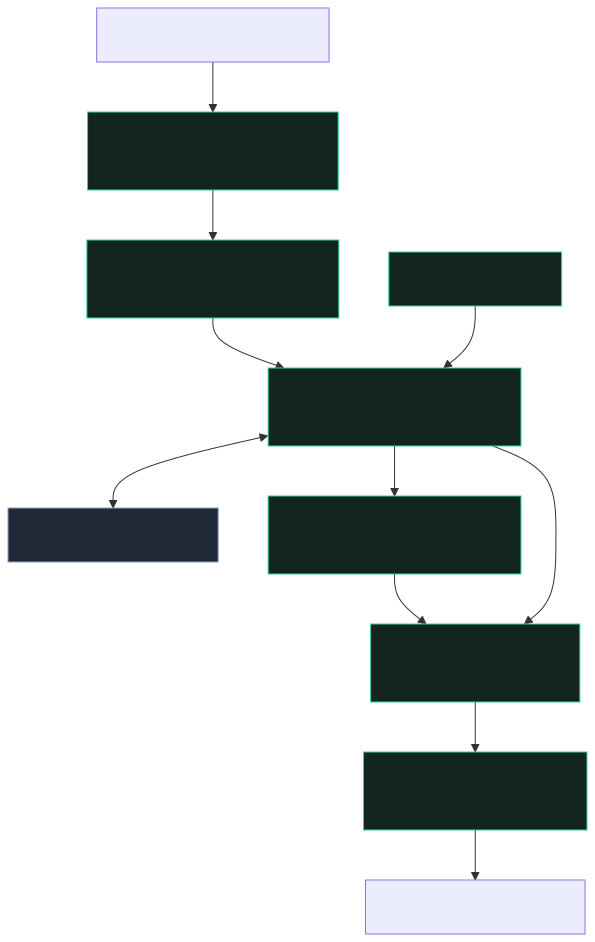

# Quant-Trad

Quant-Trad (QT) is a local quantitative research platform for turning external
market data into reproducible evidence, hypotheses, strategies, and validated
trading research.

QT combines causal data collection, typed market-state modeling, frozen
datasets, provider-free replay, walk-forward backtesting, and bounded paper
execution. The UI, `qt` CLI, backend API, reports, and MCP adapter all sit over
the same contracts and durable evidence.

<p align="center">
  
</p>

## What You Can Do

- Acquire and normalize provider data into one typed, versioned canonical
  `Fact` model with provenance and causal `known_at` semantics.
- Collect Coinbase market state and Chainlink scalar or structured observations
  through provider-specific adapters that disappear after canonicalization.
- Inspect registered scheduled collectors and continuous market-structure
  streams, including their schedules, leases, attempts, gaps, and failures.
- Freeze exact, provider-free `Dataset` evidence for replay, backtests, Checks,
  and research.
- Build Indicators over scalar and structured Facts without making research
  logic provider-aware.
- Run generic Checks that turn research questions into durable, replayable
  evidence and evidence-backed Observations.
- Compile strategies, preview decisions, compare variants, and run walk-forward
  backtests against immutable datasets.
- Run bounded observe-only paper sessions against provider streams.
- Inspect candles, overlays, signals, decisions, trades, playback, accounting,
  and runtime diagnostics in BotLens and reports.
- Drive repeatable workflows through `qt`, or expose the same guarded contracts
  to agent hosts with `qt mcp serve`.

## Platform Flow

Market truth, research evidence, and bot execution remain separate while sharing
one causal timeline.


```mermaid
flowchart LR
    external["External market state"] --> adapter["Provider adapter<br/>acquire + decode"]
    adapter --> facts["Canonical Facts<br/>typed · versioned · causal"]
    facts --> store[("Append-only Fact store<br/>provenance + gaps")]
    store --> dataset["Frozen Dataset<br/>exact evidence boundary"]
    dataset --> replay["Provider-free replay"]

    replay --> indicators["Indicators"]
    indicators --> checks["Checks"]
    checks --> observations["Observations"]
    observations --> research["Hypotheses + research memory"]

    indicators --> decisions["Strategy decisions"]
    decisions --> runtime["Walk-forward bot runtime<br/>backtest or bounded paper"]
    runtime --> inspection["BotLens + reports<br/>playback · compare · diagnose"]

    classDef provider fill:#1f2937,stroke:#94a3b8,color:#f8fafc
    classDef truth fill:#0f172a,stroke:#38bdf8,color:#e0f2fe
    classDef evidence fill:#13251d,stroke:#34d399,color:#dcfce7
    classDef runtime fill:#2e1065,stroke:#a78bfa,color:#f5f3ff
    class external,adapter provider
    class facts,store truth
    class dataset,replay,indicators,checks,observations,research evidence
    class decisions,runtime,inspection runtime
```

Provider identity matters at acquisition and in provenance. Everything below
canonicalization operates on QT semantics:

```text
Coinbase ─┐
Chainlink ├─> provider adapter ─> canonical Fact ─> Dataset ─> research
Future ───┘
```

Frozen Datasets preserve exact Facts, payload schemas, provenance, gaps, and
causal knowledge boundaries. Replay does not call the original provider.

## Quick Start

### Prerequisites

- Docker
- GNU Make
- Python 3.12+

### Set Up QT

From the repository root:

```bash
make deps
./scripts/qt setup env
make up BUILD=1 STACK_PROFILES=core
./scripts/qt setup doctor
```

`./scripts/qt` dispatches through the repo-managed virtual environment. You can
also activate it and use `qt` directly:

```bash
source .venv/bin/activate
qt setup doctor
```

If Python 3.12 is not your default interpreter, run
`make deps PY=python3.12`.

### Open the Local Stack

| Surface | Address |
| --- | --- |
| Frontend V2 | <http://localhost:5173> |
| Backend API | <http://localhost:8000> |
| TimescaleDB / PostgreSQL | `localhost:15432` |
| pgAdmin | <http://localhost:8080> |

Start Grafana, Loki, and the rest of the observability profile with:

```bash
make up BUILD=1 STACK_PROFILES=all
```

### Provider Credentials

Provider credentials are stored through encrypted credential references. Do not
put provider secrets in repository files, logs, experiment plans, or bot
configuration.

Use the guided setup after the core stack is healthy:

```bash
./scripts/qt setup provider coinbase
./scripts/qt providers credentials list
./scripts/qt providers stream-smoke \
  --provider COINBASE \
  --venue COINBASE_DIRECT \
  --symbol <product> \
  --auth-mode authenticated
```

Backtests and Checks over frozen Datasets do not require a live provider
connection.

## Core Workflows

### Stack and Diagnostics

```bash
make help
make up BUILD=1 STACK_PROFILES=core
make ps
make logs SERVICE=backend
make test
make check
make down
```

### Market Data and Datasets

```bash
qt data coverage \
  --instrument-id <instrument_id> \
  --timeframe <timeframe> \
  --start <iso> \
  --end <iso>

qt data collectors list
qt data series
qt data prepare-backtest-dataset --help
qt data freeze-dataset --help
qt data dataset <dataset_id>
```

External acquisition remains explicit and bounded. Network-backed numeric-fact
acquisition, for example, requires an affirmative `--allow-network` flag.

### Strategies, Backtests, and Paper Runs

```bash
qt strategies list
qt strategies compile <strategy_id>
qt strategies preview <strategy_id> \
  --start <iso> \
  --end <iso> \
  --interval <timeframe> \
  --instrument-id <instrument_id>

qt bots list
qt bots start <bot_id> --run-type backtest --dataset-id <dataset_id>
qt runs wait <bot_id> <run_id>

qt bots start <bot_id> \
  --run-type paper \
  --execution observe-only \
  --duration-seconds 30
```

### Reports and Comparisons

```bash
qt reports summary <run_id>
qt reports diagnostics <run_id>
qt reports export <run_id>
qt reports compare <baseline_run_id> <candidate_run_id>
```

### Experiment Plans

```bash
qt experiments validate-plan <plan.json>
qt experiments run-plan <plan.json> --experiment-id <experiment_id>
qt experiments status <experiment_id>
qt experiments events <experiment_id> --tail 50
```

Plans are validated, auditable, and resumable. Their steps run sequentially;
configured backtest work may use bounded parallel workers where supported.

### MCP

```bash
make mcp-ready
qt mcp serve
```

`qt mcp serve` exposes read resources and guarded workflow tools to agent hosts.
It adapts the `qt` and backend contracts; it is not a second runtime or source of
truth.

## Runtime and Research Model

Every derived runtime output follows one state-engine timeline:

```text
initialize -> apply_bar -> snapshot
```

- Indicators publish typed outputs through engine snapshots.
- Strategies consume those outputs and emit decisions.
- Bot runtime owns fills, fees, margin, wallet state, settlement, and lifecycle
  events.
- BotLens and reports inspect durable runtime truth; they do not reconstruct an
  alternate execution path.
- Checks freeze their evidence and remain replayable after orchestration or
  provider state disappears.

## Entry Points

| Surface | Use it for |
| --- | --- |
| `qt` CLI | Providers, market data, datasets, collectors, bot runs, strategies, reports, comparisons, experiments, and research operations. |
| `qt mcp serve` | Agent-facing workflow adapter over the same guarded backend contracts. |
| Frontend V2 | Human operation and inspection: market data, charts, strategies, BotLens, playback, reports, and research evidence. |
| Backend API | Canonical application contracts used by the CLI, UI, and MCP adapter. |
| Makefile | Local stack, tests, database access, logs, documentation sync, and forensic helpers. |

The UI does not define provider adapters, Fact schemas, collectors, strategy
execution semantics, or alternate research truth. Those remain code-reviewed
backend concerns.

## Architecture Principles

- Providers acquire and canonicalize external information.
- Everything downstream consumes canonical Facts, never provider-specific
  payloads.
- Facts are typed, schema-versioned, queryable, deterministic, causal, and
  provenance-preserving.
- Intrinsically structured market state remains one atomic observation when
  scalar flattening would lose meaning.
- Frozen Datasets are provider-free and reproducible.
- Research claims require durable, inspectable evidence.
- Bot execution has one canonical accounting and lifecycle path.
- Known-at timing is part of correctness; nothing appears retroactively.
- Agents operate through guarded CLI, API, and MCP contracts rather than hidden
  runtimes.
- Collector and provider definitions remain code-owned; operator surfaces may
  only operate registered capabilities.
- QT uses one persistence DSN: `PG_DSN`.

## Documentation

| Topic | Documentation |
| --- | --- |
| Start here | [Getting started](docs/getting-started.md), [platform overview](docs/overview.md), [docs home](docs/index.md) |
| Market-data boundary | [Data boundary](docs/architecture/data/DATA_BOUNDARY.md), [generalized Fact data plane](docs/architecture/data/GENERALIZED_FACT_DATA_PLANE.md) |
| Canonical Facts and datasets | [Canonical Fact ADR](docs/architecture/decisions/0063-use-schema-registered-canonical-facts.md), [numeric Facts and acquisition](docs/architecture/data/NUMERIC_FACTS_AND_ON_DEMAND_ACQUISITION.md) |
| Collectors | [Collector operations](docs/architecture/data/COLLECTOR_OPERATIONS_CONTROL_PLANE.md), [continuous collector runtime](docs/architecture/data/CONTINUOUS_COLLECTOR_RUNTIME.md) |
| Provider examples | [Chainlink structured Facts](docs/guides/chainlink-structured-facts.md), [Coinbase derivatives paper setup](docs/guides/coinbase-derivatives-paper-setup.md), [adding a provider](docs/guides/adding-a-provider.md) |
| Research evidence | [Check evidence boundary](docs/architecture/research-orchestration/CHECK_EVIDENCE_BOUNDARY.md), [research memory](docs/architecture/research-memory/RESEARCH_MEMORY_BOUNDARY.md) |
| Runtime | [Runtime timeline](docs/concepts/runtime-timeline.md), [execution model](docs/concepts/execution-model.md), [strategies and signals](docs/concepts/strategies-and-signals.md) |
| Inspection and reporting | [BotLens](docs/concepts/botlens.md), [reporting datasets](docs/concepts/reporting-datasets.md) |
| Agent workflows | [Developer/audit workflow](docs/engineering/developer-audit-workflow.md), [MCP research server](docs/architecture/research-orchestration/MCP_RESEARCH_SERVER.md) |
| System contracts | [Architecture component index](docs/architecture/ARCHITECTURE_COMPONENT_INDEX.md), [platform contracts](docs/contracts/README.md) |

Contracts are the source of truth when code and explanatory documentation
disagree.

## Project Status

Quant-Trad is in active development. It is designed for quantitative research,
causal data collection, reproducible backtesting, bounded paper trading, and
controlled agent-assisted workflows.

QT is not live-capital trading infrastructure by default. Do not treat it as
production trading infrastructure without independently validating execution
behavior, provider configuration, risk controls, operational recovery, and
deployment boundaries for your use case.
