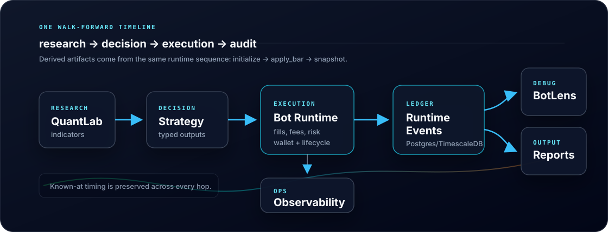

# Quant-Trad

Local trading research workbench for walk-forward backtests, paper bots, BotLens
replay, and report comparison.

Use Quant-Trad to test strategy ideas against candles, inspect the indicator and
decision evidence behind bot behavior, run provider-backed paper sessions, export
research reports, and drive repeatable workflows through `qt` or MCP.

## What You Can Do

- Run walk-forward backtests and bounded paper bot runs.
- Inspect bot behavior in BotLens: candles, overlays, signals, decisions, trades,
  playback, and runtime diagnostics.
- Create and compare strategy variants through report summaries and experiment
  plans.
- Validate provider credentials, provider streams, instruments, and candle
  coverage before starting runs.
- Export run reports and compare baseline/candidate results.
- Use `qt mcp serve` as the agent-facing research adapter over the same backend
  contracts.

## Quick Start

### Prerequisites

- Docker
- GNU Make
- Python 3.12+ for local tooling outside Docker

### Configure Local Secrets

```bash
cp secrets.env.example secrets.env
```

Set the local database values:

```bash
POSTGRES_DB=quanttrad
POSTGRES_USER=quanttrad
POSTGRES_PASSWORD=<local-db-password>
PGADMIN_DEFAULT_PASSWORD=<local-pgadmin-password>
```

Provider API keys are stored through encrypted credential references, not in
repo files, logs, plans, or bot configs. If you plan to save provider
credentials, set:

```bash
QT_SECURITY_PROVIDER_CREDENTIAL_KEY=<fernet-key>
```

Generate a key with:

```bash
python -c "from cryptography.fernet import Fernet; print(Fernet.generate_key().decode())"
```

### Start The Stack

```bash
make up BUILD=1 STACK_PROFILES=core
```

Open:

- Frontend: `http://localhost:5173`
- Backend API: `http://localhost:8000`
- TimescaleDB: `localhost:15432`
- pgAdmin: `http://localhost:8080`

For Grafana and Loki:

```bash
make up BUILD=1 STACK_PROFILES=all
```

## Core Workflows

### Stack And Diagnostics

```bash
make help
make up BUILD=1 STACK_PROFILES=core
make ps
make logs SERVICE=backend
make test
make check
make down
```

### Providers And Instruments

```bash
qt providers list
qt providers credentials schema --provider COINBASE --venue COINBASE_DIRECT
qt providers credentials add --provider COINBASE --venue COINBASE_DIRECT
qt providers stream-smoke --provider COINBASE --venue COINBASE_DIRECT --symbol <product>
```

Coinbase Direct is the active provider-backed paper/streaming path. Historical
backtests from local or cached data do not require Coinbase credentials.

### Backtests And Paper Runs

```bash
qt bots list
qt bots start <bot_id> --run-type backtest
qt runs wait <bot_id> <run_id>
qt bots start <bot_id> --run-type paper --execution observe-only --duration-seconds 30
```

### Strategies And Reports

```bash
qt strategies list
qt strategies compile <strategy_id>
qt strategies preview <strategy_id> --start <iso> --end <iso> --interval <timeframe> --instrument-id <instrument_id>
qt reports summary <run_id>
qt reports export <run_id>
qt reports compare <baseline_run_id> <candidate_run_id>
```

### Experiment Plans

```bash
qt experiments validate-plan <plan.json>
qt experiments run-plan <plan.json> --experiment-id <experiment_id>
qt experiments status <experiment_id>
qt experiments events <experiment_id> --tail 50
```

### MCP

```bash
make mcp-ready
qt mcp serve
```

`qt mcp serve` exposes read resources and guarded tools for agent hosts. It is
an adapter over `qt` and backend API contracts, not a separate runtime or source
of truth.

## Runtime Model

Quant-Trad evaluates research and bot behavior through one walk-forward
timeline:

```text
Data -> Indicators -> Decisions -> Execution -> BotLens / Reports
```

The core engine contract is:

```text
initialize -> apply_bar -> snapshot
```

Indicators publish typed outputs. Strategies consume those outputs. Bot runtime
owns fills, fees, margin, wallet state, settlement, and lifecycle events.
BotLens and reports inspect runtime truth; they do not create alternate
execution logic.

<p align="center">
  
</p>

## Entry Points

| Surface | Use it for |
| --- | --- |
| `qt` CLI | Bot runs, providers, reports, exports, comparisons, and experiments. |
| `qt mcp serve` | Agent-facing research workflow adapter over `qt` and backend contracts. |
| UI | Human inspection: BotLens, charts, strategies, fleets, playback, and reports. |
| Makefile | Local stack, tests, DB, logs, docs sync, and forensic helpers. |

## Docs

- [Getting started](docs/getting-started.md)
- [Runtime timeline](docs/concepts/runtime-timeline.md)
- [Execution model](docs/concepts/execution-model.md)
- [Strategies and signals](docs/concepts/strategies-and-signals.md)
- [BotLens](docs/concepts/botlens.md)
- [Reporting datasets](docs/concepts/reporting-datasets.md)
- [MCP research server](docs/architecture/research-orchestration/MCP_RESEARCH_SERVER.md)
- [Adding a provider](docs/guides/adding-a-provider.md)
- [Coinbase derivatives paper setup](docs/guides/coinbase-derivatives-paper-setup.md)
- [Architecture contracts](docs/contracts/README.md)

Contracts are the source of truth when code and explanatory docs disagree.

## Project Status

Quant-Trad is in active development. The system is intended for research,
backtesting, paper trading, and controlled environments unless you have
independently reviewed the execution path, provider configuration, and risk
controls for your use case.

Do not treat this as production trading infrastructure without your own
validation.
