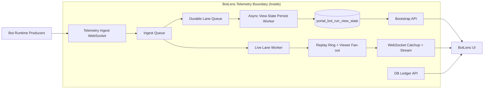

# BotLens Live Data Architecture (Snapshot + Stream + DB Ledger) — v2

## Documentation Header

- `Component`: BotLens live data pipeline (`bootstrap + stream + catchup + db_ledger`)
- `Owner/Domain`: Bot Runtime / Portal Backend
- `Doc Version`: 2.4
- `Related Contracts`: `docs/architecture/RUNTIME_EVENT_MODEL_V1.md`, `docs/architecture/SNAPSHOT_SEMANTICS_CONTRACT.md`, `portal/backend/controller/bots.py`, `portal/backend/service/bots/telemetry_stream.py`, `portal/backend/service/bots/ledger_service.py`, `portal/backend/service/storage/repos/runtime_events.py`, `portal/backend/service/storage/storage.py`

## 1) Problem and scope

BotLens must provide low-latency live state with deterministic ordering and durable audit continuity for each `(bot_id, run_id)`.

In scope:
- bootstrap snapshot delivery,
- sequenced event catchup/stream delivery,
- read-only decision/runtime ledger retrieval from DB by run,
- gap handling and resync behavior,
- client-side buffered rendering for smooth visual playback.

### Non-goals

- replay animation,
- exactly-once transport delivery,
- cross-run mixed view semantics.

Upstream assumptions:
- runtime emits causal events with stable `run_id` and monotonic `seq`,
- storage for runtime events is available.

## 2) Architecture at a glance

Boundary:
- inside: BotLens telemetry ingest, snapshot bootstrap, websocket fan-out
- outside: bot runtime event producers and UI consumers

## Mentor Notes (Non-Normative)

- Think of this as a scoreboard model: bootstrap sets the board, stream updates the board.
- The ordering key is `seq`; timestamps explain timing but do not resolve ordering disputes.
- If a gap appears, the safe move is resync, not partial guesswork.
- Bootstrap + cursor keeps reconnect cost bounded for users and operators.
- This section is explanatory only.
- If this conflicts with Strict contract, Strict contract wins.

## 3) Inputs, outputs, and side effects

- Inputs: websocket telemetry payloads, bootstrap API calls, websocket subscription requests (`run_id`, `since_seq`), DB ledger API calls (`after_seq`, `limit`, `event_name`).
- Dependencies: runtime event schema (`schema_version`, `seq`, `known_at`), durable event persistence, monotonic per-run sequencing.
- Outputs: bootstrap envelopes, streamed `bot_runtime_event` envelopes, DB ledger event pages, persisted runtime event rows.
- Side effects: websocket network I/O, retry/resync signaling to clients.

## 4) Core components and data flow

- `BotTelemetryHub.ingest(...)` is now a queue handoff only (fast path).
- Ingest worker validates payloads, trims windows, derives trade lifecycle events, and publishes live envelopes.
- Durable worker persists latest `view_state` checkpoints asynchronously via upsert.
- `BotTelemetryHub.bootstrap(...)` reads latest durable run snapshot and returns cursor state.
- `BotTelemetryHub.add_viewer(...)` sends a latest-snapshot resync when `since_seq` is stale, then live stream fan-out.
- `GET /api/bots/{bot_id}/runs/{run_id}/events` reads `portal_bot_run_events` and projects runtime-event rows into ledger events for BotLens.
- Viewer canonical cursor applies strictly ordered events and ignores duplicates by cursor.
- BotLens UI renders from a buffered queue:
  - canonical stream state advances immediately by `seq`,
  - rendered chart state drains with a target lag,
  - renderer enters catch-up mode when `seq` lag or queue depth exceeds thresholds.
- BotLens decision ledger uses DB API only; it does not read `snapshot.decisions`.
- Storage implementation note: runtime event repository logic is organized under `portal/backend/service/storage/repos/runtime_events.py`; `portal/backend/service/storage/storage.py` remains a compatibility facade.

## 5) State model

Authoritative state:
- append-only runtime events in `portal_bot_run_events` ordered by `(bot_id, run_id, seq)`.

Derived state:
- bootstrap snapshot payloads and live client view state.
- trade lifecycle deltas derived from snapshot differences.

Persistence boundaries:
- persisted: latest `view_state` checkpoints (`portal_bot_run_view_state`) and runtime event rows (`portal_bot_run_events`) with separate producers.
- in-memory only: connected viewers, per-viewer cursor, replay ring, ingest queue, durable queue, lifecycle diff cache.

## 6) Why this architecture

- A hybrid snapshot + stream model provides low-latency UX and deterministic recovery.
- Live fan-out before persistence keeps stream latency stable under DB pressure.
- Async durable lane still preserves checkpoint durability for bootstrap/recovery.
- Cursor-based catchup avoids full-history replay on reconnect.

## 7) Tradeoffs

- Duplicate delivery is possible by design (at-least-once).
- Event store growth is proportional to runtime cadence and retention policy.
- State materialization logic adds backend complexity to keep client payloads bounded.

## 8) Risks accepted

- Client desync risk under network loss or dropped packets.
- Producer payload drift risk when schema changes.
- Storage lag can delay catchup for high-frequency runs.

Mitigations:
- explicit gap->resync policy,
- schema version checks,
- strict sequence ordering and cursor-based replay.

## 9) Strict contract

- Ordering: `seq` is canonical order; timestamps are not ordering keys.
- Delivery semantics: at-least-once; idempotency by ignoring `seq <= last_applied_seq`.
- Decision ledger source: DB API (`/api/bots/{bot_id}/runs/{run_id}/events`) is authoritative for ledger rows; `snapshot.decisions` is not used by BotLens ledger rendering.
- Degrade state machine:
  - `RUNNING`: applying stream deltas.
  - `RESYNCING`: gap detected, pause delta apply, request fresh snapshot.
  - `STALE_READONLY`: bootstrap unavailable during resync; keep last known state visible.
  - `HALTED`: terminal disconnect or unsupported schema.
- In-flight work:
  - during `RESYNCING`, incoming deltas are not applied to rendered state;
  - on successful bootstrap, state is atomically replaced then stream resumes.
- Sim vs live differences: no semantic differences in BotLens transport contract; only event cadence differs by runtime mode.
- Canonical error codes/reasons when emitted:
  - `SEQUENCE_GAP`,
  - `SCHEMA_INCOMPATIBLE`,
  - `BOOTSTRAP_UNAVAILABLE`,
  - `VIEWER_SEND_FAILED`.
- Validation hooks (applicable):
  - code: cursor checks in telemetry hub ingest/catchup,
  - logs: gap/schema/viewer-send events with `bot_id`, `run_id`, `seq`,
  - storage: monotonic `seq` rows in `portal_bot_run_events`,
  - metrics: viewer lag/resync counters and client render queue/lag.

Client render buffer knobs (frontend `VITE_*` env):
- `VITE_BOTLENS_TARGET_RENDER_LAG_MS`
- `VITE_BOTLENS_CATCHUP_RENDER_LAG_MS`
- `VITE_BOTLENS_CATCHUP_SEQ_BEHIND`
- `VITE_BOTLENS_CATCHUP_QUEUE_DEPTH`
- `VITE_BOTLENS_NORMAL_APPLY_INTERVAL_MS`
- `VITE_BOTLENS_CATCHUP_APPLY_INTERVAL_MS`
- `VITE_BOTLENS_MAX_CATCHUP_BATCH`
- `VITE_BOTLENS_METRICS_PUBLISH_MS`
- `VITE_BOTLENS_LEDGER_POLL_MS`
- `VITE_BOTLENS_LEDGER_POLL_LIMIT`
- `VITE_BOTLENS_LEDGER_MAX_EVENTS`

Backend snapshot trim knobs (telemetry hub):
- `BOTLENS_MAX_CANDLES` (`0` = uncapped, default `320`)
- `BOTLENS_MAX_TRADES` (`0` = uncapped, default `400`)
- `BOTLENS_MAX_OVERLAYS` (`0` = uncapped, default `400`)
- `BOTLENS_MAX_OVERLAY_POINTS` (`0` = uncapped, default `160`)
- `BOTLENS_INGEST_QUEUE_MAX` (default `4096`)
- `BOTLENS_PERSIST_QUEUE_MAX` (default `4096`)
- `BOTLENS_PERSIST_BATCH_MAX` (default `256`)

## 10) Versioning and compatibility

- Event and bootstrap payloads include `schema_version`.
- Additive changes are preferred.
- Incompatible versions are rejected; client must resync via compatible bootstrap path.

---

## Detailed Design

# 5) Core Correctness Contracts

## 5.1 Sequencing and Ordering Guarantees

For each (bot_id, run_id):

- Exactly one component assigns seq.
- seq is strictly increasing.
- seq defines the canonical order of truth.
- The UI applies events strictly by seq.
- Delivery is at-least-once; duplicates are ignored (seq <= last_applied_seq).

Timestamps do not define order. seq does.

---

## 5.2 Event Fields

Each event includes:

- bot_id
- run_id
- seq
- event_time (when it occurred)
- known_at (when system accepted it as valid)
- schema_version
- type
- payload

### Timestamp Semantics

- event_time = when it happened
- known_at = when the system acknowledged it
- seq = the order the UI must apply

---

# 6) Event Taxonomy

## 6.1 Critical Events (Never Dropped)

Must be emitted to live lane and persisted to durable lane.

Examples:

- Order created
- Fill received
- Trade closed
- Position updated
- Bot started/stopped
- Errors

Guarantee:

- Broadcast immediately (live lane), persist asynchronously (durable lane)
- Never coalesced
- Never dropped

---

## 6.2 Soft Events (Coalescible)

May be coalesced or sampled.

Examples:

- Candle updates
- Overlay adjustments
- Regime/stat updates
- Heartbeat

Guarantee:

- May be aggregated
- May be sampled
- Coalescing occurs before seq assignment
- Still ordered by seq

---

# 7) Snapshot Strategy

## 7.1 Snapshot Contract

Bootstrap API returns:

- Current runtime status
- Bounded candle window
- Active overlays (bounded)
- Recent trades (bounded)
- Summary stats
- Cursor (run_id, seq)
- schema_version

### Snapshot Guarantee

Snapshot represents state after applying all events through:

seq = X

Snapshot is not full history.
Full audit comes from the append-only event store within the retention period.
Longer history depends on archive availability.

---

# 8) Open / Close / Reopen Semantics

## Flow

1. UI calls bootstrap API.
2. API returns snapshot + cursor (seq = X).
3. UI renders immediately.
4. UI opens WebSocket with since_seq = X.
5. Server streams events where seq > X.

## Gap Policy

If the client detects a missing seq:

- Enter "Resyncing" state
- Keep rendering last known state in read-only stale mode with obvious warning
- Pause applying new deltas until snapshot recovery succeeds
- Request fresh snapshot (with retries)
- Atomically replace state when snapshot arrives
- Resume streaming from recovered cursor

No partial backfill in v1.

---

# 9) Run Semantics

- run_id changes when a bot restarts or redeploys.
- Only one active run exists per bot.
- BotLens default attaches to latest run.
- If run B starts while viewing run A, BotLens auto-attaches to run B in v1.
- A dedicated "View older runs" flow may be added later.
- Historical runs may be supported later for audit view.

Events from different run_ids must never mix in the same live view.

---

# 10) Persistence Model

## 10.1 Append-Only Event Store

- Immutable rows
- Indexed by bot_id, run_id, seq
- No silent rewrites
- Durable lane persists checkpoints asynchronously; live lane is not blocked on DB writes

## 10.2 Retention Policy

- Raw events retained for 30 days.
- After 30 days, events may be deleted or archived.
- Retention applies to both critical and soft events.
- Archival strategy may be added later.

Audit scope:

- Full audit is guaranteed for the retention period (30 days).
- Beyond 30 days, audit is available only if archived data exists.

---

# 11) Delivery Model

## 11.1 At-Least-Once Delivery

- Events may be delivered more than once.
- UI must ignore duplicates.
- Exactly-once is not required.

## 11.2 Backpressure Policy

If a client falls too far behind:

1. Soft events are coalesced.
2. If still behind → client is instructed to resync snapshot.
3. Server may disconnect excessively slow clients.

---

# 12) Materializer Guarantees

State Materializer:

- Builds snapshot from event store.
- Tracks last applied seq.
- Must detect staleness.
- If inconsistent, rebuild from event store and log error with context.

---

# 13) Multi-Viewer Isolation

- Multiple viewers may subscribe to same bot.
- Viewing must never alter bot runtime behavior.
- WebSocket fan-out is independent of bot execution.
- Authorization enforced per bot_id.

---

# 14) Schema Versioning

- Every event includes schema_version.
- Snapshot includes schema_version.
- Client rejects incompatible versions explicitly.
- Additive schema changes preferred.

---

# 15) Failure Handling

Fail loud with context:

- bot_id
- run_id
- seq
- phase

Typical failures:

- Socket disconnect → reconnect with cursor
- Sequence gap → resync snapshot
- Materializer lag → rebuild + log
- Schema mismatch → explicit client error
- Bootstrap unavailable during resync → enter read-only stale mode with obvious warning and retry bootstrap until recovered

---

# 16) Performance Guardrails

- Bounded windows for candles/trades
- Coalescing for high-frequency updates
- Small heartbeat packets
- Payload size caps
- Lag metrics:
  - server_lag_ms
  - client_lag_ms
  - queue depth

---

# 17) Tradeoff Summary

DB-only polling → Too slow  
Stream-only → Not auditable  
Hybrid (snapshot + stream + append-only log) → Correct balance

---

# 18) Product Semantics We Commit To

This summary is defined by `## 9) Strict contract`.
For normative guarantees, use `## 9) Strict contract` as the source of truth.

---

# 19) Final Non-Negotiable Contracts

Normative contract list is intentionally centralized in `## 9) Strict contract`.
