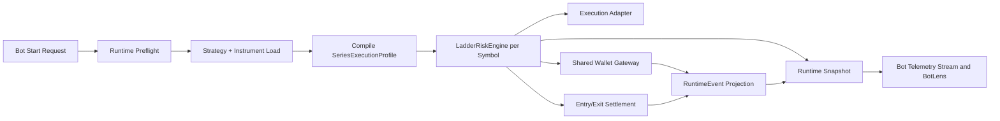
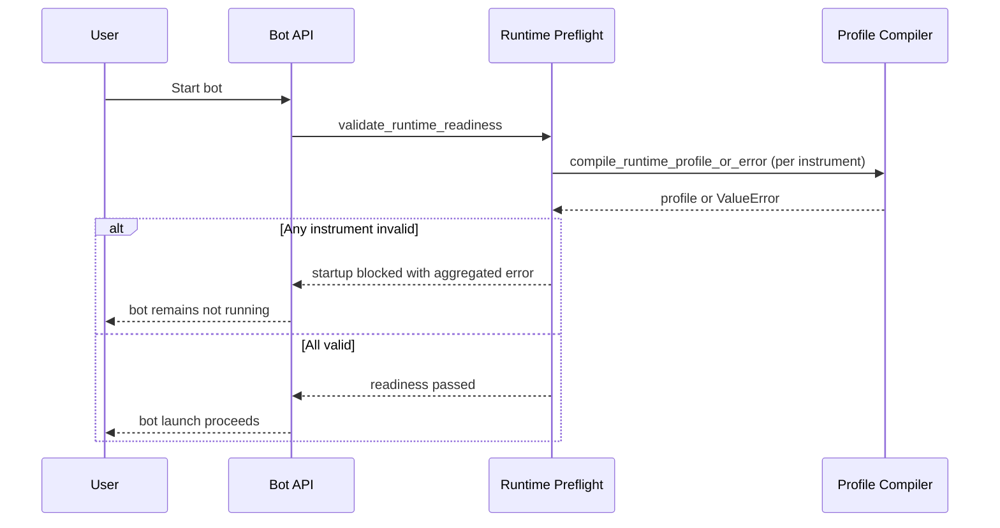
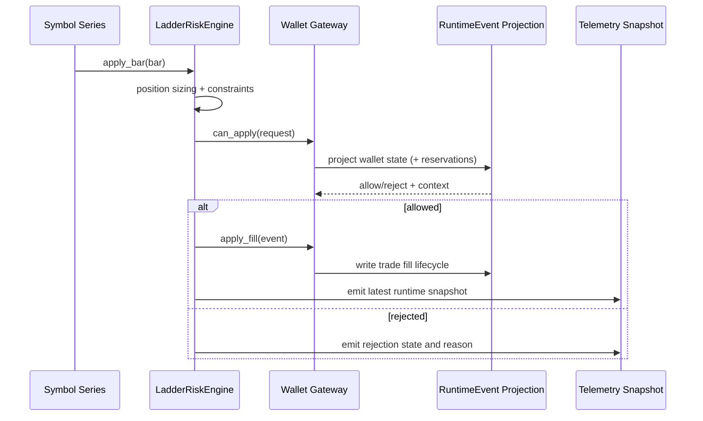

# Bot Runtime Engine Architecture (v1)

## Documentation Header

- `Component`: Bot runtime execution engine
- `Owner/Domain`: Bot Runtime
- `Doc Version`: 1.1
- `Related Contracts`: `docs/agents/01_runtime_contract.md`, `docs/architecture/RUNTIME_EVENT_MODEL_V1.md`, `docs/architecture/WALLET_GATEWAY_ARCHITECTURE.md`, `src/engines/bot_runtime/core/domain.py`

## 1) Problem and scope

The bot runtime engine converts strategy intent into execution outcomes with realistic risk, wallet, and fill semantics.

In scope:
- per-bar execution lifecycle,
- readiness/preflight enforcement,
- runtime event emission and snapshot emission,
- symbol isolation/degrade handling.

### Non-goals

- market prediction logic,
- indicator computation ownership,
- external portfolio aggregation across bots.

Upstream assumptions:
- strategy/indicator signals are already computed,
- instrument metadata and runtime profile inputs are available.

## 2) Architecture at a glance

Boundary:
- inside: runtime preflight, execution engine, wallet gateway integration, event/snapshot emission
- outside: strategy composition, provider data acquisition, BotLens UI rendering

See section `## 3) Architecture at a glance` for the runtime topology diagram.

## Mentor Notes (Non-Normative)

- Read this engine as a control loop: validate -> decide -> settle -> emit.
- `SeriesExecutionProfile` is the “compiled contract” that keeps behavior stable across providers.
- Events explain causality; snapshots make state easy to observe.
- Degrade behavior is designed to isolate symbol failures instead of collapsing the full run.
- This section is explanatory only.
- If this conflicts with Strict contract, Strict contract wins.

## 3) Inputs, outputs, and side effects

- Inputs: candle arrivals, strategy entry/exit intents, bot start/stop requests.
- Dependencies: instrument/runtime profile contract, wallet gateway contract, execution adapter contract.
- Outputs: fills/rejections, runtime events, runtime snapshots, updated trade/wallet projections.
- Side effects: persistence writes (events/snapshots), wallet reservations, telemetry network I/O.

## 4) Core components and data flow

- Runtime preflight validates strategy instruments and readiness before launch.
- `LadderRiskEngine` evaluates intent and applies execution rules per symbol series.
- Wallet gateway validates capital constraints and reservation lifecycle.
- Runtime emits canonical execution events and snapshot payloads for downstream observability.

## 5) State model

Authoritative state:
- append-only runtime events and deterministic runtime engine timeline.

Derived state:
- runtime snapshots, BotLens read models, aggregated metrics.

Persistence boundaries:
- persisted: runtime events, snapshot rows, bot run status/metadata.
- in-memory: active position objects, worker-local transient execution context.

## 6) Why this architecture

- Single-path runtime semantics keep execution explainable and auditable.
- Shared contracts (`SeriesExecutionProfile`, runtime events, wallet gateway) reduce provider-specific drift.
- Symbol-level isolation allows degradation without collapsing healthy symbols.

## 7) Tradeoffs

- Multi-process symbol sharding adds orchestration complexity.
- Futures/perps-first assumptions constrain instrument coverage in v1.
- Strict fail-loud behavior can stop runs rather than degrade silently.

## 8) Risks accepted

- Misconfigured instrument metadata can block startup.
- Wallet reservation contention can affect throughput under heavy concurrency.
- Contract drift between runtime producers/consumers can break compatibility.

## 9) Strict contract

- Timeline contract: `initialize -> apply_bar -> snapshot`.
- Retry/idempotency semantics: runtime event delivery is at-least-once; consumers must be idempotent by event identity/cursor.
- Degrade state machine:
  - `RUNNING`: normal per-symbol execution.
  - `DEGRADED`: one or more symbols failed; healthy symbols continue.
  - `HALTED`: unrecoverable runtime failure or stop.
- In-flight work:
  - work on failed symbol is terminated and marked degraded;
  - work on healthy symbols proceeds unless run enters `HALTED`.
- Sim vs live differences:
  - execution adapter behavior differs by mode;
  - core runtime contract, event taxonomy, and timing gates are unchanged.
- Canonical error codes/reasons when emitted:
  - `WALLET_INSTRUMENT_MISCONFIGURED`,
  - `WALLET_INSUFFICIENT_MARGIN`,
  - `DECISION_REJECTED_*`,
  - `RUNTIME_EXCEPTION`,
  - `SYMBOL_DEGRADED`.
- Validation hooks (applicable):
  - code: runtime contract checks in preflight/profile compilation/execution path,
  - logs: lifecycle events and rejection reasons with run/symbol context,
  - storage: runtime event records and snapshot cursor progression,
  - tests: runtime engine and margin/wallet validation suites.

## 10) Versioning and compatibility

- Runtime events carry `schema_version`.
- Additive payload evolution is preferred.
- Breaking event/snapshot shape requires explicit schema version bump and compatible consumer handling.

---

## Detailed Design

## Scope

This document describes:

- what the bot runtime engine does,
- how snapshots and live execution connect,
- which contracts drive runtime behavior,
- where the engine remains futures-coupled in v1.

---

## 1) What the engine is

The bot runtime engine is the part that turns strategy decisions into realistic trade behavior over time.

In plain terms:

1. A new candle arrives.
2. Strategy rules may produce entry/exit intent.
3. The engine sizes risk, validates wallet/collateral, and applies fills.
4. The engine updates state and emits a snapshot for observability (BotLens, logs, persistence).

The runtime engine is the source of truth for execution behavior.

Current execution topology is shared multi-process by default:

- one bot container per strategy,
- one symbol shard worker process per assigned symbol group,
- pool-based runner inside each worker process.

---

## 2) Core principle

All derived runtime outputs must come from one timeline:

`initialize -> apply_bar -> snapshot`

No alternate reconstruction path produces a different execution story.

---

## 3) Architecture at a glance

---

## 4) Contracts the engine uses

The runtime is now driven by a compiled contract: `SeriesExecutionProfile`.

It contains:

- `instrument`: symbol/type/base/quote identity
- `constraints`: tick size, contract size, qty step, min/max qty, min notional
- `capabilities`: margin/short/funding/expiry flags
- `risk`: base and multiplier inputs
- `margin_model`: resolved calculator + margin rates
- `collateral_model`: accounting mode (for v1, primarily margin vs full notional)

Why this matters:

- engine semantics do not rely on ad-hoc provider payloads,
- strategy warnings and bot startup blockers use the same compiler,
- runtime behavior is deterministic from one canonical contract.

---

## 5) Startup and readiness flow

Before a bot starts, runtime preflight validates each strategy instrument.

For runtime v1:

- only derivatives are allowed (`future` / `perp` policy),
- margin rates are required for derivatives runtime,
- missing execution-critical fields fail loud.

At strategy-edit time:

- warnings are soft (you can keep editing).

At bot-start time:

- errors are hard blockers (bot does not start).

---

## 6) Per-bar execution flow

Each symbol series follows this lifecycle repeatedly:

1. Read next bar/candle.
2. Evaluate strategy intent for this bar.
3. Build entry/exit request.
4. Validate wallet/collateral via gateway (`can_apply`).
5. Apply fill + settlement (entry/exit lifecycle event).
6. Recompute state and emit snapshot.

---

## 7) Wallet and margin semantics

The engine supports two main accounting paths:

- `margin` (derivatives-style collateral),
- `full_notional` (cash-secured spot-style behavior).

In v1 runtime, derivatives are the primary live path.

Important behavior:

- entry fills lock margin per trade,
- exit fills release margin proportionally to closed quantity,
- partial exits are supported by open-qty tracking,
- wallet checks use free collateral, not raw balance.

This keeps collateral accounting coherent across trade lifecycle events.

---

## 8) Capability flags (what they mean)

The profile compiler resolves these runtime flags:

- `supports_margin`: true when margin calculator type is `margin`
- `supports_short`: from instrument capability (derivatives default to true in compiler)
- `short_requires_borrow`: true when shorting needs borrow inventory (spot-style short borrow semantics)
- `has_funding`: informational capability flag from instrument metadata
- `has_expiry`: true when the contract has expiry

These flags drive engine behavior, not provider-specific payload internals.

---

## 9) Error and degrade behavior

Current behavior is intentionally explicit:

- startup misconfiguration: bot launch blocked,
- runtime wallet/instrument misconfiguration: fail loud (`WALLET_INSTRUMENT_MISCONFIGURED`),
- symbol runtime exception: degrade that symbol path, keep other symbols running when possible,
- BotLens can remain in stale read-only mode until bootstrap recovers.

This favors correctness and auditability over silent fallback behavior.

---

## 10) Observability and instrumentation

The engine emits lifecycle logs including:

- `series_execution_profile_compiled`
- `ladder_risk_constraints`
- `ladder_risk_configured`
- `position_sizing`
- `margin_rate_selected`
- `qty_capped_by_margin`
- `wallet_entry_rejected`
- `wallet_exit_rejected`
- `tp_leg_allocation_finalized`

Current runtime logs include fields such as:

- run context: `run_id`, `bot_id`, `strategy_id`
- market context: `symbol`, `timeframe`, `instrument_type`
- trade context: `trade_id`, `event_type`, position sizing and wallet/margin details
- time context: bar/runtime time cursor (event-specific)

---

## 11) Futures-coupled hotspots (v1)

These are known futures-oriented areas to decouple later:

1. Margin model assumptions
- notional * margin rate is the central model.
- maintenance/liquidation/funding accrual are not modeled as first-class contracts yet.

2. Contract quantity semantics
- sizing logic assumes contract-style quantity controls (`qty_step`, `min_notional`, `max_qty`).

3. Session-driven margin mode
- intraday vs overnight is built into margin selection.

4. Entry/exit collateral lifecycle
- margin lock/release is trade-lifecycle based and futures-friendly.

This is acceptable for v1 futures/perps focus and is scheduled for modularization for broader instrument support.

---

## 12) Extensibility shape

The current architecture is organized so that:

1. provider-specific data is resolved at provider/service boundaries,
2. runtime compiles one canonical execution profile per series,
3. engine behavior reads the compiled profile instead of provider payload internals.

This keeps behavior centralized and reduces provider-coupled engine semantics.

---

## 13) Related docs

- `docs/architecture/ENGINE_OVERVIEW.md`
- `docs/architecture/INSTRUMENT_CONTRACT_FUTURES_V1_READINESS.md`
- `docs/architecture/BOT_RUNTIME_SYMBOL_SHARDING_ARCHITECTURE.md`
- `docs/architecture/BOTLENS_LIVE_DATA_ARCHITECTURE.md`
- `docs/architecture/SNAPSHOT_SEMANTICS_CONTRACT.md`
