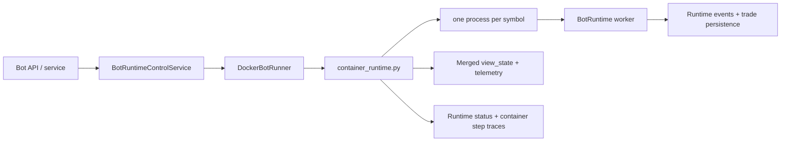

# Bot Runtime Service Architecture

## Documentation Header

- `Component`: Bot runtime service orchestration
- `Owner/Domain`: Bot Runtime / Portal Backend
- `Doc Version`: 2.0
- `Related Contracts`: [[BOT_RUNTIME_DOCS_HUB]], [[01_runtime_contract]], [[BOT_RUNTIME_ENGINE_ARCHITECTURE]], [[BOT_RUNTIME_SYMBOL_SHARDING_ARCHITECTURE]], `portal/backend/service/bots/runtime_control_service.py`, `portal/backend/service/bots/runner.py`, `portal/backend/service/bots/container_runtime.py`

## 1) Problem and scope

This document describes the current service-layer architecture that starts, stops, and supervises bot runtime execution.

In scope:
- API/service validation before launch,
- runner target resolution,
- docker container launch model,
- container runtime responsibilities,
- persistence and telemetry boundaries.

Non-goals:
- per-bar strategy execution details,
- indicator/runtime engine internals,
- UI rendering details beyond emitted service payloads.

Deep execution semantics live in [[BOT_RUNTIME_ENGINE_ARCHITECTURE]].
Deep event and wallet contracts live in [[RUNTIME_EVENT_MODEL_V1]] and [[WALLET_GATEWAY_ARCHITECTURE]].

## 2) Current service topology

## 3) Service entrypoints

Current entrypoints:
- `portal/backend/service/bots/runtime_control_service.py`: API-facing start/stop and watchdog status surface.
- `portal/backend/service/bots/runner.py`: runner abstraction plus `DockerBotRunner`.
- `portal/backend/service/bots/container_runtime.py`: launched process that owns symbol sharding, worker supervision, merged view-state emission, and container-level status/step traces.

Current target support:
- only `BOT_RUNTIME_TARGET=docker` is implemented.

## 3.1) Runtime composition root

Runtime API-facing service wiring now flows through `portal/backend/service/bots/runtime_composition.py`.

- `RuntimeComposition` assembles stream manager, config service, runtime control service, storage gateway, and watchdog.
- `RuntimeMode` (default from `BOT_RUNTIME_MODE`) selects a composition branch so backtest/paper/live can evolve without pushing mode switches into service leaf modules.
- `bot_service.py` consumes this composition lazily via `get_runtime_composition()` instead of module-level singleton construction.
- Runtime control storage writes (`upsert_bot`) are injected as a collaborator boundary, reducing hidden deep imports in service methods.

This keeps start/stop behavior stable while making runtime wiring explicit and testable.

## 4) Start flow

`BotRuntimeControlService.start_bot(bot_id)` performs the current service-side checks in this order:
1. Load the bot from config storage.
2. Validate wallet config.
3. Validate strategy id and backtest window.
4. Validate strategy existence.
5. Validate instrument policy.
6. Validate runtime readiness.
7. Resolve the runner target.
8. Launch the runtime container through `DockerBotRunner.start_bot(...)`.

If container startup fails:
- bot status is set to `error`,
- `last_run_artifact.error` is written,
- the failure is broadcast to stream subscribers,
- the exception is re-raised.

If startup succeeds:
- bot status becomes `running`,
- `runner_id` is set to the container id,
- `last_run_at` is updated,
- the updated bot payload is broadcast.

## 5) Docker runner contract

`DockerBotRunner` currently enforces:
- `BOT_RUNTIME_IMAGE` must be set,
- `BOT_RUNTIME_NETWORK` must resolve to an existing docker network,
- `PROVIDER_CREDENTIAL_KEY` must be present in backend env,
- `snapshot_interval_ms` must be configured on the bot before launch.

The runner passes through:
- `PG_DSN`,
- `PROVIDER_CREDENTIAL_KEY`,
- `BOT_ID`,
- snapshot cadence env vars,
- BotLens stream sizing env vars,
- step-trace buffer env vars,
- optional `bot_env` overrides from bot config.

The launched process is:
- `python -m portal.backend.service.bots.container_runtime`

## 6) Container runtime responsibilities

`container_runtime.py` is the service-layer runtime supervisor. It is responsible for:
- loading the bot row and its strategy id,
- generating the shared `run_id`,
- enforcing strategy symbol limits,
- assigning symbols to worker processes,
- creating the shared-wallet multiprocessing proxy,
- supervising child workers,
- merging worker view-state payloads,
- emitting compact telemetry envelopes,
- writing bot runtime status and container step traces.

Important current limits:
- default maximum symbols per strategy is 10,
- one worker process is required per symbol,
- startup fails loudly if `BOT_SYMBOL_PROCESS_MAX < symbol_count`.

## 7) Worker model

Each child worker process:
- receives exactly one symbol shard,
- receives the shared `run_id`,
- constructs a `BotRuntime` with `degrade_series_on_error=True`,
- forces `series_runner="inline"`,
- emits compact `view_state` envelopes back to the parent process,
- emits `worker_error` messages when runtime execution fails.

The parent process treats worker failures as degraded-symbol events:
- failed worker symbols are added to `degraded_symbols`,
- healthy workers continue,
- telemetry is marked degraded,
- container execution only hard-fails on parent-level exceptions.

## 8) Persistence boundaries

The service/runtime split is important.

Worker runtime persistence:
- canonical runtime events via `storage.record_bot_runtime_event(...)`,
- trade rows via `storage.record_bot_trade(...)`,
- trade-event rows via `storage.record_bot_trade_event(...)`,
- worker run artifacts via `storage.update_bot_run_artifact(...)`,
- worker reports via `report_service.record_run_report(...)`,
- runtime step traces via batched `storage.record_bot_run_steps_batch(...)`.

Container runtime persistence:
- run status via `update_bot_runtime_status(...)`,
- container loop step traces via `record_bot_run_step(...)`.

Current non-persistence:
- merged BotLens `view_state` is not durably written by `container_runtime.py`,
- the merged view is an ephemeral telemetry/read-model surface.

## 9) Telemetry contract

The container runtime builds a compact telemetry envelope with:
- `run_id`,
- `bot_id`,
- container sequence numbers,
- merged summary counts,
- optional merged `view_state`.

Transport:
- websocket push to `BACKEND_TELEMETRY_WS_URL` when configured,
- latest-message compaction inside `_TelemetryEmitter` to avoid backlog growth.

Durability:
- telemetry is supplemental,
- runtime events, trades, run artifacts, status rows, and step traces remain the durable execution record.

## 10) Merged runtime status semantics

Two status surfaces exist and should not be conflated.

Persisted service status:
- `running`
- `stopped`
- `failed`

Merged runtime payload status inside `view_state.runtime.status`:
- `running`
- `completed`
- `stopped`
- `error`
- `degraded`

Current nuance:
- if any workers are still active, merged runtime status remains `running` even when `degraded_symbols` is non-empty,
- degraded state is primarily surfaced through merged payload warnings plus `telemetry_degraded`,
- the persisted bot runtime status row does not currently store a separate `degraded` terminal state.

## 11) Stop and watchdog flow

`BotRuntimeControlService.stop_bot(bot_id)`:
- resolves the runner,
- removes the docker container,
- unregisters the bot from the watchdog,
- updates bot status to `stopped`,
- clears `runner_id`,
- persists and broadcasts the new bot state.

The watchdog remains responsible for:
- stale-heartbeat scans,
- container ownership verification,
- marking orphaned/crashed bots failed,
- reporting current watchdog status.

## 12) Strict contract

- Service start/stop must remain explicit and auditable.
- Runtime readiness validation happens before container launch, not lazily inside UI paths.
- The shared `run_id` belongs to the whole container run and is propagated to all symbol workers.
- Container runtime owns symbol sharding and merged telemetry; worker runtimes own execution semantics and canonical runtime events.
- Failures must be surfaced either as explicit bot/container failure or explicit symbol degradation. No silent success state may be invented.
