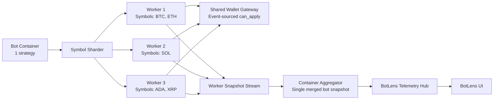
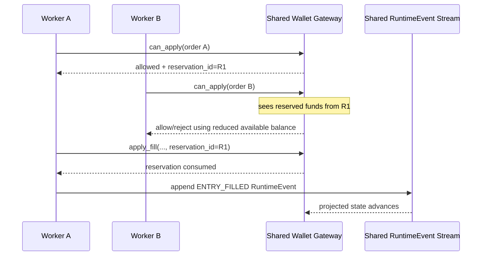

# Bot Runtime Symbol Sharding + BotLens Architecture

## Documentation Header

- `Component`: Bot runtime symbol sharding and merged telemetry
- `Owner/Domain`: Bot Runtime / Container Runtime
- `Doc Version`: 1.1
- `Related Contracts`: `docs/architecture/BOT_RUNTIME_ENGINE_ARCHITECTURE.md`, `docs/architecture/WALLET_GATEWAY_ARCHITECTURE.md`, `docs/architecture/BOTLENS_LIVE_DATA_ARCHITECTURE.md`, `portal/backend/service/bots/container_runtime.py`

## 1) Problem and scope

This component maps one strategy across multiple symbols while preserving wallet safety and one coherent BotLens view.

In scope:
- symbol-to-worker sharding,
- shared wallet coordination across workers,
- merged snapshot production for BotLens.

### Non-goals

- per-symbol process pinning without worker caps,
- cross-bot wallet sharing,
- standalone UI state reconstruction without runtime telemetry.

Upstream assumptions:
- strategy instruments are valid and symbol list is resolved,
- runtime event model and wallet gateway contracts are available.

## 2) Architecture at a glance

Boundary:
- inside: symbol sharder, worker processes, shared wallet gateway, container aggregator
- outside: strategy configuration services and BotLens UI clients

See section `## 3) High-level runtime topology` for the diagram.

## Mentor Notes (Non-Normative)

- Treat this as a two-layer system: execution workers and one merge/telemetry layer.
- Worker isolation improves resilience, while shared wallet coordination preserves capital safety.
- The merged view is a read model; canonical causality still comes from runtime events.
- Bounded worker counts are an operational control, not a semantic contract change.
- This section is explanatory only.
- If this conflicts with Strict contract, Strict contract wins.

## 3) Inputs, outputs, and side effects

- Inputs: bot start request, strategy symbol set, per-symbol bar streams, worker status events.
- Dependencies: shared wallet gateway guarantees, runtime event contract, telemetry ingest contract.
- Outputs: worker snapshots, merged container snapshot, degraded symbol list, runtime status updates.
- Side effects: process lifecycle control, shared reservation mutations, snapshot persistence, telemetry websocket I/O.

## 4) Core components and data flow

- Symbol sharder assigns symbols to bounded worker processes.
- Workers run series execution and emit per-worker snapshots.
- Shared wallet gateway validates and reconciles capital usage across workers.
- Container aggregator merges worker snapshots and publishes one bot-level envelope.

## 5) State model

Authoritative state:
- canonical runtime events and wallet projection inputs.

Derived state:
- merged chart/runtime snapshots and BotLens view state.

Persistence boundaries:
- persisted: runtime events, merged snapshot checkpoints, bot runtime status.
- in-memory: active worker maps, worker queues, intermediate aggregation state.

## 6) Why this architecture

- Bounded workers control resource usage while preserving symbol-level isolation.
- Shared wallet gateway prevents cross-worker over-allocation.
- Merged snapshot stream keeps BotLens aligned to one bot-level timeline.

## 7) Tradeoffs

- Worker sharing for multiple symbols reduces isolation for those symbols.
- Aggregation adds additional latency compared to direct worker streaming.
- Shared lock/reservation paths can create contention under high load.

## 8) Risks accepted

- Worker crash can degrade assigned symbols.
- Delayed worker snapshots can temporarily stale merged view.
- Mis-sized worker cap can under-utilize hardware or increase contention.

## 9) Strict contract

- Retry/idempotency semantics: telemetry/event delivery is at-least-once; consumers must dedupe by cursor/event identity.
- Degrade state machine:
  - `RUNNING`: all symbol workers healthy.
  - `DEGRADED`: one or more workers failed; degraded symbols marked; healthy symbols continue.
  - `HALTED`: container runtime unrecoverable or explicitly stopped.
- In-flight work:
  - failed worker symbols stop processing immediately;
  - remaining workers continue unless transitioning to `HALTED`.
- Sim vs live differences: same sharding/wallet/telemetry contract; execution adapter behavior differs by runtime mode.
- Canonical error codes/reasons when emitted:
  - `SYMBOL_WORKER_FAILED`,
  - `WALLET_INSUFFICIENT_MARGIN`,
  - `RUNTIME_EXCEPTION`,
  - `SYMBOL_DEGRADED`.
- Validation hooks (applicable):
  - code: worker assignment/aggregation logic and degrade transitions,
  - logs: worker failure and degrade symbol events with `run_id`/`worker_id`,
  - storage: merged snapshot/event cursor monotonicity,
  - metrics: active worker count, degraded symbol count, telemetry lag.

## 10) Versioning and compatibility

- Runtime envelopes include schema and cursor fields.
- Additive envelope evolution is preferred.
- Breaking changes require explicit version bump and compatible consumer rollout.

---

## Detailed Design

## Who this is for

This document is for new team members and non-specialists who want to understand:

- how one bot can run multiple symbols,
- how capital is shared safely,
- how BotLens shows live state without replaying history.

---

## 1) What we built

We now run bots with this model:

- `1 bot container = 1 strategy`
- `up to 10 symbols per strategy`
- `up to 8 worker processes per bot container`
- if symbols > 8, some workers handle multiple symbols
- each worker still uses multi-threaded series execution internally

Key behavior:

- if one symbol fails at runtime, that symbol is degraded
- healthy symbols keep running
- capital is one shared pool across all symbol workers
- BotLens receives one merged live view for the bot

---

## 2) Why this shape

### Problem before

Before this refactor, the container runtime process model was effectively strategy-centric, not symbol-centric. That made it harder to:

- control per-symbol isolation,
- bound process count,
- keep a clean “peek into the bot” UX in BotLens.

### Goal now

We want BotLens to feel like direct observability into the deployed bot, with:

- low-latency updates,
- durable state continuity,
- and enough isolation so one symbol issue does not collapse the full run.

---

## 3) High-level runtime topology

---

## 4) Symbol-to-worker assignment

Rules:

- hard cap: 10 symbols per strategy
- process cap: 8 workers
- assignment is deterministic and balanced
- if symbols > workers, workers receive multiple symbols

Example:

- 10 symbols, 8 workers
- 6 workers get 1 symbol
- 2 workers get 2 symbols

Tradeoff:

- strict “1 process per symbol” is best isolation
- capped process model reduces CPU/memory pressure
- shared workers are a practical compromise under the 8-process cap

---

## 5) Shared capital pool design

All workers share one wallet source-of-truth through a process-safe gateway.

The source-of-truth is the shared canonical `RuntimeEvent` stream, not mutable per-process balance maps.

### Important detail

A race can happen if multiple workers validate entries at the same time.

To prevent this, the shared gateway uses:

- one process lock around validation/reservation paths,
- reservation IDs,
- reservation-aware checks against wallet state projected from shared runtime events.

`apply_fill` does not mutate wallet balances directly. It marks a reservation as consumed, and wallet state advances when the corresponding canonical runtime event is appended.

---

## 6) Degrade-only-symbol behavior

Runtime series stepping now supports degrade mode.

If a series step throws:

- that series is marked done/degraded,
- warning is emitted with symbol context,
- worker continues other series.

Container-level behavior:

- non-zero worker exit marks that worker’s symbols degraded,
- remaining workers continue,
- container publishes merged runtime state with `degraded_symbols`.

This preserves visibility and avoids all-or-nothing failure.

---

## 7) BotLens data semantics (catch up, then live)

When BotLens opens:

1. client requests bootstrap snapshot,
2. server returns latest merged snapshot + cursor (`run_id`, `seq`),
3. client connects websocket from that cursor,
4. client receives only newer events.

If user closes BotLens and returns later:

- no replay animation is required,
- it jumps to latest snapshot,
- then continues streaming live.

If sequence gap occurs:

- UI keeps stale read-only state visible,
- shows obvious warning,
- retries bootstrap until healthy,
- resumes streaming from recovered cursor.

---

## 8) Why we merge worker snapshots in container

BotLens expects one coherent bot state, not N independent worker states.

So container runtime now merges worker snapshots into one envelope:

- merged `series`
- merged `trades`
- merged `runtime` summary/stats
- merged warnings + degraded symbol warnings

This gives a single source for UI updates and removes worker-level churn from the frontend.

---

## 9) Design tradeoffs

### Benefits

- better symbol isolation
- bounded process usage
- shared capital correctness across processes
- cleaner BotLens user experience

### Costs

- more orchestration complexity in container runtime
- merged view introduces an aggregation layer
- shared wallet gateway adds synchronization overhead

Why this is acceptable:

- correctness and auditability are prioritized over raw throughput,
- process cap and bounded snapshots keep runtime practical.

---

## 10) Operational knobs

Current runtime knobs:

- `BOT_MAX_SYMBOLS_PER_STRATEGY` (default `10`)
- `BOT_SYMBOL_PROCESS_MAX` (default `8`)
- `series_runner_pool_workers` (per worker internal thread pool; pool runner is the only supported runtime mode)

These can be tuned as we collect real CPU/memory and latency data.

---

## 11) What this does not solve yet

- long-term event retention/archival policy (handled separately)
- advanced worker auto-rebalancing during a running bot
- historical multi-run comparison UX in BotLens

Those are valid future increments, but not required for the correctness/UX baseline above.
