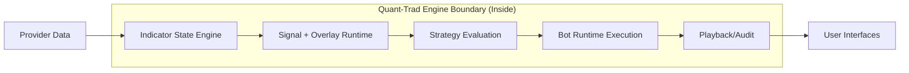

# Quant-Trad Engine Overview (Plain Language)

This document explains the "engines" in Quant-Trad as simply as possible.
It is written for someone who has never coded before.

---

## Documentation Header

- `Component`: Quant-Trad engine surface (indicator, strategy, runtime, playback)
- `Owner/Domain`: Platform Architecture
- `Doc Version`: 1.2
- `Related Contracts`: [[00_system_contract]], [[01_runtime_contract]], [[BOT_RUNTIME_DOCS_HUB]], [[BOT_RUNTIME_ENGINE_ARCHITECTURE]], [[BOT_RUNTIME_SERVICE_ARCHITECTURE]], [[INDICATOR_AUTHORING_CONTRACT]], [[REGIME_CLASSIFICATION_SYSTEM]]

## 1) Problem and scope

This overview defines how engine responsibilities connect so all outputs share one causal timeline.

In scope:
- layer boundaries,
- canonical runtime flow,
- cross-layer data handoff expectations.

### Non-goals

- implementation-level API documentation,
- provider-specific integration details,
- per-indicator algorithm details.

Upstream assumptions:
- market data feed and storage layers provide ordered candle/history inputs.

## 2) Architecture at a glance

Boundary:
- inside: Quant-Trad engines and contracts
- outside: data providers, external exchanges, UI consumers

## Runtime Package Map

Current bot runtime package layout:
- `src/engines/bot_runtime/runtime/core/`: shared runtime state models/constants/helpers
- `src/engines/bot_runtime/runtime/components/`: reusable runtime components (series runner, intrabar, buffers, policy, sinks)
- `src/engines/bot_runtime/runtime/mixins/`: orchestration behavior split by concern (setup, execution loop, events, state/streaming)
- `src/engines/bot_runtime/runtime/runtime.py`: `BotRuntime` assembly surface
- `portal/backend/service/bots/bot_runtime/runtime/`: compatibility adapters/re-exports for service-layer callers

## Strategy + Storage Package Map

Current series preparation layout:
- `portal/backend/service/bots/bot_runtime/strategy/series_builder.py`: `SeriesBuilder` assembly facade
- `portal/backend/service/bots/bot_runtime/strategy/series_builder_parts/lifecycle.py`: builder lifecycle/reset/load concerns
- `portal/backend/service/bots/bot_runtime/strategy/series_builder_parts/live_updates.py`: live refresh + strategy evaluation helpers
- `portal/backend/service/bots/bot_runtime/strategy/series_builder_parts/series_construction.py`: series construction + incremental per-bar evaluation
- `portal/backend/service/bots/bot_runtime/strategy/series_builder_parts/overlays_regime.py`: overlay and regime projection helpers
- `portal/backend/service/bots/bot_runtime/strategy/series_builder_parts/models.py`: `StrategySeries` runtime payload model

Current storage layout:
- `portal/backend/service/storage/repos/`: cohesive repository modules grouped by domain (`bots`, `runs`, `trades`, `runtime_events`, etc.)
- `portal/backend/service/storage/storage.py`: compatibility facade that re-exports repository APIs for existing imports

## Mentor Notes (Non-Normative)

- Read this as one pipeline with different responsibilities, not separate products.
- If two layers disagree, inspect ordering and source-of-truth boundaries first.
- Snapshots are the handoff language between indicator computation and downstream consumers.
- Playback is a debugger for causality, not a separate simulation truth.
- This section is explanatory only.
- If this conflicts with Strict contract, Strict contract wins.

## 3) Inputs, outputs, and side effects

- Inputs: candle streams, strategy rules, runtime configuration, user run controls.
- Dependencies: runtime contract, execution contract, indicator authoring contract.
- Outputs: indicator snapshots, signals/overlays, strategy intents, runtime events, playback artifacts.
- Side effects: persistence writes, execution adapter calls, telemetry/network publishing.

## 4) Core components and data flow

- Indicator state engines maintain per-bar state and emit snapshots.
- Signal and overlay runtimes consume snapshots only.
- Strategy evaluation consumes indicator outputs and emits intents.
- Bot runtime applies execution realism and emits canonical events.
- Playback consumes derived runtime state for audit/debug.

## 5) State model

Authoritative state:
- canonical runtime event stream and deterministic per-engine timeline.

Derived state:
- snapshots, overlays, strategy previews, playback views.

Persistence boundaries:
- persisted: runtime events and run artifacts.
- in-memory: active engine state between snapshots.

## 6) Why this architecture

- Clear layer ownership prevents semantic drift.
- Snapshot-first consumption keeps signal/overlay/runtime alignment.
- Execution realism is isolated in bot runtime while preserving auditability.

## 7) Tradeoffs

- Strict ownership boundaries reduce flexibility for ad-hoc shortcuts.
- Single-path semantics can require contract evolution before adding features.
- Deterministic replay constraints increase implementation discipline cost.

## 8) Risks accepted

- Cross-layer contract drift can break explainability.
- Missing snapshot fields can block downstream consumers.
- Temporary lag between runtime and UI projections can occur under load.

## 9) Strict contract

- Canonical flow: `initialize -> apply_bar -> snapshot`.
- Retry/idempotency semantics: runtime transport is at-least-once; consumers dedupe by identity/cursor.
- Degrade state machine:
  - `RUNNING`: canonical flow executing.
  - `DEGRADED`: partial component failure with bounded output.
  - `HALTED`: contract violation or unrecoverable runtime failure.
- In-flight work:
  - degraded components stop producing invalid artifacts;
  - recoverable components continue only if contract invariants still hold.
- Sim vs live differences: no differences in contract semantics; execution adapter behavior can differ.
- Canonical error codes/reasons when emitted:
  - `RUNTIME_EXCEPTION`,
  - `CONTRACT_VIOLATION`,
  - `SNAPSHOT_MISSING_FIELD`.
- Validation hooks (applicable):
  - code: contract assertions on timeline and snapshot requirements,
  - logs: contract violation and runtime exception events with IDs/cursors,
  - storage: runtime event/snapshot cursor continuity,
  - tests: cross-layer alignment tests for signal/overlay/runtime paths.

## 10) Versioning and compatibility

- Contract versions are explicit in runtime events/snapshots when persisted.
- Additive contract evolution is preferred.
- Breaking changes require explicit version bump and compatibility handling.

---

## Detailed Overview

## Quick Mental Model

Think of Quant-Trad like a factory line:

1. Market data comes in (candles)
2. Indicator state is updated step-by-step
3. Signals and overlays are produced from that same state
4. Strategy decides whether conditions are met
5. Bot executes orders with risk/execution realism
6. Playback shows what happened and why

The key idea: all steps use the same timeline of knowledge.

---

## The Engines We Have

## 1) Indicator State Engine

Purpose:
- Keeps indicator state up to date as each candle arrives.

How it works:
- `initialize` -> create empty state
- `apply_bar` -> update state with one new candle
- `snapshot` -> produce a safe "current view" of known data

Why it matters:
- Signals and overlays come from this snapshot.
- This prevents drift between what we calculate and what we display.

---

## 2) Signal Runtime (Indicator Signal Evaluation)

Purpose:
- Reads indicator snapshots and emits indicator signals.

Important note:
- This is not the trade execution engine.
- It is signal evaluation built on top of indicator state snapshots.

Current status:
- Runtime per-bar snapshot signal emission is the canonical path.

Direction:
- Do not introduce batch/research signal generation paths for platform behavior.

---

## 3) Overlay Runtime (Indicator Overlay Projection)

Purpose:
- Turns indicator snapshot data into chart visuals (boxes, markers, bubbles, lines).

Rule of thumb:
- Overlays are derived from the same snapshot timeline as signals.
- If signals and overlays use different timelines/timeframes, trust drops.

---

## 4) Strategy Evaluation Engine (Decision Layer)

Purpose:
- Combines indicator signals according to strategy rules.

Example:
- Rule can require one indicator condition, or multiple conditions (`all` / `any`).

What it does not do:
- It does not execute trades with fees/slippage/ATM realism.

---

## 5) Bot Runtime Engine (Execution Layer)

Purpose:
- Runs strategy decisions through realistic execution behavior over time.

Includes:
- risk controls
- fills/exits
- fees/slippage
- order lifecycle

This is the true execution engine.

---

## 6) Playback Engine (Audit/Debugger Surface)

Purpose:
- Replays outcomes so humans can verify timing and decisions.

Should show:
- what was known at each moment
- what signal/decision happened
- what execution outcome followed

Playback is not a demo; it is a correctness debugger.

---

## How They Work Together

Canonical flow:

1. Candle arrives
2. Indicator State Engine updates
3. Snapshot is produced
4. Signal Runtime reads snapshot
5. Overlay Runtime reads snapshot
6. Strategy Evaluation consumes signals
7. Bot Runtime executes decisions
8. Playback visualizes the same timeline

---

## Where Confusion Usually Happens

1. "Signal engine" vs "execution engine"
- Signal runtime evaluates indicator signals.
- Bot runtime executes trades.

2. Multiple paths for similar outputs
- If overlays and signals are computed by different paths/timeframes, they can disagree.

3. Indicator-specific logic outside indicator modules
- This makes ownership unclear and increases drift risk.

---

## Indicator Module Structure (Private Plugin-Style)

For each indicator:

- `src/indicators/<name>/domain/`
- `src/indicators/<name>/signals/`
- `src/indicators/<name>/overlays/`
- `src/indicators/<name>/indicator.py`
- `src/indicators/<name>/plugin.py`

Benefits:
- One home per indicator
- Easier maintenance
- Cleaner onboarding
- Better consistency across signals/overlays/runtime

---

## Target Path (What We Are Standardizing To)

1. Indicator runtime behavior lives inside indicator modules.
2. Plugin files are thin wiring only (manifest + engine factory), not business logic.
3. Signals and overlays for an indicator come from the same indicator-local runtime code.
4. Strategy composes indicators; indicators do not own cross-indicator strategy composition.
5. No parallel fallback path for the same artifact type.

### No-Fallback Policy

For any artifact class (signal, overlay, projection):
- one canonical runtime path
- one canonical contract
- fail loud when required payload fields are missing

This prevents silent drift between "what fired" and "what was shown."

---

## Platform Rule Reference

Normative guarantees for timeline and behavior are centralized in `## 9) Strict contract`.
