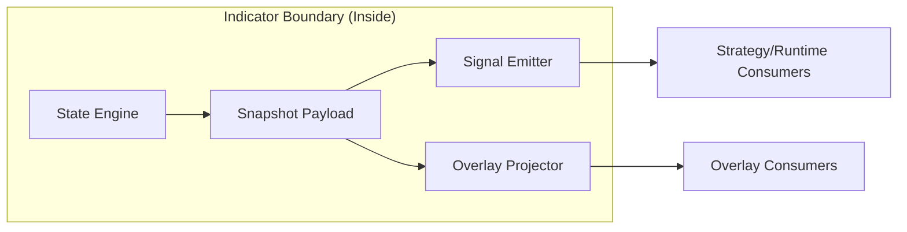

# Indicator Authoring Contract

This document defines how to add or modify indicators without creating drift.

## Documentation Header

- `Component`: Indicator authoring and runtime integration contract
- `Owner/Domain`: Indicators / Runtime Contracts
- `Doc Version`: 1.1
- `Related Contracts`: [[00_system_contract]], [[01_runtime_contract]], [[ENGINE_OVERVIEW]], `src/engines/indicator_engine/contracts.py`, `src/engines/indicator_engine/plugins.py`

## 1) Problem and scope

This contract defines how indicator modules must be authored so QuantLab, strategy preview, bot runtime, and playback stay semantically aligned.

In scope:
- indicator module layout,
- plugin registration,
- snapshot-first signal/overlay behavior.

### Non-goals

- indicator strategy composition ownership,
- generic signal marketplace/discovery behavior,
- backfill/migration logic in runtime paths.

Upstream assumptions:
- canonical candle series and indicator config are available,
- plugin runtime contracts are loaded correctly.

## 2) Architecture at a glance

Boundary:
- inside: indicator module code, plugin manifest, snapshot payload contract
- outside: strategy composition and bot execution layers

## Mentor Notes (Non-Normative)

- Treat indicator modules as self-contained labs: state, signals, and overlays move together.
- Snapshot payload is the contract boundary; downstream logic should not inspect hidden mutable state.
- Most drift bugs come from parallel logic paths, not from one path being slow.
- Registration simplicity matters because ambiguity becomes runtime drift.
- This section is explanatory only.
- If this conflicts with Strict contract, Strict contract wins.

## 3) Inputs, outputs, and side effects

- Inputs: per-bar candle updates, indicator params, plugin manifest registration calls.
- Dependencies: indicator engine contract, snapshot semantics contract, plugin registry guarantees.
- Outputs: indicator snapshots, indicator signals, overlay entries, structured logs.
- Side effects: plugin registry mutations at startup, runtime log emissions, optional persistence via upstream consumers.

## 4) Core components and data flow

- `engine_factory` produces state engine instances.
- State engine executes `initialize/apply_bar/snapshot`.
- `signal_emitter` and `overlay_projector` consume snapshot payload only.
- Plugin manifest provides the single registration surface and contract metadata.

## 5) State model

Authoritative state:
- indicator engine timeline state derived from canonical candle stream.

Derived state:
- snapshot payload, emitted signals, emitted overlays.

Persistence boundaries:
- persisted: only when downstream systems store emitted artifacts.
- in-memory: engine mutable state and per-evaluation transient payloads.

## 6) Why this architecture

- Indicator-local ownership prevents shared-engine drift.
- Snapshot-only downstream reads enforce one knowledge timeline.
- Single manifest registration removes duplicate discovery paths.

## 7) Tradeoffs

- Strict plugin contract increases up-front authoring discipline.
- Missing snapshot fields require contract changes before feature rollout.
- No fallback paths reduce resilience to malformed payloads but preserve correctness.

## 8) Risks accepted

- Misregistered plugins can block indicator availability.
- Snapshot schema drift can break consumers.
- Indicator-local runtime bugs can suppress signal emission.

## 9) Strict contract

- One registration path: `register_plugin(IndicatorPluginManifest(...))`.
- One artifact path: snapshots drive signals/overlays; no alternate reconstruction.
- Retry/idempotency semantics: per-bar evaluation is deterministic for ordered inputs; external delivery retries are upstream concern and are not guaranteed by indicator modules.
- Degrade state machine:
  - `RUNNING`: valid snapshot generation and emissions.
  - `DEGRADED`: indicator contract violation detected; emissions suppressed.
  - `HALTED`: unrecoverable initialization/runtime failure.
- In-flight work:
  - on `DEGRADED`, current evaluation fails loud and no substitute artifact is emitted.
- Sim vs live differences: no differences in indicator contract semantics.
- Canonical error codes/reasons when emitted:
  - `indicator_state_init_failed`,
  - `indicator_state_apply_failed`,
  - `indicator_state_finalize_failed`,
  - `snapshot_contract_missing_field`.
- Validation hooks (applicable):
  - code: manifest registration and snapshot payload validation paths,
  - logs: indicator lifecycle/error events with indicator/symbol/timeframe context,
  - storage: downstream emitted artifact timing consistency (`known_at`),
  - tests: indicator runtime contract and signal/overlay emission suites.

## 10) Versioning and compatibility

- Snapshot payload changes are additive by default.
- Breaking payload semantics require explicit snapshot schema/version handling.
- Incompatible payloads must fail loud with actionable context.

---

## Detailed Contract

## Purpose

Every indicator must produce consistent outputs across:
- QuantLab overlays
- Indicator signals
- Strategy preview
- Bot runtime
- Playback

Consistency requirement:
- All derived outputs must come from one runtime timeline:
`initialize -> apply_bar -> snapshot`

## Required Structure

Each indicator owns its behavior in one module tree:

- `src/indicators/<name>/indicator.py`
- `src/indicators/<name>/state_engine.py` (if custom runtime state behavior is needed)
- `src/indicators/<name>/signals/`
- `src/indicators/<name>/overlays/`
- `src/indicators/<name>/plugin.py`

Shared runtime contracts and orchestration live in:
- `src/engines/indicator_engine/`

## Registration Contract

Use a single manifest registration point in `plugin.py`:
- `register_plugin(IndicatorPluginManifest(...))`

Manifest is the source of truth for:
- `indicator_type`
- `engine_factory`
- `evaluation_mode`
- `signal_emitter`
- `overlay_projector`
- `signal_overlay_adapter`
- `signal_rules`

Do not register indicator logic through alternate decorator discovery paths.

## Snapshot-First Rules

1. Signals and overlays must read from snapshot payload.
2. If a required field is missing from snapshot payload, extend snapshot contract.
3. Do not read mutable engine internals from outside engine/state logic.
4. Missing required snapshot data must fail loud with actionable context.

## Runtime Signal Semantics (Canonical)

Signals are runtime per-bar only:
- `signal_emitter(snapshot_payload, candle, previous_candle)`

Batch/research signal generation is legacy and must not be used for platform behavior.

Any consumer needing signals must use runtime snapshot semantics so strategy preview,
bot runtime, overlays, and playback remain aligned.

## Logging Contract

At minimum, indicator logs include when available:
- `indicator_id`, `indicator_type`, `indicator_version`
- `symbol`, `timeframe`
- `bar_time` / `known_at`
- `strategy_id`, `run_id`, `bot_id` (in runtime contexts)

Log lifecycle boundaries, not per-candle noise by default.

## No-Fallback Policy

For each artifact class (signals, overlays, projections):
- one canonical computation path
- one canonical contract
- no hidden fallback reconstruction paths

If data is invalid or missing:
- fail loud
- include IDs/context
- do not silently patch or substitute

## Author Checklist (Use Before Merge)

1. Indicator has a single `plugin.py` manifest.
2. Signal/overlay logic is indicator-local (not in shared engine modules).
3. Runtime outputs are derived from snapshot payload only.
4. Required snapshot fields are explicit and validated.
5. No alternate registration/discovery path was introduced.
6. Logs are structured and include correlation context.
7. `py_compile` (or tests) passes for touched modules.
8. Strategy preview and bot runtime use the same underlying indicator semantics.

## Anti-Patterns (Reject)

- Indicator business logic inside shared engine package.
- Multiple registration systems for the same indicator behavior.
- Separate overlay/signal timelines with different source semantics.
- Silent fallback logic that masks contract violations.
