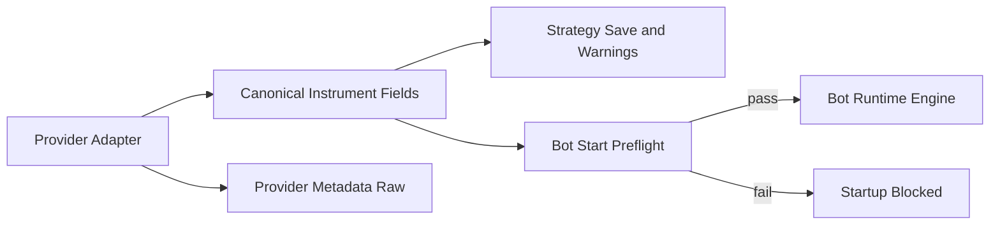

# Instrument Contract and Futures-Only Runtime (v1)

## Documentation Header

- `Component`: Instrument contract normalization and runtime readiness gates
- `Owner/Domain`: Market Instruments / Bot Runtime Preflight
- `Doc Version`: 1.1
- `Related Contracts`: `docs/architecture/BOT_RUNTIME_ENGINE_ARCHITECTURE.md`, `src/engines/bot_runtime/core/execution_profile.py`, `portal/backend/service/bots/config_service.py`

## 1) Problem and scope

This component enforces one canonical instrument contract for runtime behavior and hard readiness gates for futures/perps runtime v1.

In scope:
- canonical instrument fields used by runtime,
- preflight readiness checks at bot start,
- strategy-time warning behavior.

### Non-goals

- spot runtime readiness support in v1,
- provider-specific payload semantics in engine logic,
- runtime schema migration/backfill behavior.

Upstream assumptions:
- provider services populate instrument metadata correctly,
- strategy/instrument links are present at preflight time.

## 2) Architecture at a glance

Boundary:
- inside: instrument contract compiler, readiness validator, runtime preflight
- outside: provider-specific raw metadata acquisition

See the architecture diagram in the detailed sections below.

## Mentor Notes (Non-Normative)

- This is a compile-time gate for runtime safety, not a runtime patch mechanism.
- Canonical field mapping is the semantic lock; provider raw metadata is diagnostic context.
- Soft warnings keep editing flow usable; hard blockers protect runtime correctness.
- Most failures here are configuration and mapping quality issues, not execution bugs.
- This section is explanatory only.
- If this conflicts with Strict contract, Strict contract wins.

## 3) Inputs, outputs, and side effects

- Inputs: instrument metadata snapshots, strategy instrument links, bot start requests.
- Dependencies: canonical instrument field contract, execution profile compiler, runtime readiness policy.
- Outputs: readiness pass/fail result, aggregated startup errors, strategy-time warnings.
- Side effects: startup blocking on hard failures, operator-visible warnings, log emissions.

## 4) Core components and data flow

- Provider/instrument services map source metadata into canonical instrument fields.
- Runtime preflight compiles execution profiles from canonical fields.
- Strategy editing surfaces warnings; bot start enforces hard blockers.
- Runtime engine consumes compiled profile only, not provider raw payloads.

## 5) State model

Authoritative state:
- persisted instrument snapshots and runtime execution profile inputs.

Derived state:
- readiness validation results and warning collections.

Persistence boundaries:
- persisted: instrument records and strategy instrument links.
- in-memory: per-request readiness evaluation artifacts.

## 6) Why this architecture

- Canonical fields remove provider-coupled behavior from runtime core.
- Hard startup gates prevent silent runtime misconfiguration.
- Shared compiler path keeps strategy warnings and runtime behavior consistent.

## 7) Tradeoffs

- Futures-first policy blocks broader instrument coverage in v1.
- Strict startup validation can reduce convenience for partially configured bots.
- Canonical mapping requires ongoing provider-field maintenance.

## 8) Risks accepted

- Missing canonical fields can block bot startup.
- Incorrect provider mapping can propagate invalid readiness decisions.
- Drift between UI warnings and preflight errors can confuse operators.

## 9) Strict contract

- Engine semantics read canonical instrument fields only.
- Retry/idempotency semantics: preflight checks are deterministic per request input; no exactly-once guarantees are provided for repeated calls.
- Degrade state machine:
  - `READY`: all instruments pass hard checks.
  - `DEGRADED`: strategy edit-time warnings exist but runtime not started.
  - `HALTED`: bot start blocked by hard readiness error.
- In-flight work:
  - on `HALTED`, runtime launch does not begin.
- Sim vs live differences: no differences in readiness contract semantics.
- Canonical error codes/reasons when emitted:
  - `RUNTIME_INSTRUMENT_UNSUPPORTED`,
  - `RUNTIME_MARGIN_RATES_MISSING`,
  - `RUNTIME_PROFILE_COMPILE_FAILED`.
- Validation hooks (applicable):
  - code: readiness validator and runtime profile compiler checks,
  - logs: startup block reasons and strategy warning emission,
  - storage: instrument snapshot fields used by readiness gates,
  - tests: readiness and runtime profile compilation test coverage.

## 10) Versioning and compatibility

- Canonical instrument contract evolution is additive by default.
- Breaking field/semantic changes require explicit profile and validator compatibility updates.
- Incompatible runtime profiles fail loud at compile/readiness boundaries.

---

## Detailed Design

## Why this exists

We want one canonical instrument contract for engine behavior.
Provider-specific payloads are still useful, but engine semantics do not depend on them.

For v1 runtime, we also want strict execution readiness:

- strategy can be created with soft warnings
- bot start is blocked unless instruments are futures/perps and margin config is present

## What was implemented now

### 1) Canonical instrument fields are expanded

Provider implementations now populate these engine fields in `metadata.instrument_fields`:

- `qty_step`
- `max_qty`
- `min_notional`

These fields are also exposed in top-level instrument payloads for runtime consumers.

### 2) Engine no longer relies on `provider_metadata` for qty constraints

`resolve_amount_constraints(...)` now reads canonical fields only:

- top-level instrument fields
- `metadata.instrument_fields` fallback

It no longer reads `metadata.provider_metadata` or provider raw payloads.

### 3) Strategy remains soft-fail

Strategy instrument sync still allows save/update, but adds warnings when:

- instrument type is not futures/perps (runtime v1 unsupported)
- margin rates are missing for derivatives instruments

Warnings are visible in strategy instrument messages.

### 4) Bot start has hard readiness blockers

At bot startup preflight:

- only futures/perps instruments are allowed for runtime v1
- each derivatives instrument must have valid `margin_rates`

If any instrument fails, startup is blocked with a single aggregated error.

## Architecture boundary: canonical vs provider-specific

### Canonical contract (engine-owned)

Engine behavior depends on:

- `instrument_type`
- `tick_size`, `tick_value`, `contract_size`
- `min_order_size`, `qty_step`, `max_qty`, `min_notional`
- `maker_fee_rate`, `taker_fee_rate`
- `margin_rates`
- `base_currency`, `quote_currency`
- `can_short`, `short_requires_borrow`, `has_funding`

### Provider metadata (provider-owned)

`metadata.provider_metadata` is retained for:

- diagnostics
- UI detail views
- provider troubleshooting

Engine semantics do not read it.

## Current futures-coupled hotspots (intentional for v1)

These areas are tailored to futures-style assumptions and are scheduled for revisit when adding richer swap/perp behavior:

1. `margin.py`
- `FuturesMarginCalculator` assumes simple notional * rate model (+ fee/safety buffers)
- session model is `intraday` vs `overnight`

2. `wallet.py` + `wallet_gateway.py`
- margin lock/unlock is proportional by filled qty using `trade_id` lifecycle
- no maintenance margin model
- no liquidation model
- no funding accrual model

3. `core/domain/engine.py` (+ `core/domain/position.py`)
- `_cap_qty_by_margin(...)` assumes futures-style per-contract margin sizing
- `_resolve_tp_step(...)` for derivatives assumes discrete contract-style step handling

4. Execution lifecycle
- explicit trade lifecycle events (`ENTRY_FILL` / `EXIT_FILL`) are futures-friendly
- partial/micro-fill modeling is still basic

## What swaps/perps expansion will likely need

When you add broader derivative support, consider splitting contracts by concern:

1. `InstrumentExecutionConstraints` (qty/min/max/notional/tick)
2. `MarginModel` interface (initial + maintenance + side/session/subtype logic)
3. `CollateralModel` interface (lock/unlock, cross vs isolated behavior)
4. `FundingModel` interface (funding interval, accrual posting, pnl impact)
5. `DerivativeSubtype` in canonical contract (`future`, `perp`, `swap`)

## High-level flow (current)

## Practical tradeoff

This design is intentionally strict at bot start and lenient at strategy creation:

- fast strategy iteration
- safe runtime launch
- clear boundary between draft config and executable config
