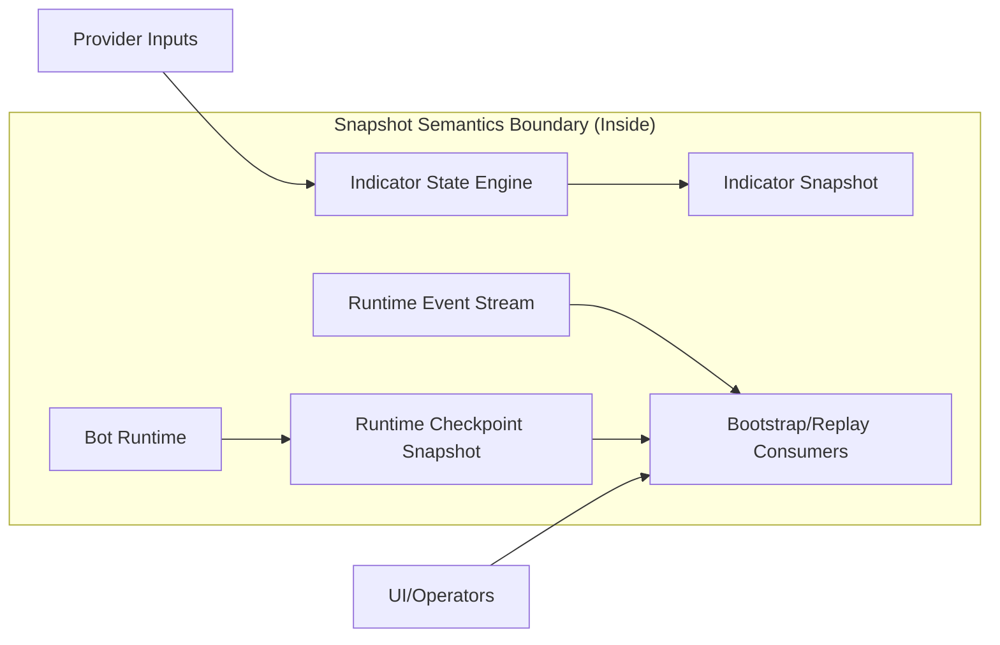

# Snapshot Semantics Architecture (v1)

## Documentation Header

- `Component`: Snapshot semantics across indicator runtime and bot runtime
- `Owner/Domain`: Runtime Contracts
- `Doc Version`: 1.2
- `Related Contracts`: `docs/architecture/RUNTIME_EVENT_MODEL_V1.md`, `docs/architecture/BOTLENS_LIVE_DATA_ARCHITECTURE.md`, `src/engines/indicator_engine/contracts.py`, `portal/backend/service/storage/storage.py`

## 1) Problem and scope

This component defines snapshot behavior so observability, persistence, replay, and runtime decisions do not drift.

In scope:
- indicator state snapshots,
- runtime checkpoint snapshots,
- cursor/version semantics and reconstruction guarantees.

### Non-goals

- using snapshots as canonical audit history,
- allowing artifact-specific alternate reconstruction paths,
- runtime backfill/migration of historical snapshot rows.

Upstream assumptions:
- canonical runtime events are available and ordered,
- candle/input streams are deterministic for the same cursor,
- producers include required cursor and timing fields.

## 2) Architecture at a glance

Boundary:
- inside: snapshot producers, envelope validators, snapshot persistence/checkpoint consumers
- outside: provider data acquisition and UI rendering implementations

## Mentor Notes (Non-Normative)

- Snapshots are camera frames; canonical events are the storyline.
- Cursors (`revision`, `snapshot_seq`, `seq`) are the continuity keys between frames.
- Fast bootstrap is a performance goal; authority remains with canonical contracts.
- When mismatch appears, rebuild/resync is safer than partial reconciliation.
- This section is explanatory only.
- If this conflicts with Strict contract, Strict contract wins.

## 3) Inputs, outputs, and side effects

- Inputs: per-bar runtime progression, runtime event stream updates, bootstrap/catchup requests.
- Dependencies: runtime event contract, indicator state engine contract, storage persistence guarantees for cursors.
- Outputs: snapshot envelopes with cursor/version metadata, checkpoint rows, bootstrap payloads.
- Side effects: writes to snapshot tables and event tables, telemetry/network publication, rebuild operations on incompatibility.

## 4) Core components and data flow

- Indicator engines produce `IndicatorStateSnapshot` from deterministic state progression.
- Bot runtime produces checkpoint snapshot envelopes with `run_id` and `snapshot_seq`.
- Telemetry/event pipelines persist normalized runtime events for canonical replay.
- Bootstrap consumers recover state by cursor and then resume streaming deltas.

## 5) State model

Authoritative state:
- runtime: append-only runtime events (`portal_bot_run_events`),
- indicator: deterministic engine timeline from canonical input stream.

Derived state:
- snapshot payloads,
- BotLens bootstrap views,
- overlay/signal projection artifacts.

Persistence boundaries:
- persisted: runtime events, checkpoint snapshot rows, schema/cursor fields.
- in-memory: transient projection caches and per-request materialization state.

## 6) Why this architecture

- Canonical events preserve auditability and deterministic causality.
- Snapshot checkpoints reduce bootstrap latency and operational load.
- Cursor/version rules prevent hidden divergence between live and rebuilt views.

## 7) Tradeoffs

- Storing both events and snapshots increases storage footprint.
- Snapshot contract discipline adds schema management overhead.
- Strict incompatibility handling can force resync/rebuild flows.

## 8) Risks accepted

- Snapshot payload drift risk across producers/consumers.
- Operational lag risk between checkpoint updates and live stream progression.
- Contract mismatch risk when incompatible schema changes are deployed out of order.

## 9) Strict contract

- Authority: snapshots are derived, not canonical runtime truth.
- Determinism: fixed prior state + canonical input cursor must produce equivalent snapshot output.
- Cursor monotonicity:
  - indicator snapshots use monotonic `revision`,
  - runtime snapshots/events use monotonic `snapshot_seq`/`seq` within run scope.
- Envelope minimums: `schema_version`, cursor fields, `known_at` (or equivalent), payload body.
- Retry/idempotency semantics:
  - runtime snapshot/event delivery is at-least-once,
  - idempotency by event/snapshot identity and monotonic cursor checks,
  - exactly-once is not guaranteed.
- Degrade state machine:
  - `RUNNING`: snapshot generation and consumption healthy.
  - `DEGRADED`: cursor/schema mismatch or partial producer failure; stale/read-only modes may apply.
  - `HALTED`: incompatible schema or unrecoverable persistence error.
- In-flight work:
  - in `DEGRADED`, new deltas are not trusted until resync/rebuild,
  - in `HALTED`, snapshot consumption path stops until recovery.
- Sim vs live differences: no differences in snapshot contract semantics; cadence differs by runtime mode.
- Canonical error codes/reasons when emitted:
  - `SNAPSHOT_SCHEMA_INCOMPATIBLE`,
  - `SNAPSHOT_CURSOR_NON_MONOTONIC`,
  - `SNAPSHOT_REBUILD_REQUIRED`,
  - `SEQUENCE_GAP`.
- Validation hooks (applicable):
  - code: schema/cursor checks in snapshot/event persistence and ingest paths,
  - logs: incompatibility and rebuild-required events with cursor context,
  - storage: monotonic snapshot/event cursor constraints,
  - tests: deterministic rebuild equivalence and cursor monotonicity suites.

## 10) Versioning and compatibility

- `schema_version` is required on persisted/cross-process snapshot envelopes.
- Additive fields are preferred.
- Breaking shape/semantic changes require explicit version bump.
- Incompatible snapshots are rejected; recovery path is rebuild/resync from canonical sources.

---

## Detailed Design Notes

- Indicator snapshots are emitted from `initialize -> apply_bar -> snapshot` state progression.
- Runtime checkpoints are optimization artifacts for bootstrap and operational recovery.
- Runtime events remain canonical for audit and deterministic replay.
