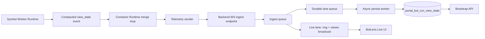

# Telemetry Emit ms Explainer (Bot Runtime -> BotLens)

## Documentation Header

- `Component`: Bot runtime telemetry publish path
- `Owner/Domain`: Bot Runtime / Portal Backend
- `Doc Version`: 2.0
- `Related Code`:
  - `portal/backend/service/bots/container_runtime.py`
  - `portal/backend/service/bots/telemetry_stream.py`
  - `portal/backend/service/storage/repos/runtime_events.py`
  - `portal/backend/controller/bots.py`
  - `portal/frontend/src/components/bots/BotLensLiveModal.jsx`

## 1) What is `telemetry_emit_ms` in simple terms?

`telemetry_emit_ms` is the time spent by the container runtime trying to deliver one telemetry payload to backend ingest.

In plain English:
- "How long did this cycle wait while pushing the update to backend?"

It is measured around the send call in the container loop.

What it includes:
- JSON serialization of payload
- socket send time
- waiting on network/TCP backpressure
- sender retry/reconnect overhead (when needed)

What it does **not** include:
- queue drain from worker processes (`queue_drain_ms`)
- merge logic (`merge_ms`)
- DB status update timing (`status_write_ms`)

## 2) High-level data flow

## 3) Where `telemetry_emit_ms` sits in the cycle

Per container cycle:
1. Drain worker queues (`queue_drain_ms`)
2. Merge latest worker states (`merge_ms`)
3. Build `view_state` envelope (when there is a new event)
4. Send telemetry payload to backend ingest (**this is `telemetry_emit_ms`**)
5. Persist/update bot runtime status (`status_write_ms`)
6. Sleep until next target interval

Important detail:
- `cycle_seq` = every loop iteration
- `view_seq` = only when a new `view_state` is emitted

So a high `telemetry_emit_ms` directly increases cycle time.

## 4) What is a `view_state checkpoint`?

A `view_state checkpoint` is the latest durable BotLens state for `(bot_id, run_id, series_key)` stored in:
- `portal_bot_run_view_state`

It is an upserted materialized row, not an append-only history table.

It is used for:
1. **Bootstrap**: when BotLens opens, backend returns latest checkpoint.
2. **Recovery fallback**: if in-memory replay cannot satisfy `since_seq`, viewer can be reseeded from latest checkpoint.
3. **Read models**: services like runtime capacity read latest runtime summary from this row.

Not used for:
- full historical replay of every telemetry event.

## 5) Who consumes what?

### Producer side
- Worker runtime emits compact `view_state` events.
- Container runtime merges and sends telemetry to backend ingest.

### Backend ingest side
- Telemetry hub receives payloads on `/api/bots/ws/telemetry/ingest`.
- Payload is queued into an ingest queue (fast handoff).
- Ingest worker trims/normalizes payload and computes stream metrics.
- **Live lane** (fast path):
  - append to in-memory replay ring
  - broadcast to connected viewers
- **Durable lane** (async path):
  - enqueue latest `view_state` checkpoint write
  - persist worker upserts `portal_bot_run_view_state`

### Frontend side
- BotLens gets initial state from bootstrap API (`/lens/bootstrap`).
- Then listens to live WS stream (`/api/bots/ws/{bot_id}`).
- If reconnect happens, it requests `since_seq` and can replay from in-memory ring.
- Historical/deep history stays in DB paths, not periodic candle polling.

## 6) Why can `telemetry_emit_ms` still become large?

Because send time is also backpressure time.

Common reasons:
1. Backend ingest queue is filling (`ingest_queue_depth` rising).
2. TCP/socket backpressure blocks sender `send()`.
3. Viewer fan-out path is saturated.
4. Transient network stalls or receiver event-loop stalls.
5. Payload still heavy (especially overlays) even when candle count is bounded.

This means:
- You can have small `merge_ms` and small `queue_drain_ms`,
- but still large `telemetry_emit_ms` if ingest/broadcast cannot drain quickly enough.

## 7) Practical mental model

Think of telemetry as a conveyor belt:
- Producer puts boxes on belt every ~250ms.
- Consumer opens each box, writes latest checkpoint, and forwards to viewers.

`telemetry_emit_ms` grows when the consumer side cannot take boxes fast enough, so producer blocks while handing off.

## 8) New metrics to watch

- `payload_bytes`: encoded telemetry payload size from container.
- `ingest_queue_depth`: queued ingest backlog at backend.
- `persist_queue_depth`: queued checkpoint writes.
- `persist_seq_lag`: latest live seq minus last persisted seq for run.
- `persist_lag_ms`: end-to-end lag from enqueue-to-persist in durable lane.

## 9) Terms quick glossary

- `telemetry_emit_ms`: producer-to-ingest handoff time for one cycle.
- `view_state`: compact live state payload for BotLens.
- `view_state checkpoint`: latest durable row in `portal_bot_run_view_state`.
- `live lane`: in-memory ring + broadcast path.
- `durable lane`: async checkpoint persistence path.
- `cycle_seq`: every container loop tick.
- `view_seq`: monotonic sequence of emitted view updates.
- `ring replay`: short-term in-memory event replay for reconnect continuity.
