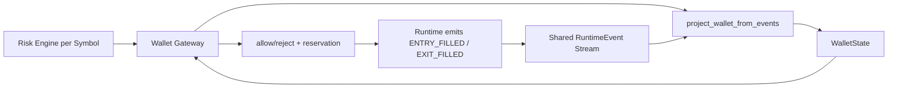
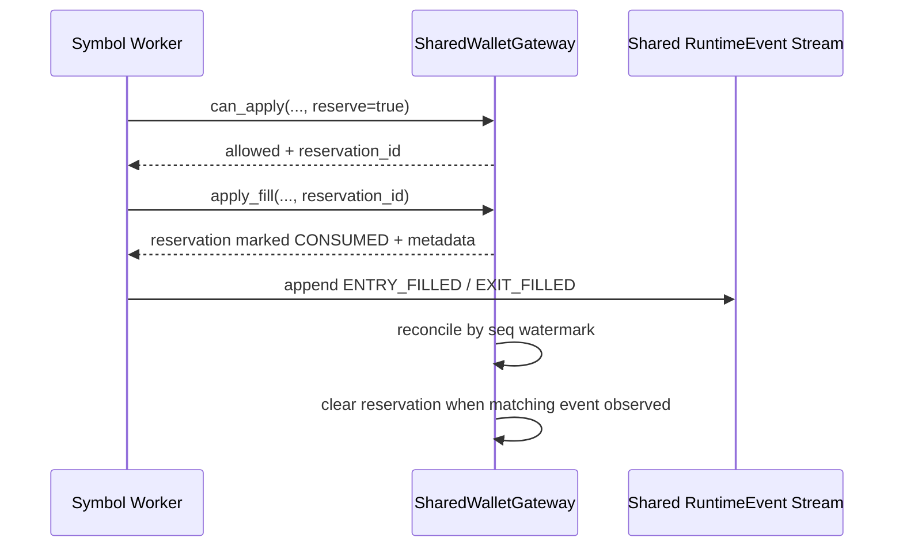

# Wallet Gateway Architecture

## Documentation Header

- `Component`: Shared wallet gateway and reservation coordination
- `Owner/Domain`: Bot Runtime / Wallet
- `Doc Version`: 1.1
- `Related Contracts`: [[BOT_RUNTIME_DOCS_HUB]], [[RUNTIME_EVENT_MODEL_V1]], [[01_runtime_contract]], `src/engines/bot_runtime/core/wallet_gateway.py`, `src/engines/bot_runtime/core/wallet.py`

## 1) Problem and scope

This component enforces capital safety between execution decisions and applied fills across concurrent symbol workers.

In scope:
- `can_apply` validation,
- reservation lifecycle management,
- wallet projection from canonical runtime events.

### Non-goals

- independent parallel wallet ledgers,
- silent overdraft tolerance,
- provider/exchange balance sync ownership.

Upstream assumptions:
- runtime emits canonical wallet-affecting events,
- execution requests include required trade and instrument context.

## 2) Architecture at a glance

Boundary:
- inside: wallet projection, reservation validation/reconciliation, allow/reject decisions
- outside: execution intent generation and external settlement/adapters

See the high-level runtime diagram below for component topology.

## Mentor Notes (Non-Normative)

- Think of reservations as short-lived locks that protect shared collateral decisions.
- Gateway decisions are policy checks; wallet projection provides the current evidence.
- Event-sourced projection keeps wallet state explainable across concurrent workers.
- Conservative rejection under uncertainty protects correctness over throughput.
- This section is explanatory only.
- If this conflicts with Strict contract, Strict contract wins.

## 3) Inputs, outputs, and side effects

- Inputs: entry/exit settlement requests, runtime event stream, reservation metadata.
- Dependencies: runtime event schema, reservation invariants, amount/margin constraints.
- Outputs: allow/reject decisions, reservation IDs/states, projected wallet state, rejection reasons.
- Side effects: reservation state mutations, runtime-event-derived projection updates, diagnostics/log emission.

## 4) Core components and data flow

- `SharedWalletGateway` processes `can_apply` and `apply_fill` lifecycle operations.
- Wallet projection consumes canonical wallet-affecting runtime events.
- Reservation manager tracks `ACTIVE/CONSUMED/RELEASED/EXPIRED/STUCK`.
- Runtime uses gateway responses to continue or reject execution paths.

## 5) State model

Authoritative state:
- canonical runtime events affecting wallet.

Derived state:
- projected balances/free collateral/locked margin,
- reservation status views and diagnostics.

Persistence boundaries:
- persisted: runtime events (authoritative), optional run artifacts.
- in-memory: active reservations and projection cache in runtime process.

## 6) Why this architecture

- one gateway path prevents race-driven capital overspend,
- event-sourced projection preserves audit and deterministic replay,
- reservation lifecycle allows concurrent workers with bounded contention.

## 7) Tradeoffs

- reservation bookkeeping increases runtime complexity,
- shared lock contention can affect throughput,
- stale/missing runtime events can delay projection convergence.

## 8) Risks accepted

- stuck reservations can temporarily block capacity,
- malformed settlement metadata can cause false rejects,
- projection lag can affect near-real-time available collateral view.

## 9) Strict contract

- Wallet truth is derived from canonical runtime events, not ad-hoc mutable balances.
- Retry/idempotency semantics: at-least-once request handling with idempotency by reservation/event identity; exactly-once is not guaranteed.
- Degrade state machine:
  - `RUNNING`: reservations and projections healthy.
  - `DEGRADED`: projection inconsistency or reservation anomalies detected; conservative rejects may increase.
  - `HALTED`: unrecoverable wallet contract failure.
- In-flight work:
  - in `DEGRADED`, pending requests may be rejected conservatively;
  - in `HALTED`, settlement path stops.
- Sim vs live differences: contract semantics are unchanged; adapter fill timing/source differs by mode.
- Canonical error codes/reasons when emitted:
  - `WALLET_INSUFFICIENT_CASH`,
  - `WALLET_INSUFFICIENT_MARGIN`,
  - `WALLET_INSUFFICIENT_QTY`,
  - `WALLET_INSTRUMENT_MISCONFIGURED`,
  - `RESERVATION_INVALID_STATE`.
- Validation hooks (applicable):
  - code: reservation invariant checks and projection guardrails,
  - logs: wallet reject/degrade events with symbol/trade/reason context,
  - storage: runtime event stream consistency for replayed wallet state,
  - metrics: reservation status counts, reject-rate by reason code.

## 10) Versioning and compatibility

- Wallet-affecting event payload schema follows runtime event `schema_version`.
- Additive event field changes are preferred.
- Breaking event or reservation semantic changes require explicit compatibility updates.

---

## Detailed Design

## Purpose

The Wallet Gateway is the safety layer between trade decisions and capital usage.

It answers one core question before a trade fills:

- "Given current wallet state, can this fill be applied safely?"

It also coordinates reservation behavior so concurrent symbol workers do not over-spend shared capital.

## High-Level Role In Runtime

At runtime, each symbol worker has its own risk engine, but all workers share one wallet context.

- Risk engine decides what it wants to do.
- Wallet Gateway validates whether it is financially valid.
- Runtime emits canonical `RuntimeEvent` records.
- Wallet state is derived from replaying those runtime events.

## Why This Exists

Without this boundary:

- workers could race and both spend the same collateral,
- capital checks could drift between code paths,
- wallet state could become impossible to audit.

The gateway centralizes these concerns.

## Main Responsibilities

1. Validate candidate fills (`can_apply`).
2. Reserve required capital to prevent race conditions.
3. Reconcile reservation lifecycle (TTL, consumption, observation, stuck detection).
4. Expose projected wallet state (`project`) for visibility and diagnostics.

## Gateway Modes

Current implementation is intentionally single-path:

- `SharedWalletGateway`:
  Used by multi-process bot runtime.
  Projects from one shared canonical runtime-event stream and shared reservations.

- `BaseWalletGateway`:
  Reusable abstract base contract for future transports.
  It is not a runnable wallet mode by itself.

## Core Data Model

The gateway consumes:

- Canonical runtime events:
  `WALLET_INITIALIZED`, `WALLET_DEPOSITED`, `ENTRY_FILLED`, `EXIT_FILLED`.
- Reservation records:
  temporary holds created between `can_apply` and confirmed runtime events.

Reservation record fields:

- `reservation_id`
- `created_at`
- `expires_at` (TTL)
- `status` (`ACTIVE | CONSUMED | RELEASED | EXPIRED | STUCK`)
- `correlation_id`
- `trade_id` (optional)
- `required_delta` (includes at least `currency`, `collateral_reserved`, `fee_estimate`)
- `seq_created_at` (stream watermark when reservation was created)

Persistence boundary:

- Reservations are transient runtime coordination state (shared process memory for the active run).
- Canonical `RuntimeEvent` records are the persisted source of truth.

Canonical runtime event payload keys used by reconciliation:

- `ENTRY_FILLED.payload.reservation_id`
- `EXIT_FILLED.payload.reservation_id`
- `ENTRY_FILLED.payload.correlation_id` (reservation correlation)
- `EXIT_FILLED.payload.correlation_id` (reservation correlation)

`reservation_id` may be `null` when no reservation was created for that fill path. Reconciliation uses fallback tuple matching only for this backcompat/missing-id case.

Wallet state projection outputs:

- balances,
- locked margin,
- free collateral,
- per-trade margin positions.

## Reservation Lifecycle

Reservations protect the short window between validation and confirmed event append.

Important behavior:

- `can_apply(..., reserve=true)` creates an `ACTIVE` reservation with TTL.
- `apply_fill` requires an `ACTIVE` reservation (when reservation_id is provided), marks it `CONSUMED`, and returns metadata for runtime event payloads.
- `apply_fill` does not directly mutate wallet balances in shared mode.
- Canonical runtime events are the source of wallet truth.

### Hold Accounting Formula

`ACTIVE` reservations reduce projected free collateral by:

- `hold = required_delta.collateral_reserved + required_delta.fee_estimate`

If additional required components are introduced, they must be added through the same `required_delta` contract and included by the same deterministic hold path.

### Reconciliation Rules

Reconciliation runs on each `can_apply` and projection path:

1. `ACTIVE` reservations past `expires_at` become `EXPIRED`.
2. `CONSUMED` reservations are cleared only after a matching canonical event is observed.
3. If a `CONSUMED` reservation is not observed after timeout, it becomes `STUCK` and emits diagnostics (logs).

### Observation Rule (Seq-Based)

Observation uses stream sequence ordering, not event timestamps:

- Shared runtime-event stream events carry monotonic integer `seq`.
- Gateway tracks `last_seen_seq`.
- A reservation is observed only if a matching event exists with:
  - `event.seq > reservation.seq_created_at`, and
  - deterministic match precedence:
    - first: exact `payload.reservation_id`
    - fallback (backcompat when event payload has no reservation_id):
      - ENTRY: `trade_id + correlation_id`
      - EXIT: `trade_id + exit_kind + correlation_id`

This avoids false matches from older events that happen to share identifiers.

## Lock Scope

`SharedWalletGateway` uses one shared lock for the critical section in `can_apply`:

1. reconcile reservations (`EXPIRE`, clear observed `CONSUMED`, mark `STUCK`),
2. project wallet state from canonical events,
3. apply `ACTIVE` reservation holds to projected free collateral,
4. evaluate candidate fill (`wallet_can_apply`),
5. create reservation (if `reserve=true`).

The lock is kept tight to wallet consistency logic only. Event persistence IO happens outside gateway lock ownership.

## Integration With Bot Runtime

### Runtime start

- Container creates shared wallet proxy:
  - shared runtime-event list,
  - shared reservation map,
  - shared lock,
  - shared runtime-event sequence counter.
- Runtime uses `shared_wallet_proxy` (required) and attaches `SharedWalletGateway`.

### During execution

- Entry/exit settlement calls gateway `can_apply`.
- On success, reservation metadata is returned.
- `apply_fill` returns metadata (`reservation_id`, `correlation_id`, `required_delta`, `wallet_delta`) for runtime event payload composition.
- Runtime emits canonical events (with monotonic `seq`) and persists them.
- Events are mirrored into the shared runtime-event stream for cross-process projection.

### BotLens path

BotLens streams from telemetry snapshot lifecycle events.
Runtime canonical execution events and snapshot events share a run id but are filtered by event type for Lens bootstrap/catchup.

## What It Solves

1. Shared-capital correctness across symbol workers.
2. Deterministic replay and auditability from one canonical stream.
3. Reduced coupling between execution logic and mutable wallet maps.
4. Cleaner debugging: wallet state can be recomputed from events.

## Tradeoffs

1. More lock contention under very high worker concurrency.
2. Reservation bookkeeping complexity.
3. Slightly delayed state convergence between `apply_fill` and canonical event append.
4. More dependence on event ordering and append reliability.

These tradeoffs are acceptable because correctness and auditability are prioritized over raw throughput.

## Failure Semantics

- If validation fails, trade is rejected with structured reason and context.
- If reservation expires before fill append, it is marked `EXPIRED` and no longer blocks collateral.
- If reservation is consumed but canonical event does not arrive, it transitions to `STUCK` after timeout and remains visible for diagnostics.
- Projection invariants still guard against invalid margin math (negative locks, over-release, etc.).

## Relation To Runtime Event Model

Wallet Gateway is not a separate ledger system.

It is an execution-time guardrail that reads from and aligns with:

- `RuntimeEvent` contract,
- event-sourced wallet projection rules.

That keeps wallet decisions and audit artifacts semantically consistent.
