# Autonomous Research and Promotion Roadmap

## Status and assessment boundary

This is the ratified governing cross-boundary roadmap. Unimplemented phases
remain direction rather than implementation truth, and this document is never an
authorization to submit external orders. It records the repository state
inspected on 2026-08-05 and defines the evidence and enforcement that must exist
before permissions expand.

The assessment treated documentation as intent and traced executable paths,
composition roots, persisted contracts, reports, experiment orchestration, and
tests. In this document, **production-wired** means reachable through a normal
runtime, backend, CLI, or report composition path. A type, test fixture, draft,
or ADR by itself is not production wiring.

### Ratification and implementation record

The roadmap and Phase 0 semantics were human-ratified on 2026-08-05. The
ratification permanently narrows golden to reproducibility/reconciliation,
retains separate quality and eligibility dimensions, selects strict passive
price penetration for X2, keeps scientific authority before generative strategy
expansion, and keeps L2 work independent until the venue-neutral lifecycle
boundary exists. It also requires `economic_claim_intent` to be immutable per
run so exploratory evidence cannot be relabeled after completion.

Phase 1, Phase 2A, Phase 2B, Phase 3A, Phase 3B, Phase 4, Phase 5, and the
offline Phase 6 ceiling are implemented by the
[Phase 1 economic execution contract](../execution-runtime/PHASE_1_ECONOMIC_EXECUTION_CONTRACT.md),
[Phase 2A venue-neutral execution context](../execution-runtime/PHASE_2A_VENUE_NEUTRAL_EXECUTION_CONTEXT.md),
the [Phase 2B durable canonical order lifecycle](../execution-runtime/PHASE_2B_DURABLE_CANONICAL_ORDER_LIFECYCLE.md),
the [Phase 3A replay-certified book execution](../execution-runtime/PHASE_3A_REPLAY_CERTIFIED_BOOK_EXECUTION.md),
and [Phase 3B passive queue bounds and latency](../execution-runtime/PHASE_3B_PASSIVE_QUEUE_BOUNDS_AND_LATENCY.md),
[scientific research authority](SCIENTIFIC_RESEARCH_AUTHORITY.md), the
[typed strategy/action graph](TYPED_STRATEGY_GRAPH.md), and
[offline research governance](OFFLINE_RESEARCH_GOVERNANCE.md).
The verified inventory below is maintained as current production wiring rather
than the original gap list. Phase 7 and later remain proposed. Phase 6 promotion
means registry state `RESEARCH_CERTIFIED`; no shadow, paper, live-order,
deployment, credential, or capital authority is opened by these implementations.

The first operated campaign exposed a missing distinction between canonical
batch publication time and causally derivable research replay time. The
[research replay availability boundary](RESEARCH_REPLAY_AVAILABILITY.md) now
requires frozen raw receipts, exact aggregate/coverage reconciliation, a pinned
watermark and latency policy, decision-time cross-fact joins, and causal
opportunity admission before a campaign can allocate attempts. Historical
campaign v1 charters remain immutable and non-executable; future searches need
a new v2 identity and sealed assignment.

Market-data acquisition and coverage are deliberately outside the critical
path of this roadmap. The starting assumption is that every required market
fact is causal, complete, frozen, losslessly replayable, and identified by
immutable provenance. The execution system must still declare the fact
capability it consumed, such as bars, spread, aggregated L2, or order-level L3;
perfect source data does not raise the execution-quality class unless the
execution model actually uses it.

## Verified current-state conclusion

Quant Trad is a strong deterministic research runtime with frozen backtest
datasets, causal decision evaluation, explicit entry/exit order semantics,
canonical wallet and fill accounting, materialized research reports, bounded
experiment orchestration, and production-wired streaming paper runs. It is
suitable for reproducible signal research and predefined experiments.

It is now suitable for explicitly bounded X0-X5 execution research, controlled
S0-S4 scientific search, budgeted typed strategy invention, and autonomous
offline research promotion through `RESEARCH_CERTIFIED`. It is not suitable for
venue-realized execution claims or any operational strategy deployment.
The most important remaining blockers are not market data:

- X5 supplies named deterministic passive queue bounds and latency stresses, but
  hidden liquidity, calibrated venue latency, and realized reconciliation remain
  absent;
- typed strategy graphs now express bounded facts, expressions, actions, sizing,
  risk, and execution policy, but operational adapters for every new action are
  intentionally not deployment-wired;
- protocol-bound train/validation/holdout, search ledgers, one-use holdouts, and
  S0-S4 certificates are enforced, but identity remains application-asserted and
  stronger external/forward holdout custody is deferred;
- `golden` currently certifies reproducibility and reconciliation, not economic
  realism or statistical validity;
- ADRs 0048 and 0059 govern offline mutation/promotion through
  `RESEARCH_CERTIFIED`, while ADR 0049 keeps external order submission closed;
- derivative contracts and entry margin exist, but funding charges, maintenance
  liquidation, mark behavior, settlement/roll, borrow/carry, and other complete
  derivative economics are not applied by the performance runtime.

This validates the supplied operating conclusion with three corrections:

1. Current execution is more than naive candle touch. It has explicit X0-X2 bar
   economics plus replay-certified X3 spread and X4 aggressive L2 models,
   canonical lifecycle/residual custody, per-fill accounting, and reconciled
   evidence plus X5 bounded passive queue/latency scenarios. The missing layer is
   venue calibration and realized reconciliation, not basic execution semantics.
2. Paper mode is production-wired against live closed candles, but it delegates
   fills to the backtest adapter. X3/X4 remain backtest-only; paper is still
   bar-based simulated execution, not production-book shadow execution.
3. `SeriesExecutionProfile` remains a sound instrument-level compiler and
   compatibility boundary. Phase 2A now binds it into a separately versioned
   `ResolvedExecutionContext`; it was not expanded into the venue, fee, model,
   and calibration monolith the roadmap warned against.

## Verified current-state inventory

Wiring classifications used below are `production`, `bounded production`,
`seam`, and `proposed`.

| Capability | What exists and evidence | Wiring | Remaining gap |
| --- | --- | --- | --- |
| Causal deterministic replay | One walk-forward runtime and causal bar-time checks in `src/engines/bot_runtime/runtime/runtime.py::BotRuntime`, `src/strategies/evaluator.py::evaluate_strategy_bar`, and the canonical platform contracts. | Production | Preserve unchanged; extend every new expression, execution, and calibration input with known-at and prefix-invariance tests. |
| Frozen datasets | Immutable backtest planning, validation, material hashes, and preparation in `portal/backend/service/market/backtest_dataset_service.py::{derive_backtest_dataset_plan,validate_backtest_dataset,prepare_backtest_dataset}`. | Production | Scientific split assignments and holdout-use identity do not yet exist above the dataset boundary. |
| Typed strategy decisions | `src/strategies/compiler.py::compile_strategy`, `DecisionRuleSpec`, and `evaluate_strategy_bar` compile and evaluate one signal trigger with typed indicator-output guards and deterministic priority arbitration. | Production | Only long/short entry intent is expressed. There is no general boolean expression graph or position, risk, session, prior-signal, order, and execution fact vocabulary. |
| Canonical execution intent and order lifecycle | `RuntimeExecutionPlan` expresses policy; `CanonicalOrderRequest`, immutable attempts, and append-only lifecycle events own requested/validated/accepted/open/partial/fill/reject/expire/cancel/replace state, residual quantity, replay hashes, and context/policy binding. `FillOrder` remains an immediate compatibility adapter behind that authority. Entry, pending fallback, exits, runtime events, artifacts, BotLens, and reports are production-wired. | Production for X0-X5 backtest lifecycle simulation | Book-driven aggressive and passive entry fills settle incrementally and retain residual custody. Paper/live book execution remains closed. `FillOrder` must not regain long-term order ownership. |
| Instrument and execution-context authority | `SeriesExecutionProfile` compiles instrument/risk inputs; `execution_context.py` separately resolves immutable instrument, venue, fee, and model contracts and pins their complete hash-validated bundle per run. Every durable order pins the context and execution-policy hashes for its lifetime. X5 additionally pins the book/trade tape and queue/latency policy hashes. | Production for X0-X5 backtests | Production-verified venue schedules and calibration artifacts are absent. X5 latency is a declared deterministic stress scenario, not an empirical venue distribution. |
| Bar execution | Phase 1 `DeterministicExecutionModel`, spot/derivative models, adapters, and position execution apply pinned market/stop slippage, strict-penetration X2 passive fills, full-fill disclosure, maker/taker fees, adverse gaps, and pessimistic ambiguous-bar arbitration through the resolved context. | Production for X0-X2 | Remains the immutable fallback/compatibility family. It makes no observed spread, depth, queue, latency, or capacity claim. |
| Slippage | One immutable Phase 1 assumption manifest drives entry and exit adverse-BPS behavior and per-fill evidence; reports validate the matching model/context hashes. | Production for X0-X2 | Slippage is conservative configuration, not venue-calibrated evidence. Spread-, size-, regime-, and latency-sensitive models remain absent. |
| Fees | The resolved `FeeSchedule` owns maker/taker rates, source, version, profile binding, currency, basis, deterministic rounding, precision, tier, configured/verified-zero status, and hash. Phase 2A admits only non-negative quote-notional fees in the instrument quote currency because canonical wallet/event accounting can settle exactly that subset. | Production for admitted pinned bar schedules | Effective-time/account-tier resolution against authoritative production venues is not yet implemented; non-quote fees, base-quantity fees, and rebates require a new canonical accounting/event contract and fail context resolution today. Missing economic assumptions still fail or downgrade under Phase 1 rules. |
| Partial fills and resting orders | The lifecycle owns cumulative/residual quantity and replacement lineage; partial fills settle through the canonical wallet and position. `PassiveBookExecutionModel` uses initial displayed quantity ahead, causal trade prints, and an optional bounded cancellation-credit policy to produce deterministic maker-fill bounds while residual custody remains in the existing lifecycle. | Production for bounded passive X5 backtests | Aggregated L2 cannot prove exact queue position, hidden liquidity, or whether a particular cancellation was ahead. Those limitations remain mandatory evidence until later shadow/live calibration. |
| Book and latency simulation | Certified market-structure replay exports immutable, validity-aware book-and-trade tapes. `BookExecutionModel` selects causal X3/X4 state; `PassiveBookExecutionModel` applies a pinned decision/network/ack/cancel/replace latency scenario, trade-driven queue progress, expiration, and deterministic cancel/replace race boundaries. Reports validate X5 queue evidence and deterministically downgrade X5→X4→X3→X2. | Production for backtest X3-X5; paper/live closed | Declared latency is stress input rather than venue calibration. Hidden liquidity, exact queue truth, paper/shadow reconciliation, and venue-realized models remain later phases. |
| Paper, shadow, and live | `PaperMarketStreamRunner` is started by `container_runtime.py`; `PaperAdapter` delegates to `BacktestAdapter`; observe-only intake is also implemented. `LiveAdapter` is an injected forwarding seam. | Paper: production. Shadow: absent. Live: closed seam. | Paper does not replay the live book. No local shadow order lifecycle or simulated-versus-realized reconciliation exists. No production venue trading adapter is authorized; ADR 0049 remains controlling. |
| Canonical accounting | Fill-driven wallet settlement, position state, margin reservation, fee/PnL accounting, and report reconciliation live under `src/engines/bot_runtime/core` and `portal/backend/service/reports`. | Production | New partial fills, funding, liquidation, and venue fees must enter through these owners rather than parallel ledgers. |
| Research evidence and comparison | `RunResearchDataset`, comparisons, semantic fingerprints, continuity, wallet reconciliation, golden reproducibility, X0-X5 assessment, context/tape/policy validation, cost stress, and separate quality dimensions are production-wired. | Production | Scientific authority remains S0; golden and X class do not confer selection, promotion, or deployment eligibility. Historical runs without context bundles remain explicit legacy evidence. |
| Experiment orchestration | Immutable local plans/events, explicit immutable claim intent, run/report/comparison composition, resume state, baseline/golden/X2-or-higher requirements, and non-empty selection-oriented gates are wired in `cli/experiments`. | Bounded production | Plans remain local orchestration pointers rather than a canonical protocol/trial/search-budget ledger. Holdout and multiple-testing authority remain absent. |
| Scientific controls | Frozen inputs and deterministic reruns provide an excellent base. Research checks and sweeps retain ranked evidence and can create observations. | Reproducibility production; selection controls absent | No immutable train/validation/final-holdout assignment, purge/embargo, search budget, complete trial accounting, multiple-testing control, uncertainty interval, parameter-neighborhood test, or holdout reuse prevention is wired. “Walk-forward” currently describes runtime chronology, not a statistical validation protocol. |
| Research memory | Observations, checks, hypotheses, studies, links, async jobs, and run evidence are exposed by `portal/backend/service/research/service.py`. | Production | It is evidence memory, not a promotion authority. `create_research_item` accepts statuses including `promoted`; there is no enforced transition graph or separation of proposer and approver. |
| Mutation and audit | MCP mutations generally plan first and guarded CLI helpers use apply/confirm. `CliAuditLog` records invocation/API/artifact evidence. ADR 0048 defines the stronger target. | Partial/bounded | Mutation envelopes are not uniform; local audit can be disabled by `cli/main.py --no-audit-log`; actor, policy, request, idempotency, authorization, and durable audit identities are not enforced end to end. |
| Promotion and deployment | Recommendations, status labels, runtime modes, and a live adapter seam exist. | Proposed/closed | No candidate/promotion state machine, immutable authorization, self-approval prevention, capital policy, evidence-driven demotion, or deployment service exists. External orders remain prohibited by ADR 0049. |
| Derivative economics | Contract size/tick value, margin calculators, short capability, and funding/expiry presence flags exist; causal funding facts can be stored in the data plane. | Partial production | Runtime performance does not apply funding, borrow/carry, basis, maintenance liquidation, mark-price behavior, settlement, expiry/roll, collateral haircuts, or venue position limits. `MarginRequirement.maintenance_margin` is currently unset. Proxy derivatives therefore remain signal research. |
| Provider and venue isolation | The provider registry remains data/identity authority, while `VenueExecutionProfile` independently owns execution rules. Generic execution modules contain no named Coinbase/Kraken branches, and every Phase 2A profile keeps external submission false. | Production for data resolution and X0-X2 simulation rules | No production trading adapter or empirically verified venue profile is authorized. `VenueConfig.supportsOrders` still cannot confer execution authority. |

## Invariants that remain non-negotiable

- Frozen provider-free material is the only canonical backtest input.
- Every fact and model input has explicit event-time and known-at semantics.
- A run pins the exact dataset, strategy, protocol, venue profile, execution
  model, fee schedule, calibration, and policy hashes it consumed.
- The existing runtime remains the owner of orders/fills/positions and the
  wallet remains the owner of balances, reservations, fees, and realized PnL.
- Append-only revisions and provenance are retained for proposals, trials,
  certificates, authorizations, transitions, fills, reconciliations, and
  calibration artifacts.
- Provider adapters normalize source facts. They do not decide strategy meaning,
  promotion, accounting, or generic execution behavior.
- Missing economically material assumptions fail closed for economic claims;
  they may be admitted only to an explicitly signal-only exploration class.
- No agent writes directly to a live runtime, canonical strategy row, balance,
  order, promotion state, or certificate.
- Every mutation goes through plan/apply/confirm or a stricter policy-authorized
  equivalent, with no audit-disable path.

## Target architecture

### Boundaries and ownership

| Component | Owns | Must not own |
| --- | --- | --- |
| Causal fact view | Typed market, portfolio, position, risk, prior-signal, session, order, and execution facts visible at one decision time. | Future facts, strategy policy, venue translation. |
| Typed expression compiler | Type checking, boolean/numeric/enum expressions, deterministic graph hash, referenced fact catalog, history requirements, and migration from current decision rules. | Fees, fills, wallet mutations, arbitrary agent Python. |
| Canonical intent planner | Enter, exit, reduce, add, reverse, adjust stop/target, cancel, and hold intents plus quantity and execution-policy references. | Venue-specific order names or fee logic. |
| Scientific protocol authority | Immutable hypothesis, baselines, splits, purge/embargo, metrics, gates, search budget, trial lineage, holdout eligibility/use, stress matrix, and required quality classes. | Strategy execution or post-hoc protocol edits. |
| Canonical order/execution engine | Order validation flow, lifecycle, deterministic latency, aggressive matching, resting behavior, partial fills, residuals, cancellation/replacement, fee application request, and fill generation. | `if venue == ...` rules, strategy signals, independent accounting. |
| Instrument execution contract | Instrument semantics, tick/quantity/notional/contract constraints, collateral and accounting mode. This evolves the sound `SeriesExecutionProfile` boundary. | Provider transport and venue lifecycle peculiarities. |
| Venue execution profile | Supported order types/TIF, post-only behavior, maker/taker classification, fee-schedule resolver, fee currency/rounding, rejection/market-protection rules, lifecycle mappings, book capability, funding/settlement rules, and approved calibration families. | Strategy logic and generic matching algorithms. |
| Execution model artifact | A versioned model and assumptions for bar, spread, L2, queue, latency, shadow-calibrated, or live-calibrated behavior, with training evidence and limitations. | Silent online mutation or self-promotion. |
| Venue market/trading adapters | Normalize public/private venue events and translate canonical authorized orders/lifecycle events. | Simulation truth, strategy choice, promotion authority, or ledger ownership. |
| Canonical accounting | Apply canonical fills, fees, funding, collateral, liquidation, settlement, and position consequences. | Alternative venue-specific PnL ledgers. |
| Evidence and certification | Materialize run/trial lineage, separate reproducibility, execution, scientific, and deployment evidence, compare like-for-like artifacts, and sign certificates. | Selecting its own thresholds or promoting the artifact it evaluated. |
| Promotion authority | Enforce state transitions, roles, approval separation, policy/capital limits, idempotency, kill switches, quarantine, demotion, and rollback. | Generating research results or directly submitting orders. |
| Calibration service | Reconcile expected and realized arrival books, acknowledgements, fills, fees, cancels, rejects, and latency; fit candidate models and detect drift. | Replacing a production model without independent validation and authorization. |

These contracts stay separate even when one resolver composes them for a run:

```text
ResolvedExecutionContext
  = InstrumentExecutionContract@hash
  + VenueExecutionProfile@hash
  + ExecutionModelArtifact@hash
  + FeeSchedule@hash
  + CalibrationArtifact@hash-or-none
```

`src/data_providers/registry.py::VenueConfig` remains a data-provider and auth
catalog. It may share stable venue identity with the execution registry, but it
must not become the execution rule authority. Likewise, `SeriesExecutionProfile`
should evolve into or compose the instrument contract; turning it into one
venue/model/calibration monolith would weaken the existing source/execution
separation.

### End-to-end flow

```mermaid
flowchart LR
    A[Agent or researcher] --> P[Proposal service]
    P --> G[Mutation and authorization policy]
    G --> V[Immutable strategy version]
    G --> R[Immutable research protocol and budget]
    D[Frozen causal dataset] --> F[Causal fact view]
    V --> C[Typed expression compiler]
    F --> C
    C --> I[Canonical intents]
    R --> X[Deterministic trial runner]
    I --> X
    X --> O[Canonical order and execution engine]
    E[Instrument execution contract] --> O
    U[Venue execution profile] --> O
    M[Versioned execution model] --> O
    O --> L[Canonical fills and lifecycle]
    L --> W[Wallet, position, and accounting owners]
    W --> Q[Run and trial evidence]
    R --> Q
    Q --> S[Independent certification]
    S --> T[Promotion state machine]
    T --> H[Shadow or paper]
    H --> K[Expected-versus-realized reconciliation]
    K --> B[Calibration candidate registry]
    B --> M
    T -. policy-authorized only .-> Z[Controlled live adapter]
    Z --> K
```



The architecture has four control planes:

1. The research plane creates immutable strategy and protocol versions.
2. The execution plane deterministically turns causal intent into canonical
   lifecycle and fills using pinned rule/model artifacts.
3. The evidence plane certifies facts but cannot choose its own promotion.
4. The governance plane authorizes transitions and capital without mutating
   runtime internals.

### Canonical order evolution

Retain current order types and liquidity roles, but evolve the pre-fill contract
from `FillOrder` into a canonical order request and append-only lifecycle:

```text
REQUESTED -> VALIDATED -> ACCEPTED -> OPEN
OPEN -> PARTIALLY_FILLED -> FILLED
OPEN/PARTIALLY_FILLED -> CANCEL_PENDING -> CANCELED
OPEN/PARTIALLY_FILLED -> REPLACE_PENDING -> REPLACED
REQUESTED/VALIDATED -> REJECTED
OPEN/PARTIALLY_FILLED -> EXPIRED
```

Every event carries order id, parent intent id, attempt id, venue profile hash,
execution model hash, event time, known-at time, sequence, reason, quantity
deltas, and idempotency identity. A fill is one lifecycle event, not a synonym
for an order. Partial fills update the existing position/accounting owners; they
do not create a second ledger.

### Research and promotion lifecycle

Use existing domain language where practical, but keep research evidence and
deployment authorization distinct. A minimum lifecycle is:

```text
observation -> hypothesis -> protocol_draft -> protocol_authorized -> running
running -> evidence_complete -> candidate | rejected
candidate -> validation_passed -> holdout_eligible -> holdout_evaluated
holdout_evaluated -> shadow_authorized -> paper_authorized
paper_authorized -> controlled_live_authorized -> promoted
any deployed state -> degraded -> quarantined -> demoted | reauthorized
any terminal research state -> archived
```

Creation of a research-memory item with a label such as `promoted` must not
perform or imply a governed promotion transition. Transition records are
append-only and include proposal actor, authorization actor/policy, request id,
idempotency key, input evidence hashes, previous/new state, reason, effective
limits, and rollback target. A proposer cannot approve its own request.

## Execution-quality taxonomy

Execution quality is a versioned, machine-enforced claim about the least-realistic
economically material fill path in a run. It is not a score and cannot be raised
by configuration text alone. Mixed instruments/orders receive the minimum class
unless the report partitions claims by class.

| Class | Name | Minimum required evidence and assumptions | Claims permitted |
| --- | --- | --- | --- |
| X0 | Causal signal replay | Frozen causal inputs and deterministic strategy/fill trace. Fees, spread, slippage, fill probability, or size realism may be absent. | Signal behavior and accounting mechanics only; no economic or venue-performance claim. This is the safe classification for current general runs. |
| X1 | Fully costed bar | X0 plus pinned fee schedule or explicit research-only zero-cost override, wired entry and exit cost/slippage facts, full-fill assumption disclosure, and reproducible cost-stress cases. | Coarse bar-level economic screening; no maker-fill or venue-liquidity claim. |
| X2 | Conservative bar | X1 plus adverse market/stop handling, limit penetration or explicit conservative no-fill rule, marketable-limit semantics, bounded fill probability policy, and disclosed bar ambiguity. | Conservative bar execution comparisons within the same model/version. |
| X3 | Spread-aware | X2 plus causal bid/ask or spread at simulated arrival, side/order-aware spread crossing, and spread provenance. | Spread-aware economic screening; no depth or queue claim. |
| X4 | L2 book replay | X3 plus synchronized/replay-certified aggregated book, deterministic arrival time, aggressive book walking, price-level fills, partial fills, and residual policy. | Visible-liquidity aggressive execution and marketable-limit claims at bounded size. |
| X5 | Resting and queue bounded | X4 plus resting lifecycle, trades/book-update progress, cancel/replace, latency, queue model and uncertainty, and explicit L2-versus-L3 capability disclosure. | Passive execution claims within declared queue confidence; never exact queue claims from aggregated L2. |
| X6 | Shadow calibrated | X5 plus production-feed shadow orders, expected/observed reconciliation, sufficient stratified samples, calibrated error bounds, model drift tests, and a pinned accepted calibration artifact. | Venue/instrument/model claims within calibration support; no live-fill equivalence claim. |
| X7 | Live calibrated | X6 plus approved tiny-live samples, actual acknowledgements/fills/rejects/fees/cancels, independent calibration validation, freshness limits, and regression monitoring. | Controlled venue execution claims within sample, size, regime, and freshness bounds. |

Every run/report/comparison/certificate stores:

- taxonomy version and attained class;
- required class for the attempted claim or transition;
- instrument, venue profile, fee schedule, execution model, and calibration ids,
  versions, and hashes;
- data capability actually consumed;
- explicit assumptions, unsupported behaviors, overrides, and downgrade reasons;
- per-order evidence so the class can be recomputed independently.

An explicit zero-cost override never masquerades as observed zero venue cost. It
may satisfy reproducibility, but the claim remains X0 unless the zero is a
versioned, verified venue fact and all other X1 requirements are met.

## Scientific-quality taxonomy

Scientific quality is orthogonal to execution quality. A perfect simulator does
not repair selection bias, and a sealed holdout does not repair unrealistic
fills.

| Class | Name | Minimum protocol | Claims permitted |
| --- | --- | --- | --- |
| S0 | Reproducible exploration | Frozen causal dataset, immutable strategy/config identities, deterministic rerun certificate, and retention of the produced result. No selection protocol required. | Exploratory observation only. This is the current general ceiling. |
| S1 | Protocol-bound research | S0 plus immutable hypothesis, baseline, metrics, non-empty gates, train/validation assignments, explicit search/trial budget, complete trial lineage including failures/abandonment, minimum sample/exposure rules, and pinned cost stresses. | Comparison and automatic rejection inside the declared protocol; no final performance claim. |
| S2 | Leakage-controlled validation | S1 plus walk-forward validation splits, purging/embargo when horizons overlap, uncertainty intervals, subperiod/regime checks, and budget-aware multiple-testing control. | Candidate nomination and validation claims. |
| S3 | Sealed holdout | S2 plus candidate freeze before access, append-only single-use holdout authorization/use ledger, no selection on holdout, independent evaluation, and family-level multiplicity accounting. | Final holdout evidence and shadow eligibility. |
| S4 | Robustness certified | S3 plus parameter-neighborhood stability, sensitivity to cost/latency/execution-model versions, cross-window/instrument concentration limits, prespecified failure policy, and reproducibility certification by an independent service. | Promotion evidence at the execution class required by policy. |

Scientific class is computed from protocol and evidence artifacts, never chosen
by the agent that generated the candidate. Failed, negative, invalid, timed-out,
and abandoned trials consume budget and remain queryable.

## Composite eligibility, not one overloaded “golden” flag

The current golden pipeline is valuable and should be preserved as a
reproducibility/reconciliation certificate. It should not silently acquire every
future meaning. Promotion eligibility is an explicit policy predicate:

```text
eligible(stage) =
    reproducibility_certificate == valid
    AND execution_class >= policy.minimum_execution_class
    AND scientific_class >= policy.minimum_scientific_class
    AND instrument_economics_class >= policy.minimum_instrument_class
    AND all mandatory gates passed
    AND authorization policy passed
    AND no quarantine, drift, or kill-switch condition is active
```

Version the report contract to expose these dimensions separately. During
migration, retain `golden_candidate_status` as a legacy field with explicit
scope `reproducibility_only`; deprecate `research_valid` when it is derived only
from that field. Economic comparisons and all promotion operations require an
explicit minimum X/S class. Exploratory comparisons may omit those minima but
must label their claims accordingly.

## Phased roadmap overview

| Phase | Outcome |
| --- | --- |
| 0. Verified baseline | This inventory, target boundaries, taxonomies, and permission baseline become the reviewed plan. |
| 1. Economic truth floor | Every economic run uses complete, emitted fee/slippage assumptions and receives an enforceable X0-X2 classification. |
| 2A. Venue-neutral execution context | Instrument facts, venue rules, fee schedules, and bar execution models are separate immutable contracts pinned per run. |
| 2B. Durable canonical order lifecycle | Requested/open/partial/cancel/replace/reject/expiry state replaces the immediate-fill request as the long-term order contract. |
| 3. Book and order realism | Aggressive L2 replay, partial/residual lifecycle, resting orders, queue bounds, cancel/replace, and latency raise eligible runs to X4-X5. |
| 4. Scientific protocol authority | Immutable splits, budgets, trial lineage, leakage controls, robustness gates, and holdout-use policy enable S1-S4 evidence. |
| 5. Typed strategy landscape | Agents can generate bounded expression/action/intent variants without arbitrary code or venue coupling. |
| 6. Governed mutation and promotion | A durable non-self-approving state machine replaces labels and ad hoc mutations with policy-authorized transitions. |
| 7. Shadow and paper reconciliation | Production-feed shadow orders and realistic paper lifecycles produce continuous expected-versus-observed evidence. |
| 8. Venue calibration | Human-authorized tiny live probes support versioned X6-X7 calibration with drift and regression controls. |
| 9. Derivative economics | Funding, margin/liquidation, mark, carry, settlement/expiry, collateral, and limits make derivative claims classifiable. |
| 10. Progressive autonomous promotion | Agents select, promote, demote, and deploy only within explicit evidence, policy, and capital envelopes. |

## Phase 0 — Baseline ratification

**Implementation status:** Completed by human ratification on 2026-08-05.

- **Objective:** Review and accept or amend this repository-grounded baseline,
  taxonomies, boundaries, and autonomy rules before implementation.
- **Capabilities added:** A common vocabulary for current wiring, claim quality,
  evidence ownership, and permission expansion.
- **Non-goals:** No runtime, strategy, report, mutation, or live behavior changes.
- **Dependencies:** Canonical platform contracts and accepted ADRs 0027, 0040,
  0041, 0043, 0045, 0048, 0049, and 0051.
- **Architectural changes:** None; proposed boundaries only.
- **Migrations:** None.
- **Operator-visible behavior:** This document and the architecture index are
  available for review.
- **Agent permission before/after:** Unchanged. Agents may observe, propose, run
  explicitly approved predefined experiments, and write research memory through
  existing guarded surfaces. They may not certify, promote, deploy, or mutate
  live runtime state.
- **Required tests:** Documentation frontmatter/index validation and link checks.
- **Deterministic acceptance:** A second repository inspection can reproduce the
  inventory classifications and source references.
- **Evidence artifacts:** Reviewed roadmap revision and recorded human decisions.
- **Rollout:** Merge documentation only after review.
- **Rollback:** Revert the roadmap/index entry; no runtime state is affected.
- **Residual risks:** The working tree can evolve before implementation; each
  campaign must refresh its affected current-state evidence.

## Phase 1 — Mandatory economic assumptions and conservative execution

**Implementation status:** Implemented on 2026-08-05. The normative current
behavior, evidence rules, limitations, and rollback contract are documented in
[Phase 1 Economic Execution Contract](../execution-runtime/PHASE_1_ECONOMIC_EXECUTION_CONTRACT.md).

- **Objective:** Make bar-level economics honest before adding book complexity.
- **Capabilities added:** A versioned resolved execution-assumption manifest;
  explicit fee resolution; one entry/exit slippage path; conservative market,
  stop, limit, and marketable-limit bar rules; deterministic cost-stress cases;
  X0-X2 classification; report/comparison/gate enforcement.
- **Non-goals:** L2 walking, queue simulation, venue trading adapters, live order
  submission, partial fills, or broad strategy-language changes.
- **Dependencies:** Existing `SeriesExecutionProfile`, execution plans/liquidity
  roles, adapters, fill accounting, RunResearchDataset, and experiment runner.
- **Architectural changes:** Add an immutable `ExecutionAssumptionSet` resolved
  outside strategy code. Route entry and exit pricing through one canonical bar
  execution policy before canonical fill/accounting. Derive report facts from
  emitted fill/model evidence, never config inference.
- **Migrations:** Classify legacy and incomplete-cost runs X0. Deprecate
  `default_zero` for economic claims, config-only slippage reporting, empty gates
  for selection/promotion plans, and `research_valid` derived solely from golden.
  Exploratory plans may remain gate-free only when their protocol intent is
  explicitly exploratory and they cannot create candidates.
- **Operator-visible behavior:** Starting an economic or promotion-eligible run
  with missing fee/slippage assumptions fails before execution. Operators see
  model version, X class, downgrade reasons, explicit overrides, and base/adverse/
  severe cost-stress outcomes.
- **Agent permission before/after:** Before, only predefined research with
  human interpretation. After, agents may run approved bar-cost/stress variants,
  compare artifacts at a declared X class, and automatically reject failed
  economic gates. They still cannot create canonical strategy variants, certify
  themselves, promote, or deploy.
- **Required tests:** Entry/exit long/short slippage direction; maker/taker fee
  selection; missing versus explicit-zero fees; stop gaps; limit touch versus
  penetration; marketable limits; ambiguous bars; full-fill disclosure; config
  cannot disagree with emitted facts; class downgrade; non-empty selection gates;
  report/comparison enforcement; repeatability and prefix invariance.
- **Deterministic acceptance:** Identical frozen inputs and assumption hashes
  produce byte-stable order/fill economics and X class. Every entry and exit has
  fee and slippage provenance. Removing any mandatory assumption deterministically
  fails or downgrades to X0, never “clean” economic status.
- **Evidence artifacts:** Assumption manifest, model hash, per-fill cost facts,
  quality assessment, stress matrix, report schema version, and gate results.
- **Rollout:** Dual-write legacy and new quality fields; shadow-compare old/new
  reports; then require the new manifest for newly started economic runs.
- **Rollback:** Pin the prior bar model for reproducibility but force X0 and block
  promotion; never roll back to a higher unsupported class.
- **Residual risks:** Bar data cannot establish true passive fills, depth, queue,
  or size capacity. X2 claims stay deliberately narrow.

## Phase 2A — Venue-neutral profiles and resolved execution context

- **Objective:** Establish the extension point that makes Coinbase, Kraken, and
  future venues implementations of the same execution contract.
- **Capabilities added:** Versioned `VenueExecutionProfile`, `FeeSchedule`,
  `ExecutionModelArtifact`, and resolved execution context; order/TIF capability
  validation; price/quantity/notional constraints; post-only, classification,
  rejection, protection, fee currency/rounding, lifecycle mapping, and book-
  capability contracts; complete per-run bundle pinning and fill/report
  evidence. This subphase is implemented as of 2026-08-05.
- **Non-goals:** Durable open-order lifecycle, partial fills, accurate queue
  simulation, production trading, calibration, or every venue/order type.
- **Dependencies:** Phase 1 quality evidence and existing provider/execution
  identity separation.
- **Architectural changes:** Keep the data-provider registry, instrument execution
  contract, venue profile, and model/calibration registry separate. The generic
  engine asks typed questions of profiles and contains no venue-name branch.
- **Migrations:** `SeriesExecutionProfile` now compiles the instrument portion
  of `ResolvedExecutionContext`. Existing `FillOrder` callers are adapted with
  TIF, post-only, fee identity, and context evidence; `FillOrder` remains
  explicitly deprecated as the long-term name for a durable order.
- **Operator-visible behavior:** Run preparation shows the resolved contract
  bundle and rejects unsupported order/TIF/profile combinations before execution.
  Reports disclose profile/model versions and exact fee schedule.
- **Agent permission before/after:** Agents may select only allow-listed profile
  and model versions in an approved protocol. They may propose new profiles but
  cannot publish, approve, or mutate them.
- **Required tests:** Profile conformance fixtures for at least two deliberately
  different venues; unsupported order/TIF; increments/notional; post-only
  rejection; maker/taker classification; fee currency/basis/rebate admission;
  rounding/tier; lifecycle mapping; stable hashes; no generic venue-name
  condition; provider isolation.
- **Deterministic acceptance:** Met for X0-X2 bar execution: two different
  synthetic profiles resolve through the same code; startup rejects unsupported
  policy; identical manifests hash identically; runtime/report evidence matches
  the pinned bundle; generic modules contain no named venue branch.
- **Evidence artifacts:** Profile manifest and hash, capability matrix, fee
  schedule, resolved-context manifest, conformance report, and migration map.
- **Rollout:** Start with synthetic reference profiles, then verified spot venue
  profiles for simulation. Keep external-order capability false.
- **Rollback:** Pin a previous profile/model bundle. A profile cannot be edited
  in place, and rollback cannot retain a higher unsupported X class.
- **Residual risks:** A rules profile proves implemented semantics, not empirical
  fill accuracy. The attained class remains X0-X2 until spread/book evidence
  exists. Synthetic fixtures are not production-verified venue profiles.
  Non-quote fees and rebates remain unsupported until canonical accounting and
  event schemas are deliberately versioned to settle them.

## Phase 2B — Durable canonical order lifecycle

**Implementation status:** Delivered on 2026-08-05. See the
[Phase 2B implementation contract](../execution-runtime/PHASE_2B_DURABLE_CANONICAL_ORDER_LIFECYCLE.md)
and [ADR 0057](../decisions/0057-use-append-only-canonical-order-lifecycle.md).

- **Objective:** Replace the immediate full-fill request as the long-term order
  abstraction without creating a parallel accounting or venue-specific engine.
- **Capabilities added:** Immutable canonical order request and attempt identity;
  requested, validated, accepted, open, partially filled, filled, rejected,
  expired, canceled, and replaced transitions; residual quantity; idempotent
  lifecycle events; context binding retained for the order's lifetime.
- **Non-goals:** L2 matching, queue estimation, latency calibration, external
  order submission, or an alternate fill/accounting ledger.
- **Dependencies:** Implemented Phase 2A context and the existing canonical fill,
  position, wallet, event, and reconciliation owners.
- **Architectural changes:** Order state becomes append-only runtime truth;
  fills remain canonical accounting inputs. Venue profiles map lifecycle facts
  but do not own the generic transition graph.
- **Migrations:** Introduce the durable request/event types behind the existing
  `execute_order(FillOrder)` seam. Migrate entry and exit callers incrementally,
  retaining a deterministic adapter until no immediate-fill caller remains.
- **Operator-visible behavior:** Reports and diagnostics show accepted/open/
  residual/canceled/rejected state and exact order/context identity.
- **Agent permission before/after:** No new external authority. Agents may run
  allow-listed lifecycle simulations and reject invalid transitions; they still
  cannot publish profiles, submit orders, promote, or deploy.
- **Required tests:** Transition table, illegal transitions, duplicate event
  idempotency, cancel/fill races under deterministic ordering, residual
  accounting, replacement lineage, replay equality, restart recovery, and
  compatibility-adapter parity.
- **Deterministic acceptance:** Replaying the same order/event trace and pinned
  context produces identical lifecycle, fills, positions, wallet effects, and
  reports. No partial fill can disappear or settle twice.
- **Evidence artifacts:** Order request/attempt manifests, append-only lifecycle
  trace, transition conformance, fill links, replay hash, and migration parity.
- **Rollout:** First run the lifecycle beside current immediate-fill behavior as
  comparison evidence, then make it authoritative per order type.
- **Rollback:** Pin the previous adapter/model and stop admitting new durable
  orders; preserve existing lifecycle evidence and deterministically drain or
  cancel in-flight simulated orders under their original contract.
- **Residual risks:** A correct lifecycle still does not prove book liquidity,
  queue position, or venue latency. Those begin in Phase 3.

## Phase 3 — L2 replay, partial fills, resting orders, queue bounds, and latency

**Implementation record:** Releases 3A and 3B are implemented by
[Phase 3A replay-certified book execution](../execution-runtime/PHASE_3A_REPLAY_CERTIFIED_BOOK_EXECUTION.md)
and [Phase 3B passive queue bounds and latency](../execution-runtime/PHASE_3B_PASSIVE_QUEUE_BOUNDS_AND_LATENCY.md).
Together they cover X3 spread/top-of-book, aggressive X4 L2 walking, exact level
fills, incremental accounting, TIF/residual custody, deterministic resting
progress, bounded queue uncertainty, nonzero latency scenarios, and X5 report
classification for backtests. Paper/shadow use and empirical calibration remain
later work.

- **Objective:** Model canonical order behavior against visible liquidity without
  claiming unknowable queue precision.
- **Capabilities added:** Deterministic arrival timestamps; spread-aware pricing;
  opposing-book walking; price-level fills; residual open quantity; IOC/FOK/GTC
  behavior where profiles support it; resting-maker lifecycle; trade/book-update
  progress; cancel/replace; bounded latency; capability-aware queue models; X3-X5.
- **Non-goals:** Exact queue position from L2, live-order calibration, hidden
  liquidity prediction, or unrestricted order algorithms.
- **Dependencies:** Phase 2 lifecycle/profile contracts and the assumed perfect,
  replay-certified causal book/trade facts.
- **Architectural changes:** Implement matching models behind the generic
  execution-model interface. Arrival-time book selection uses canonical clocks.
  Partial fills flow through existing accounting per fill while the order retains
  residual state.
- **Migrations:** Release 3A adds spread, aggressive L2, partial fills, residual
  policy, and X4. Release 3B adds resting orders, cancel/replace, latency, queue
  bounds, and X5. Existing bar models remain immutable lower-class artifacts.
- **Operator-visible behavior:** Playback exposes arrival book, consumed levels,
  quantity ahead range, fill/cancel/reject reasons, latency components, residual
  disposition, uncertainty, and downgrade reasons.
- **Agent permission before/after:** Agents may run and compare approved book/
  latency scenarios and automatically reject capacity-sensitive candidates. They
  may not transmit orders or choose unapproved latency/queue calibrations.
- **Required tests:** Persisted-to-offline book checkpoint equality; sequence/gap
  failure; buy/sell walks; marketable limits; depth exhaustion; partial settlement;
  residual cancel/rest; replacement identity; TIF; price improvement; queue
  monotonicity; deterministic seeded distributions; L2/L3 capability downgrade;
  shared-wallet ordering; reconciliation.
- **Deterministic acceptance:** Replaying the same facts and model hashes yields
  identical lifecycle/fill/accounting artifacts. Aggregate consumed quantity
  never exceeds visible eligible depth; residual and queue assumptions are
  explicit and mechanically classifiable.
- **Evidence artifacts:** Arrival-book references, level fills, lifecycle ledger,
  latency trace, queue-bound trace, accounting reconciliation, and X certificate.
- **Rollout:** Shadow-run book models beside X2 without changing decisions; then
  permit X4 comparisons; enable X5 only per supported capability/profile.
- **Rollback:** Select a prior immutable model version; cancel simulated open
  orders deterministically at the model boundary and retain both traces.
- **Residual risks:** Hidden liquidity, feed-to-matching-engine differences, and
  L2 queue ambiguity remain until shadow/live calibration.

## Phase 4 — Scientific protocol and search-budget authority

**Implementation status (2026-08-06): implemented.** See
[Scientific Research Authority](SCIENTIFIC_RESEARCH_AUTHORITY.md). The deployed
shape is one application and database with logical roles; external attestation,
forward allocation, and institution-grade identity isolation remain deferred.

- **Objective:** Make selection evidence resistant to leakage, repeated search,
  weak samples, and post-hoc threshold changes before agents gain a larger search
  surface.
- **Capabilities added:** Canonical immutable protocols; dataset-role assignments;
  walk-forward split generator; purge/embargo policy; search/trial budget ledger;
  mandatory baselines/gates; uncertainty; multiple-testing control; minimum
  sample/exposure; subperiod/regime/concentration/cost/model sensitivity;
  negative-result retention; sealed holdout authorization/use; S0-S4.
- **Non-goals:** New strategy syntax, autonomous promotion, or a claim that one
  statistical method fits every hypothesis.
- **Dependencies:** Frozen dataset identity and Phase 1 execution-quality facts.
- **Architectural changes:** Move promotion-relevant experiment identity and
  trial lineage into a durable backend authority. Keep local experiment files as
  resumable pointers/caches. Separate protocol authoring, authorization, execution,
  evaluation, and holdout unsealing roles.
- **Migrations:** Add protocol intent (`exploration`, `selection`, `promotion`)
  and import existing plans as S0. Empty gates remain valid only for exploration.
  Historic unbudgeted searches cannot be retroactively labeled S1+.
- **Operator-visible behavior:** Operators see budget consumed/remaining, all
  trials including failures, split/embargo timelines, holdout state/use count,
  multiplicity family, uncertainty, robustness failures, and S class.
- **Agent permission before/after:** Agents may author protocols from approved
  templates, spend explicitly granted train/validation budgets, execute and
  compare trials, auto-reject weak variants, and nominate candidates. They may
  not edit an authorized protocol, erase trials, unseal final holdout without
  policy authorization, self-certify, or promote.
- **Required tests:** Immutable protocol hash; overlapping-label purge/embargo;
  walk-forward boundary causality; budget exhaustion under retries/failures;
  idempotent trial recording; failed/abandoned retention; multiplicity family;
  CI determinism; minimum exposure; holdout single-use and leakage attempts;
  execution-model sensitivity; independent rerun.
- **Deterministic acceptance:** Every selection result maps to one authorized
  protocol, a complete bounded trial set, and immutable dataset roles. Exhausted
  budget and reused/unsealed holdout fail closed. The same evidence recomputes
  the same S class and gate result.
- **Evidence artifacts:** Protocol manifest, split ledger, budget/trial ledger,
  gate definitions/results, uncertainty/robustness bundle, holdout authorization
  and use records, S certificate, and negative-result archive.
- **Rollout:** S0 import/read-only first; then S1 train/validation; then guarded
  S2; finally sealed S3/S4 after authorization workflows are exercised.
- **Rollback:** Stop accepting new trials for the faulty protocol version; retain
  evidence, invalidate affected certificates, and issue a new protocol revision.
- **Residual risks:** Statistical controls limit known search bias; they cannot
  prove stationarity or eliminate model risk.

## Phase 5 — Typed fact, expression, signal, action, and order-policy graph

**Implementation status (2026-08-06): implemented for bounded offline graph
generation and canonical action-intent compilation.** See
[Typed Strategy and Action Graph](TYPED_STRATEGY_GRAPH.md). A graph is not order
submission or deployment authority.

- **Objective:** Give agents a broad but constrained deterministic strategy
  landscape after search accounting exists.
- **Capabilities added:** Typed fact catalog; nested `all`/`any`/`not`, numeric,
  enum, time, state, and bounded-history expressions; named signals; canonical
  enter/exit/reduce/add/reverse/adjust-stop/adjust-target/cancel/hold actions;
  quantity policies; separate market/passive/aggressive-limit/stop/stop-limit/
  staged/expiry/chase execution policies.
- **Non-goals:** Arbitrary agent-written Python, venue terms in strategy schemas,
  wallet mutation, or bypassing runtime risk/authorization.
- **Dependencies:** Phase 4 protocols/budgets and current compiler/evaluator
  artifact model.
- **Architectural changes:** Introduce strategy schema v2 compiled to a typed,
  hashable expression/action graph. The causal fact view mediates all references.
  Action meaning is separate from execution policy; runtime remains the sole
  order/fill/accounting owner.
- **Migrations:** Compile current one-trigger-plus-guards entry rules into an
  equivalent v2 graph. Retain ATM v1/v2 execution plans as compatible policy
  sources, then deprecate hard-coded entry-only strategy semantics as the sole
  authoring surface. Existing strategy hashes remain reproducible.
- **Operator-visible behavior:** Compilation shows type errors, referenced facts,
  history, causality, action/policy graph, deterministic hash, and human-readable
  decision trace.
- **Agent permission before/after:** Within an authorized protocol and budget,
  agents may create immutable bounded strategy/indicator/ATM/execution-policy
  variants from allow-listed nodes and ranges. They may not mutate canonical
  versions, publish arbitrary code, add new node implementations, or authorize
  their own variants.
- **Required tests:** Type checking; invalid fact/action combinations; all action
  semantics; expression nesting; bounded history; prefix invariance; exact
  decision-time validation; deterministic hash; v1-to-v2 equivalence; risk and
  execution rejection traces; fuzz/property tests for graph validation.
- **Deterministic acceptance:** The same schema, fact prefix, protocol, and model
  bundle yields the same signals, intents, orders, artifacts, and hash. No graph
  can reference an undeclared/future fact or invoke arbitrary code.
- **Evidence artifacts:** Authored and compiled graphs, referenced-fact manifest,
  migration/equivalence certificate, decision traces, trial lineage, and budget.
- **Rollout:** Read-only compile/preview; v1 equivalence shadow; opt-in v2 research;
  then agent generation inside approved node/range catalogs.
- **Rollback:** Pin the prior immutable compiler/schema; disable a node type in
  authorization policy without rewriting historic graphs.
- **Residual risks:** A constrained language still creates a large hypothesis
  space; Phase 4 budget and multiplicity controls remain mandatory.

## Phase 6 — Audited mutation and promotion state machine

**Implementation status (2026-08-06): implemented through the offline
`RESEARCH_CERTIFIED` ceiling.** See
[Offline Research Governance](OFFLINE_RESEARCH_GOVERNANCE.md). Operational
promotion states are structurally absent.

- **Objective:** Turn ADR 0048 into an enforced boundary before promotion rights
  expand.
- **Capabilities added:** Common mutation envelope; actor/request/policy/
  idempotency identity; plan/apply/confirm or policy-equivalent authorization;
  append-only audit; immutable strategy/profile/model versions; state transition
  service; non-empty stage gates; self-approval prevention; quarantine/demotion;
  rollback target; capital/risk policy references; kill switches.
- **Non-goals:** External order submission or automatic approval of high-risk
  capital transitions.
- **Dependencies:** Phase 4 evidence classes and Phase 5 immutable variants.
- **Architectural changes:** Proposal, authorization, transition application,
  certification, and runtime deployment become separate services/roles. Runtime
  consumes authorized immutable snapshots; it never accepts direct agent edits.
- **Migrations:** Remove `--no-audit-log` for mutations; preserve an audit-free
  option only for genuinely read-only local commands if needed. Treat research
  item `promoted` as a legacy label, not state. Import existing strategies as
  immutable versions and local experiment refs as non-authoritative evidence.
- **Operator-visible behavior:** Every mutation presents a deterministic plan,
  evidence/gate matrix, proposer/authorizer, policy version, limits, resulting
  version/state, and rollback. Unauthorized transitions explain exact blockers.
- **Agent permission before/after:** Agents may submit proposals and transition
  requests. An independent policy/certification service may automatically move
  qualifying candidates through research/validation/holdout states allowed by
  policy. Agents cannot approve their own requests, edit evidence, promote to
  paper/live yet, or deploy directly.
- **Required tests:** All allowed/forbidden transitions; missing/empty gates;
  actor separation; replay/idempotency; stale plan; policy version drift;
  concurrent request conflict; audit persistence failure; certificate mismatch;
  kill/quarantine priority; rollback; direct-route bypass attempts.
- **Deterministic acceptance:** No canonical mutation or state transition succeeds
  without a durable audit record and matching authorization. Replaying a request
  is idempotent. A proposer cannot become its own approving authority.
- **Evidence artifacts:** Proposal plan, authorization decision, certificate set,
  transition event, version snapshots, policy/capital envelope, audit receipt,
  and rollback pointer.
- **Rollout:** Observe-only policy evaluation; require envelopes on agent/MCP
  writes; then CLI/API writes; finally enable low-risk automatic research-state
  transitions.
- **Rollback:** Freeze new transitions, invoke kill/quarantine, restore the last
  authorized immutable deployment pointer, and retain all audit events.
- **Residual risks:** Authorization bugs are high impact; keep live closed and
  require defense-in-depth route and database constraints.

## Phase 7 — Production-feed shadow execution and paper reconciliation

- **Objective:** Measure model error in real market conditions without sending
  external orders.
- **Capabilities added:** Local shadow order lifecycle against production facts;
  arrival-book capture; realistic paper engine using Phase 3 models; expected
  acknowledgement/fill/cancel/reject timing; simulated-versus-shadow comparison;
  continuous reconciliation and drift alarms; shadow/paper stage gates.
- **Non-goals:** External orders, claims of live fill equivalence, or model
  recalibration without versioned review.
- **Dependencies:** X4-X5 engine, promotion state machine, stable production feed,
  and complete order/profile/model identity.
- **Architectural changes:** Shadow is an execution target that consumes canonical
  intents and public venue facts but has no trading credentials or submit method.
  Reconciliation is an evidence service, not an accounting alternative.
- **Migrations:** Keep current closed-candle paper mode as a lower-class model.
  Introduce explicit `bar_paper` and `book_shadow` identities instead of silently
  changing historic paper semantics.
- **Operator-visible behavior:** Operators see zero-transmit proof, shadow/open
  lifecycle, expected-versus-model deltas, missing capability, drift, and automatic
  quarantine/demotion triggers.
- **Agent permission before/after:** Policy may promote S3/S4 candidates with the
  required X class into shadow and, after non-capital gates, realistic paper.
  Agents may monitor and request demotion; they still cannot submit external
  orders or approve calibration models.
- **Required tests:** Credential absence and network-submit impossibility;
  deterministic shadow replay; arrival timing; reconnect/gap handling;
  lifecycle reconciliation; stale model/profile; drift thresholds; quarantine;
  restart/idempotency; current bar-paper backward compatibility.
- **Deterministic acceptance:** The persisted shadow fact stream reproduces the
  same local lifecycle offline. No code path can transmit an order. Breached
  reconciliation policy deterministically blocks advancement or demotes.
- **Evidence artifacts:** Shadow manifest, zero-transmit attestation, arrival-book
  refs, lifecycle traces, reconciliation series, drift alerts, and transition
  decisions.
- **Rollout:** Observe-only diagnostics, then shadow duplicate, then policy-gated
  book paper. Run bar paper in parallel until differences are understood.
- **Rollback:** Disable shadow intake/promotion, preserve traces, and demote to the
  last accepted lower execution class/model.
- **Residual risks:** Shadow cannot reveal private queue placement or actual
  venue acknowledgements and must not be described as live calibrated.

## Phase 8 — Controlled live probes and venue-calibrated models

- **Objective:** Use tiny, independently authorized live outcomes to validate and
  calibrate execution models without opening general autonomous trading.
- **Capabilities added:** Hard-limited calibration-order executor; private venue
  lifecycle capture; actual fees; clock/latency breakdown; expected-versus-realized
  reconciliation; stratified calibration dataset; candidate/accepted model
  registry; freshness, drift, regression, and X6-X7 certification.
- **Non-goals:** Strategy profit deployment, unrestricted capital, agent-approved
  model promotion, or silent online learning.
- **Dependencies:** Phase 6 governance, Phase 7 reconciliation, explicit secrets
  boundary, and a new accepted ADR that narrowly amends ADR 0049.
- **Architectural changes:** A calibration executor is separate from the strategy
  deployment adapter and accepts only preauthorized probe plans with hard venue,
  instrument, order, size, count, loss, time, and kill limits. Calibration
  training and acceptance are separate roles.
- **Migrations:** None to historic models. Candidate models are immutable new
  versions; open orders and runs stay pinned to their original version.
- **Operator-visible behavior:** Human approval displays maximum loss/notional,
  exact orders, venue, schedule, expiry, kill conditions, and credential scope.
  Dashboards show residuals, coverage, freshness, drift, and rollback model.
- **Agent permission before/after:** Agents may propose probe designs and model
  candidates. Only an independent human/policy authority may authorize probes
  and accept a calibration version. Agents cannot expand limits or use probes
  for strategy deployment.
- **Required tests:** Credential isolation; hard cap enforcement below adapter;
  duplicate/retry idempotency; partial/reject/cancel/replace lifecycle; clock
  synchronization evidence; fee/rounding; emergency kill; calibration split;
  regression threshold; stale model downgrade; self-approval prevention.
- **Deterministic acceptance:** No submitted probe can exceed the signed envelope.
  Raw private events and normalized lifecycle reconcile. The accepted model is
  reproducible from a frozen calibration dataset and beats prespecified baselines
  on validation without regressing protected cohorts.
- **Evidence artifacts:** Signed probe plan, live order/event ledger, fee receipts,
  reconciliation bundle, calibration dataset/hash, training/validation report,
  model certificate, drift policy, and rollback version.
- **Rollout:** Sandbox schema/lifecycle tests, then zero-submit dry run, then one
  venue/instrument/order type at tiny size, with manual approval each batch.
- **Rollback:** Kill all probe authority, cancel bounded outstanding orders,
  quarantine the model, restore the prior accepted model, and retain evidence.
- **Residual risks:** Sparse samples, adverse selection, private-event outages,
  exchange rule changes, and real financial loss remain.

## Phase 9 — Complete derivative economics

- **Objective:** Separate credible spot research from derivative claims and add
  each derivative economic effect through canonical execution/accounting.
- **Capabilities added:** Contract multipliers; initial/maintenance/variation
  margin; mark/index behavior; liquidation engine and fees; funding; basis;
  borrow/carry; collateral haircuts; settlement; expiry/roll; fee differences;
  leverage/position limits; derivative economics quality classification.
- **Non-goals:** Treating a spot or proxy series as a perpetual/future performance
  result, or one generic derivative model for every product.
- **Dependencies:** Venue profiles, order lifecycle, canonical accounting,
  execution/scientific taxonomies, and complete causal economic facts.
- **Architectural changes:** Extend instrument and venue contracts with product-
  specific economics. Funding/liquidation/settlement emit canonical ledger events
  and use the same causal clocks and reconciliation owners as fills.
- **Migrations:** Keep current proxy-derivative runs classified signal-only.
  Rename or clarify terminal forced close so it cannot be mistaken for a
  maintenance-margin liquidation. Historic derivative reports do not receive a
  higher class retroactively.
- **Operator-visible behavior:** Reports itemize funding, carry, basis, margin,
  mark, liquidation, settlement/roll, collateral, and limits with missing-rule
  blockers and product-specific quality class.
- **Agent permission before/after:** Agents may research/promote a derivative
  candidate only for instruments whose complete product profile and required
  X/S class pass. Proxy derivatives remain proposal/signal research. Live
  derivative authorization remains a separate high-risk capital policy.
- **Required tests:** Long/short funding signs/timing; initial/maintenance margin;
  mark/index divergence; liquidation ordering/fees; cross/isolated collateral;
  haircuts; expiry/settlement/roll; contract multipliers; borrow/carry; leverage/
  position limits; canonical accounting reconciliation; missing-rule fail closed.
- **Deterministic acceptance:** Frozen facts and product profile reproduce every
  economic ledger event. Omitting any applicable product rule blocks derivative
  performance certification and promotion.
- **Evidence artifacts:** Product economics profile/hash, funding/carry ledger,
  margin/liquidation trace, settlement/roll evidence, reconciliation, and quality
  assessment.
- **Rollout:** One product family and venue at a time, simulation first, then
  shadow/paper; separate authorization for any controlled-live derivative use.
- **Rollback:** Disable the affected product profile, quarantine candidates,
  close only through authorized risk policy, and retain the old model for replay.
- **Residual risks:** Venue bankruptcy/ADL, nonlinear collateral interactions,
  rule changes, and tail liquidity require product-specific controls.

## Phase 10 — Progressive autonomous selection and controlled promotion

- **Objective:** Permit full autonomous research and bounded deployment only
  inside explicit evidence, role, risk, and capital policies.
- **Capabilities added:** Budget allocation across approved research programs;
  observation/hypothesis generation; bounded variant search; automatic rejection,
  nomination, validation, holdout, shadow, paper, and policy-bounded controlled-
  live transitions; continuous monitoring; automatic quarantine/demotion/rollback;
  portfolio-level capital allocation and kill policy.
- **Non-goals:** An unrestricted “autonomous mode,” self-modifying policy, direct
  runtime mutation, unbounded search/capital, self-approval, or bypassing human-
  reserved boundaries.
- **Dependencies:** All applicable prior phases and a human-approved capital/
  deployment ADR and policy.
- **Architectural changes:** The agent operates as proposer and bounded workflow
  executor. Independent protocol, certification, promotion, risk, and deployment
  services remain enforcement authorities. Live adapters accept only signed
  deployment snapshots and capital leases.
- **Migrations:** Begin with research-only programs, then shadow, paper, and tiny
  controlled-live tiers. Existing human-managed strategies are imported with
  explicit ownership and cannot be silently adopted or modified.
- **Operator-visible behavior:** One view shows active budgets, candidates, stage,
  certificates, capital leases, exposures, drift, decisions, approvals, kill
  state, and complete observation-to-deployment lineage.
- **Agent permission before/after:** Agents may observe, propose, create bounded
  immutable artifacts, spend granted budgets, execute trials, compare evidence,
  request independent certification, and cause policy-authorized transitions up
  to the delegated capital tier. They never sign their own certificate, change
  policy/limits, write live state directly, or exceed a lease. Human approval may
  remain mandatory for new venues/products and higher capital tiers.
- **Required tests:** End-to-end lineage; budget/capital exhaustion; concurrent
  candidate conflicts; portfolio exposure; policy downgrade; evidence expiry;
  model drift; automatic demotion; kill latency; adapter denial; disaster restart;
  audit reconstruction; adversarial self-approval and direct-mutation attempts.
- **Deterministic acceptance:** Every deployed order traces to a signed strategy,
  protocol, evidence set, certificates, transition, deployment snapshot, capital
  lease, venue/model bundle, and causal intent. Any expired/invalid dependency or
  limit breach prevents new risk and triggers the prescribed demotion/kill action.
- **Evidence artifacts:** Full lineage graph, policy decisions, certificates,
  deployment manifests, capital leases, live lifecycle/accounting, monitoring,
  demotions, kills, and incident evidence.
- **Rollout:** Increase one permission and capital tier at a time using explicit
  canaries and dwell periods; retain a human stop and manual recovery path.
- **Rollback:** Revoke leases, block new risk, cancel/flatten per signed policy,
  demote/quarantine, restore the prior deployment pointer, and preserve evidence.
- **Residual risks:** Market/model regime change, correlated portfolio failures,
  venue failure, policy bugs, and operational compromise can be reduced but not
  eliminated.

## Autonomy ladder

This matrix is normative. Existing endpoints that technically allow more do not
grant authority; they are enforcement gaps to close in Phase 6. “Certify” below
always means request an independent deterministic certifier, never write or sign
one's own certificate.

| Boundary | Observe | Propose | Create | Mutate | Execute | Compare | Certify | Promote | Deploy |
| --- | --- | --- | --- | --- | --- | --- | --- | --- | --- |
| Current / Phase 0 | Canonical facts, runs, reports, research memory | Hypotheses, plans, recommendations | Research items and approved local experiment plans | Guarded human-approved wrappers only; no direct canonical/live state | Predefined backtest and current bar paper | Materialized reports, labeled exploratory | No agent certificate; existing golden is system reproducibility evidence | None | None |
| Phase 1 | Plus cost/model evidence and X class | Cost/stress variants | Approved assumption-bound experiment variants | None beyond existing guarded scope | X0-X2 approved plans and stress matrix | Only compatible declared X classes | Request reproducibility/X assessment | None | None |
| Phase 2A | Plus resolved instrument/venue/fee/model manifests | Propose new profile/model versions | Orders bound to allow-listed immutable profiles in X0-X2 simulations | Cannot publish profiles/models or alter pinned bundles | Profile-conformant bar simulation | Compatible profile/model bundles | Request conformance/X assessment | None | None |
| Phase 2B | Plus durable order/lifecycle facts | Propose bounded lifecycle trials | Create simulated orders only inside approved protocols | Cannot mutate authoritative order state directly | Durable lifecycle simulation | Lifecycle-aware comparison | Request lifecycle conformance/X assessment | None | None |
| Phase 3 | Plus book, latency, queue, residual evidence | Book/latency scenarios | Approved X3-X5 simulation variants | Cannot change calibrations | L2/resting simulations | Capacity and execution sensitivity | Request X3-X5 assessment | None | None |
| Phase 4 | Plus protocol, trial, budget, holdout ledger | Immutable protocols from approved templates | Authorized train/validation trials | No protocol edits; append new revision only | Within explicit search budget | Protocol-bound trials | Request S assessment; independent service decides | Auto-reject and nominate only; no deployment stage | None |
| Phase 5 | Plus typed graph and fact lineage | Bounded strategy/action variants | Immutable allow-listed graphs within protocol ranges | No canonical in-place mutation or new code nodes | Budgeted generated variants | Evidence within family/multiplicity rules | Request X/S certificates | Nominate candidates | None |
| Phase 6 | Plus policies, authorizations, transitions, audit | Mutation and transition requests | New immutable strategy/profile/model revisions | Only via authorized envelope; no self-approval | Authorized research/validation/holdout | Policy-gated | Invoke independent certifier | Policy may move through candidate/validation/holdout states | None; live remains closed |
| Phase 7 | Plus shadow/paper reconciliation | Shadow/paper transition and demotion | Shadow instances from signed snapshots | No runtime edits | Production-feed shadow and realistic paper | Simulated/shadow cohorts | Request shadow/paper evidence certification | Policy may move qualifying candidates to shadow/paper | Shadow/paper only, zero external orders |
| Phase 8 | Plus private live probe/calibration evidence | Probe and calibration candidates | Frozen calibration datasets/models | Cannot approve models or expand limits | Human/policy-authorized tiny probes only | Expected versus realized cohorts | Request X6-X7; independent acceptance | Calibration model transition only under separate authority | No strategy live deployment |
| Phase 9 | Plus complete product economics | Derivative variants for complete profiles | Product-qualified research artifacts | No product-rule bypass | Derivative simulation/shadow/paper within class | Product/profile compatible evidence | Request derivative X/S/economics assessment | Same stage rights only when product complete | Separate high-risk live authority required |
| Phase 10 | All authorized lineage and monitoring | Research programs, candidates, demotions | Bounded immutable artifacts and deployment requests | Policy-mediated only | Trials through delegated controlled-live tier | All policy-compatible evidence | Request only; never self-sign | Automatic within delegated evidence/capital policy | Signed snapshots and capital leases only; never direct state |

## Completed first implementation campaign (historical)

### Campaign objective suitable for handoff

**Implement the truthful bar-execution and economic-quality floor (Phase 1)
without adding L2 simulation, live trading, or broad strategy changes.**

Trace and unify the complete entry and exit execution path so every economically
material fill is produced by one deterministic, venue-neutral bar execution
policy. Resolve and pin explicit fee and slippage assumptions, remove silent
missing-cost success for economic claims, emit assumption/model provenance on
orders and fills, add X0-X2 execution classification, separate legacy golden
reproducibility from economic/scientific eligibility, require non-empty gates for
selection/promotion-intent experiment plans, and run a deterministic base/adverse/
severe cost-stress matrix. Preserve all existing causal, replay, accounting,
dataset, provenance, provider-isolation, and live-closed boundaries.

### Bounded scope

1. Add versioned `ExecutionAssumptionSet` and `ExecutionQualityAssessment`
   contracts, resolved and hashed in the run snapshot.
2. Resolve maker/taker fee schedules explicitly. Missing is distinct from
   verified zero and from an explicit signal-only zero override.
3. Route market and limit entries plus target, stop, fixed-horizon, and terminal
   exits through the same bar price/cost policy. Preserve current canonical
   order plans, liquidity roles, wallet settlement, and reconciliation.
4. Implement deterministic X0-X2 assessment and downgrade/block reasons. Record
   the full-fill and bar-ambiguity assumptions.
5. Make RunResearchDataset use emitted execution evidence. Add separate
   reproducibility, execution-quality, and scientific-quality fields; retain the
   legacy golden field with migration scope.
6. Require an explicit experiment intent. Require non-empty mandatory gates and
   minimum quality classes for selection/promotion intent; exploration remains
   possible but cannot produce a candidate.
7. Add immutable base/adverse/severe cost-stress cases and comparison evidence.
8. Add deterministic regression, report, experiment, and migration tests.

### Explicit non-goals

- No Coinbase/Kraken-specific branches or production trading adapters.
- No L2 walking, queue, latency distribution, or book-generated partial-fill lifecycle.
- No general strategy-expression rewrite.
- No autonomous strategy mutation or promotion state machine.
- No redefinition of old reports as economically credible.

### Campaign acceptance criteria

- No production runtime builder can silently omit the resolved assumption set.
- Entry and every exit path prove the fee/slippage/model facts actually applied.
- Missing fee or slippage evidence blocks economic/selection/promotion claims or
  deterministically classifies the result X0.
- Identical frozen inputs and hashes produce identical fills, costs, quality
  assessment, stress results, and report semantic fingerprint.
- Reports never infer applied slippage solely from configuration.
- Empty gates cannot pass a selection or promotion plan.
- Existing deterministic replay, prefix invariance, wallet reconciliation,
  dataset pinning, paper behavior, and live-closed tests remain green.

## Recommended next implementation campaign

Stabilize and exercise the completed offline Phases 4-6 before expanding the
ceiling: run real frozen research families, measure operator ergonomics, harden
authenticated actor identity, add externally attested or forward-unseen holdout
allocation only when a real custodian exists, and expand canonical runtime action
adapters only from observed typed-graph demand. Phase 7 shadow execution remains
deliberately unstarted until the owner separately authorizes that operational
boundary.

## Explicit deprecations

- `default_zero` as an economically valid fee source; keep only as an X0 legacy
  or explicit research override.
- Config-derived slippage claims when no matching fill evidence exists.
- `golden_candidate_status` or `research_valid` as a proxy for economic,
  scientific, promotion, or deployment eligibility.
- Empty pass gates for any experiment that can nominate or promote.
- `FillOrder` as the final name/shape of a canonical order; Phase 2B preserves
  it only as the versioned immediate-execution compatibility adapter.
- Research-memory status `promoted` as authorization evidence.
- Local experiment artifacts as sufficient promotion lineage.
- Audit-disable behavior on any mutation path.
- Hard-coded entry-only strategy intent as the sole authoring surface after v2;
  retain deterministic v1 replay.
- Proxy-derivative performance claims before complete product economics.

## Architecture decisions requiring human review

The 2026-08-05 ratifications retain golden as a narrow compatibility
certificate, retain separate X/S dimensions, require strict penetration for
X2, and approve separate instrument, venue, fee, model, and later calibration
contracts. Remaining review decisions are:

1. Choose the durable protocol/trial/holdout ledger and the authority allowed to
   unseal final holdout data.
2. Choose promotion state names, automatic research-stage transitions, actor
   separation policy, and which transitions always require a human.
3. Decide whether read-only CLI commands may retain `--no-audit-log`; mutation
   commands must not.
4. Before Phase 8, accept a new ADR defining calibration-only external orders,
   credential isolation, maximum loss/notional/count, cancellation, and kill
   behavior. ADR 0049 otherwise remains closed.
5. Before Phase 10, approve delegated capital tiers, exposure aggregation,
   rollout dwell periods, demotion/flatten policy, and human-reserved boundaries.

## Repository uncertainty and refresh points

- No production venue private-event/order adapter was found; the `LiveAdapter`
  requires injection and ADR 0049 prohibits treating the seam as authorization.
- The market-structure replay boundary now exports a certified provider-neutral
  execution tape and Phase 3A consumes it in backtests. Operational retention,
  artifact sizing, and sustained production-session export remain deployment
  concerns, but they do not change the implemented causal/capability contract.
- Phase 2A now represents fee currency, rounding, precision, tier, schedule
  identity, version, source, and hash separately from venue rules. Credential-
  dependent production account-tier lookup and effective-time venue schedule
  publication remain unresolved; synthetic conformance is not venue verification.
- The correct purge/embargo duration depends on each strategy's label/outcome
  horizon. Phase 4 must derive it from typed protocol facts rather than choose a
  universal constant.
- Queue confidence and calibration sample thresholds require empirical policy
  decisions; the architecture can enforce them but repository inspection cannot
  supply statistically justified numeric thresholds.
- Derivative scope must be selected product by product. Repository inspection
  cannot infer the intended first venue, collateral mode, or contract family.
