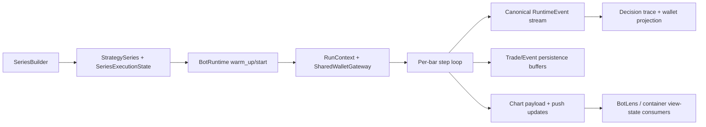

# Bot Runtime Engine Architecture

## Documentation Header

- `Component`: Bot runtime execution engine
- `Owner/Domain`: Bot Runtime
- `Doc Version`: 2.2
- `Related Contracts`: [[BOT_RUNTIME_DOCS_HUB]], [[01_runtime_contract]], [[BOT_RUNTIME_SERVICE_ARCHITECTURE]], [[BOT_RUNTIME_SYMBOL_SHARDING_ARCHITECTURE]], [[RUNTIME_EVENT_MODEL_V1]], [[WALLET_GATEWAY_ARCHITECTURE]], `src/engines/bot_runtime/runtime/`, `src/engines/bot_runtime/core/`, `src/engines/bot_runtime/strategy/`, `portal/backend/service/bots/runtime_dependencies.py`

## 1) Problem and scope

This document describes the current bot runtime engine as implemented today.

In scope:
- canonical runtime package layout,
- prepare/start/step/snapshot lifecycle,
- signal -> decision -> execution -> outcome flow,
- wallet and runtime event ownership,
- chart payload and streaming read models.

Non-goals:
- API/container orchestration,
- BotLens transport details,
- strategy authoring semantics outside runtime consumption.

## 2) Canonical implementation location

The canonical implementation is under `src/engines/bot_runtime/`.

Current package split:
- `src/engines/bot_runtime/runtime/runtime.py`: `BotRuntime` assembly.
- `src/engines/bot_runtime/runtime/mixins/setup_prepare.py`: preparation, series bootstrap, indicator runtime state, overlay aggregation, intrabar setup.
- `src/engines/bot_runtime/runtime/mixins/execution_loop.py`: blocking start/run loop, per-series stepping, intrabar stepping, completion handling.
- `src/engines/bot_runtime/runtime/mixins/runtime_events.py`: canonical runtime event emission, decision trace, run artifact construction, shared wallet runtime context.
- `src/engines/bot_runtime/runtime/mixins/runtime_projection.py`: snapshots, chart payloads, visible-state projection, and read-model shaping.
- `src/engines/bot_runtime/runtime/mixins/runtime_persistence.py`: trade persistence, `series_bar.telemetry`, and step-trace recording/flush.
- `src/engines/bot_runtime/runtime/mixins/runtime_push_stream.py`: subscriber lifecycle, overlay delta generation, and live runtime push payloads.
- `src/engines/bot_runtime/runtime/mixins/state_streaming.py`: compatibility shim that aggregates the split runtime projection/persistence/push mixins.
- `src/engines/bot_runtime/runtime/overlay_types.py`: explicit runtime overlay-type registration invoked during runtime setup.
- `src/engines/bot_runtime/runtime/components/overlay_delta.py`: pure overlay diff/fingerprint helpers used by live runtime streaming.
- `src/engines/bot_runtime/runtime/components/`: helpers for run context, runtime policy, series runner, chart state, intrabar cache, settlement, signal consumption, event sinks, trade persistence, and step-trace buffering.
- `src/engines/bot_runtime/strategy/`: runtime-domain strategy loading contracts, series construction, regime overlays, and incremental signal/overlay preparation.
- `src/engines/bot_runtime/deps.py`: explicit boundary contract for portal-owned collaborators.
- `src/engines/bot_runtime/core/`: execution profile compilation, execution adapters, wallet gateway, wallet projection, margin/fee helpers, and the ladder trading domain engine.
- `src/engines/bot_runtime/core/domain/engine.py`: `LadderRiskEngine`, the per-series execution core used by strategy series.

Portal-owned adapters now live beside the service composition layer rather than inside a shadow runtime tree:
- `portal/backend/service/bots/runtime_dependencies.py`: concrete dependency bundle for worker runtime construction.
- `portal/backend/service/bots/strategy_loader.py`: DB-backed strategy adapter that returns runtime-domain strategy models.

Indicator execution is now owned by:
- `src/engines/indicator_engine/contracts.py`: manifest, typed output, overlay, and indicator base contracts.
- `src/engines/indicator_engine/runtime_engine.py`: synchronous manifest validation, dependency ordering, per-bar execution, and frame building.

## 3) Runtime topology

## 4) Current module boundaries

`BotRuntime` is a composition root, not a monolith.

Runtime assembly:
- `BotRuntime` subclasses explicit execution/event/projection/persistence/push mixins and adds no behavior of its own beyond assembly.
- `BotRuntime` requires an explicit `BotRuntimeDeps` bundle and does not import portal services directly.
- Overlay-type registration is explicit during runtime setup; runtime import no longer performs hidden registry side effects.

Preparation boundary:
- `RuntimeSetupPrepareMixin` owns strategy loading, series construction, indicator engine initialization, warmup replay, overlay bootstrap, and building `SeriesExecutionState`.
- Runtime preparation depends on injected collaborators for strategy loading, market data fetch, indicator metadata, and persistence.

Execution boundary:
- `RuntimeExecutionLoopMixin` owns `warm_up()`, `start()`, `_execute_loop()`, `_step_series_state()`, intrabar stepping, and final status transitions.

Event boundary:
- `RuntimeEventsMixin` owns append-only canonical runtime events, correlation IDs, decision trace entries, shared wallet projection hooks, and final run artifact payloads.

Read-model boundary:
- `RuntimeProjectionMixin` owns `snapshot()` and `chart_payload()` read models.
- `RuntimePersistenceMixin` owns trade persistence, `series_bar.telemetry`, and step-trace buffering.
- `RuntimePushStreamMixin` owns subscriber updates and live overlay/runtime delta payload assembly.
- `RuntimeStateStreamingMixin` remains only as a compatibility shim and should not accumulate new behavior.

Component boundary:
- `RunContext` is the in-memory per-run holder for `run_id`, status, wallet gateway, runtime events, and decision trace.
- `RuntimeModePolicy` centralizes run-type switches such as `allow_live_refresh`, `use_intrabar`, and wallet enforcement.
- `InlineSeriesRunner` is the only supported series runner type at runtime today.
- `IntrabarManager` fetches and caches 1-minute candles for active-trade intrabar stepping on coarse timeframes.
- `ChartStateBuilder` trims chart state to current visibility and enforces `known_at` overlay gating.
- `TradePersistenceBuffer` batches trade and trade-event writes.
- `StepTracePersistenceBuffer` asynchronously batches runtime step traces so execution is not DB-bound.

## 5) Lifecycle

### Prepare

`warm_up()` and `start()` both flow through `_ensure_prepared()`.

Preparation does the following:
1. Validate that `strategy_ids` are present.
2. Build `StrategySeries` instances through `src/engines/bot_runtime/strategy/series_builder.py`.
3. Build `SeriesExecutionState` for each series.
4. Build runtime indicator instances and initialize `IndicatorExecutionEngine`.
5. Replay warmup candles through the canonical indicator contract:
   - `apply_bar(bar, dependency_outputs)`
   - `snapshot()`
   - `overlay_snapshot()`
6. Capture the last `EngineFrame(outputs, overlays)` on the series state.
7. Treat overlays as full current-state snapshots, diff them only at the runtime transport boundary, and mark the runtime `idle`.

Preparation is single-flight and guarded by `_prepare_lock`. Read paths must not implicitly build partial runtime state.

### Start

`start()` is blocking and does the following:
1. Ensure preparation is complete.
2. Build a `RunContext`.
3. Require `wallet_config.balances` and `shared_wallet_proxy`.
4. Attach `SharedWalletGateway` to every series risk engine.
5. Emit `WALLET_INITIALIZED` if balances are available.
6. Start the series runner and overlay aggregator.

### Step

Each due series state runs through `_step_series_state()`:
1. Read the next candle.
2. Execute `IndicatorExecutionEngine.step(...)` in topological dependency order.
3. Store the returned `EngineFrame.outputs` and `EngineFrame.overlays` on `SeriesExecutionState`.
4. Evaluate typed strategy rules from the flattened output map only.
5. Convert full current overlay snapshots into transport deltas for BotLens/runtime subscribers.
6. Consume pending signals up to the current epoch.
7. Emit `SIGNAL_EMITTED` when a direction is chosen.
8. Attempt entry through `LadderRiskEngine.maybe_enter(...)`.
9. Emit `DECISION_ACCEPTED` or `DECISION_REJECTED`.
10. Persist trade-entry rows and canonical `ENTRY_FILLED` / `EXIT_FILLED` events as execution occurs.
11. If an active trade exists on a coarse timeframe, switch into intrabar stepping with cached 1-minute candles.
12. Finalize the bar, refresh state, and push a chart/runtime update.

### Complete

At completion or stop:
- runtime status is updated,
- trade buffers are flushed,
- step traces are flushed,
- a run artifact is built from runtime events plus projected wallet state,
- report persistence is triggered from the worker runtime.

## 6) Canonical event and wallet model

The canonical audit surface is the append-only `RuntimeEvent` stream defined in `src/engines/bot_runtime/core/runtime_events.py`.

Deep event taxonomy, payload rules, and causality semantics live in [[RUNTIME_EVENT_MODEL_V1]].

Current runtime uses that contract for:
- signal events,
- decision events,
- fill/outcome events,
- wallet bootstrap and runtime fault/degrade events.

Important invariants:
- every runtime event is stamped with `run_id`, `bot_id`, `strategy_id`, symbol/timeframe context, and a deterministic bar correlation ID,
- signal/decision/execution causality is linked through `root_id`, `parent_id`, and `correlation_id`,
- runtime events are persisted immediately through injected storage collaborators from `BotRuntimeDeps`,
- wallet state is projected from runtime events, not from ad-hoc mutable balance copies,
- shared-wallet coordination uses reservations plus the shared canonical runtime-event stream.

## 7) Runtime state and read models

Authoritative runtime state is split across:
- worker-local sequential series state (`SeriesExecutionState`, active trades, indicator outputs, indicator overlays),
- append-only canonical runtime events,
- shared wallet reservations/runtime events when running in symbol-sharded mode.

Derived read models:
- `snapshot()`: thread-safe runtime status/progress/stats surface.
- `chart_payload()`: BotLens-oriented payload containing visible candles, overlays, trades, logs, decisions, warnings, and the runtime snapshot.
- `decision_trace`: reduced causality ledger derived from runtime events.
- final run artifact: serialized runtime event stream plus projected wallet start/end state.

`chart_payload()` is not a second execution path. It is a read model derived from the same runtime state timeline.

Indicator boundary rules in runtime:
- strategies consume typed outputs only,
- overlays remain separate from typed outputs,
- overlay meaning originates from the indicator,
- runtime only filters, trims, diffs, and streams overlay payloads.

## 8) Known-at and visibility contract

The runtime currently enforces visibility at the chart/read-model layer.

`ChartStateBuilder`:
- trims candles to the visible prefix for the current status,
- merges the active intrabar snapshot into the last visible candle,
- trims overlay payloads to the current epoch,
- hides overlays until `known_at` has passed.

This keeps playback and BotLens aligned with the same known-at causality used by indicator runtime state.

## 9) Current limitations and accepted tradeoffs

- Only `inline` series execution is accepted by `BotRuntime`; alternate runner types are not part of the live contract.
- Intrabar refinement is always enabled by `RuntimeModePolicy` and currently uses 1-minute fetches plus an in-memory cache.
- The runtime still depends on portal-owned adapters for external boundaries, but only through the explicit `BotRuntimeDeps` contract.
- Worker runtimes persist their own run artifacts/reports using the shared `run_id`; the container layer does not currently build a separate bot-level artifact.
- Package roots such as `engines.bot_runtime.runtime` and `engines.bot_runtime.strategy` are intentionally kept light; callers should import concrete modules directly when they need runtime assembly or series-builder behavior.

## 10) Strict contract

- Derived runtime outputs must come from one sequential series timeline. No alternate reconstruction path should invent a different execution story.
- `RunContext` must exist before canonical runtime events are emitted.
- Wallet checks must flow through `SharedWalletGateway`; direct mutable wallet attachment is intentionally rejected.
- Failures must either fail the run loudly or explicitly degrade the affected series and emit `SYMBOL_DEGRADED`.
- Consumers should treat runtime events as the source of truth and `chart_payload()` as a derived observability surface.
