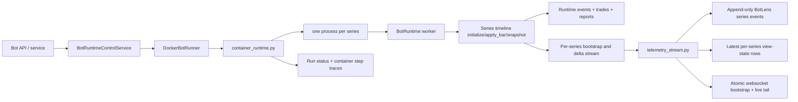

# Bot Runtime Service Architecture

## Documentation Header

- `Component`: Bot runtime service orchestration
- `Owner/Domain`: Bot Runtime / Portal Backend
- `Doc Version`: 3.1
- `Related Contracts`: [[BOT_RUNTIME_DOCS_HUB]], [[01_runtime_contract]], [[BOT_RUNTIME_ENGINE_ARCHITECTURE]], [[BOT_RUNTIME_SYMBOL_SHARDING_ARCHITECTURE]], `portal/backend/service/bots/runtime_control_service.py`, `portal/backend/service/bots/runner.py`, `portal/backend/service/bots/container_runtime.py`

## 1) Problem and scope

This document describes the current service-layer architecture that starts, stops, and supervises bot runtime execution.

In scope:
- API/service validation before launch,
- runner target resolution,
- docker container launch model,
- container runtime responsibilities,
- persistence and telemetry boundaries.

Non-goals:
- per-bar strategy execution details,
- indicator/runtime engine internals,
- UI rendering details beyond emitted service payloads.

Deep execution semantics live in [[BOT_RUNTIME_ENGINE_ARCHITECTURE]].
Deep event and wallet contracts live in [[RUNTIME_EVENT_MODEL_V1]] and [[WALLET_GATEWAY_ARCHITECTURE]].

## 2) Current service topology

## 3) Service entrypoints

Current entrypoints:
- `portal/backend/service/bots/runtime_control_service.py`: API-facing start/stop and watchdog status surface.
- `portal/backend/service/bots/runner.py`: runner abstraction plus `DockerBotRunner`.
- `portal/backend/service/bots/container_runtime.py`: launched process that owns symbol sharding, worker supervision, per-series BotLens transport emission, and container-level status/step traces.
- `portal/backend/service/bots/telemetry_stream.py`: ingest/projection hub for BotLens live delivery and durable latest-view materialization.

Current target support:
- only `BOT_RUNTIME_TARGET=docker` is implemented.

## 3.1) Runtime composition root

Runtime API-facing service wiring now flows through `portal/backend/service/bots/runtime_composition.py`.

- `RuntimeComposition` assembles stream manager, config service, runtime control service, storage gateway, and watchdog.
- `RuntimeMode` (default from `BOT_RUNTIME_MODE`) selects a composition branch so backtest/paper/live can evolve without pushing mode switches into service leaf modules.
- `bot_service.py` consumes this composition via `get_runtime_composition()` instead of module-level singleton construction.
- Runtime control storage writes (`upsert_bot`) are injected as a collaborator boundary, reducing hidden deep imports in service methods.
- Worker runtime construction uses `build_bot_runtime_deps()` to pass portal-owned adapters into the canonical engine instead of letting engine modules import portal services directly.

This keeps start/stop behavior stable while making runtime wiring explicit and testable.

## 4) Start flow

`BotRuntimeControlService.start_bot(bot_id)` performs the current service-side checks in this order:
1. Load the bot from config storage.
2. Validate wallet config.
3. Validate strategy id and backtest window.
4. Validate strategy existence.
5. Validate instrument policy.
6. Validate runtime readiness.
7. Resolve the runner target.
8. Launch the runtime container through `DockerBotRunner.start_bot(...)`.

If container startup fails:
- bot status is set to `error`,
- `last_run_artifact.error` is written,
- the failure is broadcast to stream subscribers,
- the exception is re-raised.

If startup succeeds:
- bot status becomes `running`,
- `runner_id` is set to the container id,
- `last_run_at` is updated,
- the updated bot payload is broadcast.

## 5) Docker runner contract

`DockerBotRunner` currently enforces:
- `BOT_RUNTIME_IMAGE` must be set,
- `BOT_RUNTIME_NETWORK` must resolve to an existing docker network,
- `PROVIDER_CREDENTIAL_KEY` must be present in backend env,
- `snapshot_interval_ms` must be configured on the bot before launch.

The runner passes through:
- `PG_DSN`,
- `PROVIDER_CREDENTIAL_KEY`,
- `BOT_ID`,
- snapshot cadence env vars,
- BotLens stream sizing env vars,
- step-trace buffer env vars,
- optional `bot_env` overrides from bot config.

The launched process is:
- `python -m portal.backend.service.bots.container_runtime`

## 6) Container runtime responsibilities

`container_runtime.py` is the service-layer runtime supervisor. It is responsible for:
- loading the bot row and its strategy id,
- generating the shared `run_id`,
- enforcing strategy symbol limits,
- assigning symbols to worker processes,
- creating the shared-wallet multiprocessing proxy,
- supervising child workers,
- assigning run-scoped and series-scoped BotLens sequence numbers,
- forwarding per-series bootstrap/delta telemetry envelopes,
- writing bot runtime status and container step traces.

Supporting helpers are split explicitly:
- `container_runtime_projection.py`: compact view-state shaping plus worker/runtime payload merge helpers.
- `container_runtime_telemetry.py`: bounded outbound telemetry emission and message-context helpers.

Important current limits:
- default maximum symbols per strategy is 10,
- one worker process is required per symbol,
- startup fails loudly if `BOT_SYMBOL_PROCESS_MAX < symbol_count`.

## 7) Worker model

Each child worker process:
- receives exactly one symbol shard,
- receives the shared `run_id`,
- constructs a `BotRuntime` with `degrade_series_on_error=True` and an explicit `BotRuntimeDeps` bundle,
- forces `series_runner="inline"`,
- resolves the attached indicator set into a dependency-closed runtime graph,
- computes typed indicator outputs, indicator-owned overlays, strategy decisions, and trades on the same series timeline,
- persists `series_bar.telemetry` ledger events asynchronously from that same series timeline,
- emits one `botlens_series_bootstrap` after warm-up,
- emits ordered `botlens_series_delta` messages from the runtime subscriber queue,
- emits `worker_error` messages when runtime execution fails.

The parent process treats worker failures as degraded-symbol events:
- failed worker symbols are added to `degraded_symbols`,
- healthy workers continue,
- telemetry is marked degraded,
- container execution only hard-fails on parent-level exceptions.

Dependency semantics:
- attached indicators are the root set for the series,
- explicit indicator-instance dependency bindings are followed transitively,
- upstream dependencies do not need to be reattached manually if they are already referenced by a dependent indicator,
- and runtime initialization fails loud if a dependency binding is missing, ambiguous, or points to the wrong indicator type.

## 8) Persistence boundaries

The service/runtime split is important.

Worker runtime persistence:
- canonical execution events via injected `BotRuntimeDeps.record_bot_runtime_event(...)` with `event_type=runtime.*`,
- per-series runtime telemetry via `BotRuntimeDeps.record_bot_runtime_events_batch(...)` with `event_type=series_bar.telemetry`,
  - telemetry payloads are compact per-bar runtime facts: series/bar identity plus candle payload,
  - they are not a second analytics schema for background candle/regime tables,
- trade rows via `BotRuntimeDeps.record_bot_trade(...)`,
- trade-event rows via `BotRuntimeDeps.record_bot_trade_event(...)`,
- worker run artifacts via `BotRuntimeDeps.update_bot_run_artifact(...)`,
- worker report bundles via `BotRuntimeDeps.build_run_artifact_bundle(...)`,
- runtime step traces via `BotRuntimeDeps.record_bot_run_steps_batch(...)`.

Container/runtime telemetry persistence:
- run status via `update_bot_runtime_status(...)`,
- container loop step traces via `record_bot_run_step(...)`.
- append-only BotLens series events via `record_bot_runtime_event(...)` with:
  - `event_type=botlens.series_bootstrap`
  - `event_type=botlens.series_delta`
- latest per-series BotLens materializations via `upsert_bot_run_view_state(...)`.

Important semantics:
- the latest BotLens row is a materialized cache, not the execution source of truth,
- BotLens bootstrap can read the materialized rows,
- but live execution never reads DB-backed BotLens projections back into the worker timeline.
- BotLens persistence only accepts canonical per-series keys of the form `SYMBOL|timeframe`; legacy merged `series_key=bot` rows are not part of the runtime contract.
- report/deepdive consumers read `portal_bot_run_events` directly and project what they need from `runtime.*`, `series_bar.*`, and `botlens.*`.

## 8.1) Indicator-owned analytics and report capture

Indicator-derived analytics are now owned by indicators on the canonical runtime timeline.

- backend OHLCV persistence does not enqueue candle-stats or regime-stats background work,
- `candle_stats` and `regime` run only when those indicators are attached to the active series,
- report capture records indicator outputs from the same runtime frames that drove decisions and overlays,
- and post-run reporting may enrich that bundle with DB-derived trades and trade events, but not alternate indicator-history tables.

This preserves the system contract:
- one runtime state-engine timeline,
- no alternate reconstruction path for bot execution artifacts,
- no async stats lag leaking into live execution semantics,
- and clear provenance between runtime-emitted artifacts and post-run DB enrichments.

## 9) Telemetry contract

The container runtime emits BotLens telemetry with per-series message ownership.

Envelope types:
- `botlens_series_bootstrap`
- `botlens_series_delta`

Each envelope carries:
- `run_id`
- `bot_id`
- `series_key`
- monotonic `run_seq`
- monotonic per-series `series_seq`
- event timing fields
- either a bounded per-series `projection` bootstrap or a typed `runtime_delta`

Transport:
- websocket push to `BACKEND_TELEMETRY_WS_URL` when configured,
- bounded FIFO queueing inside `TelemetryEmitter` to preserve in-order per-series delivery semantics.

Service split:
- `telemetry_stream.py`: ingest queue, projection application, durable `botlens.*` writes, latest per-series view-state cache, and runtime-status rebroadcast.
- `live_series_stream.py`: websocket viewer attachment, bounded replay ring, stream-session continuity, resync invalidation, and live-tail fanout.

Durability:
- telemetry transport is supplemental,
- `botlens.*` rows in `portal_bot_run_events` are the durable BotLens artifact ledger,
- `series_bar.telemetry` rows are the durable per-bar runtime telemetry source,
- runtime/trade/status/step-trace rows remain the rest of the durable execution record.

### 9.1) BotLens series delivery semantics

BotLens `series_seq` is continuity-sensitive.

That means transport is not allowed to silently compact away intermediate `series_seq` values if downstream consumers treat missing sequences as continuity failure.

Required semantics:
- `series_seq` is emitted in ascending order per `run_id` / `series_key`,
- the emitter preserves FIFO order,
- a failed send does not advance the queue head,
- later snapshots must not bypass an older undelivered snapshot,
- BotLens series websocket subscribe must send the baseline snapshot on that same channel and replay buffered live-tail messages newer than `baseline_seq` before enabling future-only fanout,
- one continuity epoch is identified by `stream_session_id`, and continuity invalidation rotates that id before future live fanout resumes,
- the backend may emit `botlens_live_resync_required` and close active sockets when run continuity is no longer trusted,
- and any backlog must be surfaced as explicit backpressure rather than silent compaction.

This is important because the ingest path and BotLens frontend both treat missing `series_seq` values as a resync condition.

### 9.2) Producer backpressure

Producer backpressure means per-series update production is forced to observe transport capacity instead of overwriting undelivered messages.

In the current service implementation this entails:
- `TelemetryEmitter` has a bounded queue,
- `send_message(...)` blocks up to `BOT_TELEMETRY_EMIT_QUEUE_TIMEOUT_MS` when the queue is full,
- if capacity does not free within that window, the emitter logs `bot_telemetry_emit_queue_backpressure` and returns failure,
- container runtime marks telemetry degraded when send fails,
- and operators can inspect queue depth, retry timing, payload size, and send latency through telemetry logs.

Backpressure is therefore an explicit signal that:
- per-series update cadence is too aggressive,
- payloads are still too large,
- or the transport path is too slow.

It is not a license to silently skip state.

### 9.3) Continuity invalidation and retry semantics

BotLens live recovery is explicit.

When continuity is broken:
- the backend rotates `stream_session_id`,
- clears incompatible live-tail replay buffers,
- emits `botlens_live_resync_required` to current viewers,
- and closes those sockets so the client must establish a new atomic subscribe.

The frontend is expected to retry within a bounded budget and surface a terminal continuity-unavailable state if that budget is exhausted.

### 9.4) Important non-goal

The telemetry queue is not the durable execution record.

It exists only to preserve transport continuity for the BotLens live inspection path.
Authoritative execution history still lives in durable runtime events, trades, artifacts, and derived BotLens view-state persistence.

## 10) Run-level and series-level status semantics

Two status surfaces exist and should not be conflated.

Persisted service status:
- `running`
- `stopped`
- `failed`

Runtime payload status inside a per-series BotLens projection:
- `running`
- `completed`
- `stopped`
- `error`
- `degraded`

Current nuance:
- if any workers are still active, run-level status may remain `running` even when one series is degraded,
- degraded state is surfaced through runtime warnings, per-series payload state, and telemetry continuity signals,
- the persisted bot runtime status row does not currently store a separate `degraded` terminal state.

## 11) Stop and watchdog flow

`BotRuntimeControlService.stop_bot(bot_id)`:
- resolves the runner,
- removes the docker container,
- unregisters the bot from the watchdog,
- updates bot status to `stopped`,
- clears `runner_id`,
- persists and broadcasts the new bot state.

The watchdog remains responsible for:
- stale-heartbeat scans,
- container ownership verification,
- marking orphaned/crashed bots failed,
- reporting current watchdog status.

## 12) Strict contract

- Service start/stop must remain explicit and auditable.
- Runtime readiness validation happens before container launch, not lazily inside UI paths.
- The shared `run_id` belongs to the whole container run and is propagated to all symbol workers.
- Container runtime owns symbol sharding, run/series sequencing, and per-series BotLens transport; worker runtimes own execution semantics and canonical runtime events.
- Failures must be surfaced either as explicit bot/container failure or explicit symbol degradation. No silent success state may be invented.
