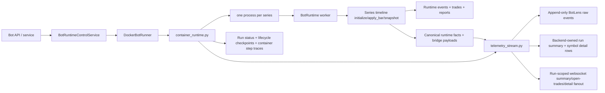

# Bot Runtime Service Architecture

## Documentation Header

- `Component`: Bot runtime service orchestration
- `Owner/Domain`: Bot Runtime / Portal Backend
- `Doc Version`: 4.0
- `Related Contracts`: [[BOT_RUNTIME_DOCS_HUB]], [[BOT_STARTUP_LIFECYCLE_CONTRACT]], [[01_runtime_contract]], [[BOT_RUNTIME_ENGINE_ARCHITECTURE]], [[BOT_RUNTIME_SYMBOL_SHARDING_ARCHITECTURE]], `portal/backend/service/bots/runtime_control_service.py`, `portal/backend/service/bots/runner.py`, `portal/backend/service/bots/container_runtime.py`

## 1) Problem and scope

This document describes the current service-layer architecture that starts, stops, and supervises bot runtime execution.

In scope:
- API/service validation before launch,
- runner target resolution,
- docker container launch model,
- container runtime responsibilities,
- persistence and telemetry boundaries.

Non-goals:
- per-bar strategy execution details,
- indicator/runtime engine internals,
- UI rendering details beyond emitted service payloads and diagnostics projections.

Deep execution semantics live in [[BOT_RUNTIME_ENGINE_ARCHITECTURE]].
Deep event and wallet contracts live in [[RUNTIME_EVENT_MODEL_V1]] and [[WALLET_GATEWAY_ARCHITECTURE]].

## 2) Current service topology

## 3) Service entrypoints

Current entrypoints:
- `portal/backend/service/bots/runtime_control_service.py`: API-facing start/stop and watchdog status surface.
- `portal/backend/service/bots/runner.py`: runner abstraction plus `DockerBotRunner`.
- `portal/backend/service/bots/container_runtime.py`: launched process that owns symbol sharding, worker supervision, symbol-scoped BotLens fact emission, and container-level status/step traces.
- `portal/backend/service/bots/telemetry_stream.py`: ingest/projection hub for BotLens run summary, open-trades, symbol-detail materialization, and live rebroadcast.

Current target support:
- only `BOT_RUNTIME_TARGET=docker` is implemented.

## 3.1) Runtime composition root

Runtime API-facing service wiring now flows through `portal/backend/service/bots/runtime_composition.py`.

- `RuntimeComposition` assembles stream manager, config service, runtime control service, storage gateway, and watchdog.
- `RuntimeMode` (default from `BOT_RUNTIME_MODE`) selects a composition branch so backtest/paper/live can evolve without pushing mode switches into service leaf modules.
- `bot_service.py` consumes this composition via `get_runtime_composition()` instead of module-level singleton construction.
- Runtime control storage writes (`upsert_bot`) are injected as a collaborator boundary, reducing hidden deep imports in service methods.
- Worker runtime construction uses `build_bot_runtime_deps()` to pass portal-owned adapters into the canonical engine instead of letting engine modules import portal services directly.

This keeps start/stop behavior stable while making runtime wiring explicit and testable.

## 4) Start flow

`BotRuntimeControlService.start_bot(bot_id)` now delegates to `BotStartupOrchestrator`.

Backend-owned startup order:
1. Load the bot record.
2. Generate the backend-owned `run_id`.
3. Record `start_requested`.
4. Create the run row immediately so run ownership exists before launch.
5. Record `validating_configuration`.
6. Resolve one startup snapshot through `prepare_startup_artifacts(...)`:
   - normalized wallet config,
   - strategy snapshot,
   - runtime readiness/profile facts,
   - symbol list for startup planning.
7. Record `resolving_strategy`.
8. Record `resolving_runtime_dependencies`.
9. Record `preparing_run` and persist the startup snapshot into `portal_bot_runs`.
10. Record `stamping_starting_state` and persist bot status/runner ownership.
11. Record `launching_container`.
12. Launch the runtime container through `DockerBotRunner.start_bot(bot=..., run_id=...)`.
13. Record `container_launched`.
14. Register the bot with the watchdog.
15. Record `awaiting_container_boot`.
16. Return the projected bot state with `active_run_id` and lifecycle detail.

If startup fails before the container boot contract is handed off:
- the backend persists `startup_failed`,
- the backend preserves the `run_id`,
- `last_run_artifact.error` carries the failed phase/message payload,
- the failed lifecycle state is broadcast instead of leaving the bot vaguely `starting`.

## 5) Docker runner contract

`DockerBotRunner` currently enforces:
- `BOT_RUNTIME_IMAGE` must be set,
- `BOT_RUNTIME_NETWORK` must resolve to an existing docker network,
- `PROVIDER_CREDENTIAL_KEY` must be present in backend env,
- `snapshot_interval_ms` must be configured on the bot before launch,
- backend-owned `run_id` must be supplied to `start_bot(...)`.

The runner passes through:
- `PG_DSN`,
- `PROVIDER_CREDENTIAL_KEY`,
- `BOT_ID`,
- `RUN_ID`,
- snapshot cadence env vars,
- BotLens stream sizing env vars,
- step-trace buffer env vars,
- optional `bot_env` overrides from bot config.

The launched process is:
- `python -m portal.backend.service.bots.container_runtime`

## 6) Container runtime responsibilities

`container_runtime.py` is the service-layer runtime supervisor. It is responsible for:
- loading the bot row and its strategy id,
- claiming the backend-injected `run_id`,
- enforcing strategy symbol limits,
- assigning symbols to worker processes,
- creating the shared-wallet multiprocessing proxy,
- supervising child workers,
- reporting startup checkpoints back into the lifecycle tables,
- maintaining per-series startup progress metadata,
- bridging per-series bootstrap/fact-batch telemetry envelopes across the process boundary,
- emitting lifecycle/process bridge events,
- detecting bridge backpressure and forcing rebootstrap instead of inventing continuity,
- writing bot runtime status and container step traces.

The worker runtime now also owns a minimal indicator guard at the indicator execution boundary:

- per-indicator execution time is measured per bar,
- per-indicator overlay point count and serialized payload bytes are measured when overlays are requested,
- repeated soft-budget breaches become structured runtime warnings,
- optional hard overlay budgets suppress only that indicator's overlay emission for the current bar,
- and trading/decision outputs remain untouched.

Supporting helpers are split explicitly:
- `container_runtime_projection.py`: compact view-state shaping plus worker/runtime payload merge helpers.
- `container_runtime_telemetry.py`: bounded outbound telemetry emission and message-context helpers.

Important current limits:
- default maximum symbols per strategy is 10,
- one worker process is required per symbol,
- startup fails loudly if `BOT_SYMBOL_PROCESS_MAX < symbol_count`.

Container startup is now decomposed into explicit functions:
- `load_container_startup_context()`
- `spawn_workers()`
- `supervise_startup_and_runtime()`

These functions consume the backend-owned contract instead of inventing run ownership locally.

## 7) Worker model

Each child worker process:
- receives exactly one symbol shard,
- receives the shared `run_id`,
- constructs a `BotRuntime` with `degrade_series_on_error=True` and an explicit `BotRuntimeDeps` bundle,
- forces `series_runner="inline"`,
- resolves the attached indicator set into a dependency-closed runtime graph,
- computes typed indicator outputs, indicator-owned overlays, strategy decisions, and trades on the same series timeline,
- applies a lightweight indicator guard that detects repeated slow indicators and bulky overlays before they silently poison runtime transport,
- persists `series_bar.telemetry` ledger events asynchronously from that same series timeline,
- emits one `botlens_runtime_bootstrap_facts` bridge payload after warm-up,
- emits ordered `botlens_runtime_facts` bridge payloads from the runtime subscriber queue,
- uses explicit subscriber gap signaling when BotLens transport consumers fall behind,
- marks the runtime `degraded` when a series is degraded inside the worker runtime,
- emits `worker_error` messages when runtime execution fails or finishes degraded.

Indicator-guard warnings stay run-scoped and bounded:

- warnings are grouped by warning type, indicator id, and symbol scope,
- repeated occurrences increment `count` and update `last_seen_at`,
- the runtime snapshot carries those grouped rows,
- and BotLens projects them into summary health rather than creating a separate observability channel.

The parent process treats worker failures as degraded-symbol events:
- failed worker symbols are added to `degraded_symbols`,
- healthy workers continue,
- telemetry is marked degraded,
- container execution only hard-fails on parent-level exceptions.
- if no series ever reached `live`, final supervision resolves to `startup_failed` instead of `degraded`.

Worker failure checkpoints now include structured failure detail when available:
- worker id and symbol,
- exit code,
- exception type,
- traceback,
- owner / phase / reason code.

`bot_run_diagnostics_projection.py` derives a frontend-ready diagnostics contract from the raw lifecycle trail so the UI can render root cause, last successful checkpoint, worker breakdown, and the supporting event trail without reinterpreting backend semantics client-side.

Dependency semantics:
- attached indicators are the root set for the series,
- explicit indicator-instance dependency bindings are followed transitively,
- upstream dependencies do not need to be reattached manually if they are already referenced by a dependent indicator,
- and runtime initialization fails loud if a dependency binding is missing, ambiguous, or points to the wrong indicator type.

## 8) Persistence boundaries

The service/runtime split is important.

Worker runtime persistence:
- canonical execution events via injected `BotRuntimeDeps.record_bot_runtime_event(...)` with `event_type=runtime.*`,
- per-series runtime telemetry via `BotRuntimeDeps.record_bot_runtime_events_batch(...)` with `event_type=series_bar.telemetry`,
  - telemetry payloads are compact per-bar runtime facts: series/bar identity plus candle payload,
  - they are not a second analytics schema for background candle/regime tables,
- trade rows via `BotRuntimeDeps.record_bot_trade(...)`,
- trade-event rows via `BotRuntimeDeps.record_bot_trade_event(...)`,
- worker run artifacts via `BotRuntimeDeps.update_bot_run_artifact(...)`,
- worker report bundles via `BotRuntimeDeps.build_run_artifact_bundle(...)`,
- runtime step traces via `BotRuntimeDeps.record_bot_run_steps_batch(...)`.

Container/runtime telemetry persistence:
- run status via `update_bot_runtime_status(...)`,
- current lifecycle state via `record_bot_run_lifecycle_checkpoint(...)` into `portal_bot_run_lifecycle`,
- append-only lifecycle checkpoint trail via `portal_bot_run_lifecycle_events`,
- container loop step traces via `record_bot_run_step(...)`,
- append-only BotLens raw facts via `record_bot_runtime_event(...)` with:
  - `event_type=botlens.runtime_bootstrap_facts`
  - `event_type=botlens.runtime_facts`
  - `event_type=botlens.lifecycle_event`
- latest BotLens run summary and symbol detail materializations via `upsert_bot_run_view_state(...)`.

Important semantics:
- startup truth now lives in the lifecycle tables first, not in container inference or Docker inspect,
- the latest BotLens row is a materialized cache, not the execution source of truth,
- BotLens lifecycle diagnostics and chart/runtime state are now derived from the same fact path,
- BotLens bootstrap can read the materialized rows,
- but live execution never reads DB-backed BotLens projections back into the worker timeline.
- BotLens persistence now uses one run summary row (`series_key=__run__`) plus canonical symbol detail keys of the form `instrument_id|timeframe`; legacy merged `series_key=bot` rows are not part of the runtime contract.
- report/deepdive consumers read `portal_bot_run_events` directly and project what they need from `runtime.*`, `series_bar.*`, and `botlens.*`.

## 8.1) Indicator-owned analytics and report capture

Indicator-derived analytics are now owned by indicators on the canonical runtime timeline.

- backend OHLCV persistence does not enqueue candle-stats or regime-stats background work,
- `candle_stats` and `regime` run only when those indicators are attached to the active series,
- report capture records indicator outputs from the same runtime frames that drove decisions and overlays,
- and post-run reporting may enrich that bundle with DB-derived trades and trade events, but not alternate indicator-history tables.

This preserves the system contract:
- one runtime state-engine timeline,
- no alternate reconstruction path for bot execution artifacts,
- no async stats lag leaking into live execution semantics,
- and clear provenance between runtime-emitted artifacts and post-run DB enrichments.

## 9) Telemetry contract

The service stack now separates bridge transport from canonical BotLens truth.

Supervisor/worker bridge envelope types:
- `botlens_runtime_bootstrap_facts`
- `botlens_runtime_facts`
- `botlens_lifecycle_event`

Bridge payload ownership:
- runtime owns canonical fact batches (`runtime_state_observed`, `candle_upserted`, `overlay_ops_emitted`, `trade_upserted`, `decision_emitted`, `log_emitted`, `series_stats_updated`) plus enough data to project downstream,
- supervisor/container runtime attaches transport metadata such as `bridge_session_id` and `bridge_seq`,
- backend validates bridge continuity before advancing BotLens state,
- backend assigns run-scoped BotLens ordering for summary/open-trade/detail delivery.

Transport:
- websocket push to `BACKEND_TELEMETRY_WS_URL` when configured,
- bounded FIFO queueing inside `TelemetryEmitter` and the local process bridge,
- explicit resync/bootstrap recovery when bridge continuity is not trustworthy.

Service split:
- `telemetry_stream.py`: ingest queue, projection application, durable `botlens.*` writes, latest run-summary/symbol-detail cache, and runtime-status rebroadcast.
- `botlens_run_stream.py`: run-scoped websocket viewer attachment, bounded replay ring, viewer hot-symbol tracking, and summary/open-trades/detail fanout.

Durability:
- telemetry transport is supplemental,
- `botlens.*` rows in `portal_bot_run_events` are the durable BotLens raw-fact ledger,
- `portal_bot_run_view_state.seq` is the canonical latest BotLens summary/detail cursor,
- `series_bar.telemetry` rows are the durable per-bar runtime telemetry source,
- runtime/trade/status/step-trace rows remain the rest of the durable execution record.

### 9.1) BotLens continuity and ordering semantics

Bridge continuity and canonical projection ordering are separate concerns.

Required semantics:
- `bridge_seq` is emitted in ascending order per `run_id` / `series_key` / `bridge_session_id`,
- the bridge preserves FIFO order,
- a failed send does not advance the queue head,
- later bootstraps may reset bridge continuity through a new `bridge_session_id`, but they do not redefine durable BotLens ordering,
- the backend only advances BotLens state after bridge continuity is valid,
- a continuity gap marks the affected symbol detail `resync_required` instead of merging unknown state,
- BotLens websocket subscribe attaches to the run once and replays buffered run deltas newer than the client cursor before future-only fanout,
- one live websocket continuity epoch is identified by `stream_session_id`,
- symbol switching updates viewer subscription state instead of tearing down the websocket,
- the backend may emit `botlens_run_resync_required` when replay continuity is no longer trustworthy,
- and any backlog must be surfaced as explicit backpressure rather than silent compaction.

### 9.2) Producer backpressure

Producer backpressure means per-series update production is forced to observe transport capacity instead of overwriting undelivered messages.

In the current service implementation this entails:
- `TelemetryEmitter` has a bounded queue,
- the supervisor process bridge queue is bounded,
- runtime subscriber queues may signal a gap instead of crashing runtime execution,
- `send_message(...)` blocks up to `BOT_TELEMETRY_EMIT_QUEUE_TIMEOUT_MS` when the queue is full,
- if capacity does not free within that window, the emitter logs backpressure and the bridge schedules a fresh bootstrap requirement,
- container runtime marks telemetry degraded when send fails,
- and operators can inspect queue depth, retry timing, payload size, and send latency through telemetry logs.

Backpressure is therefore an explicit signal that:
- per-series update cadence is too aggressive,
- payloads are still too large,
- or the transport path is too slow.

It is not a license to silently skip state.

### 9.3) Continuity invalidation and retry semantics

BotLens live recovery is explicit.

When continuity is broken:
- the backend rotates `stream_session_id`,
- clears incompatible live-tail replay buffers,
- emits `botlens_live_resync_required` to current viewers,
- and closes those sockets so the client must establish a new atomic subscribe.

The frontend is expected to retry within a bounded budget and surface a terminal continuity-unavailable state if that budget is exhausted.

### 9.4) Important non-goal

The telemetry queue is not the durable execution record.

It exists only to preserve transport continuity for the BotLens live inspection path.
Authoritative execution history still lives in durable runtime events, trades, artifacts, and derived BotLens view-state persistence.

## 10) Run-level and series-level status semantics

Two status surfaces exist and should not be conflated.

Persisted service status:
- `running`
- `stopped`
- `failed`

Runtime payload status inside a per-series BotLens projection:
- `running`
- `completed`
- `stopped`
- `error`
- `degraded`

Current nuance:
- if any workers are still active, run-level status may remain `running` even when one series is degraded,
- degraded state is surfaced through runtime warnings, per-series payload state, and telemetry continuity signals,
- the persisted bot runtime status row does not currently store a separate `degraded` terminal state.

## 11) Stop and watchdog flow

`BotRuntimeControlService.stop_bot(bot_id)`:
- resolves the runner,
- removes the docker container,
- unregisters the bot from the watchdog,
- updates bot status to `stopped`,
- clears `runner_id`,
- persists and broadcasts the new bot state.

The watchdog remains responsible for:
- stale-heartbeat scans,
- container ownership verification,
- marking orphaned/crashed bots failed,
- reporting current watchdog status.

## 12) Strict contract

- Service start/stop must remain explicit and auditable.
- Runtime readiness validation happens before container launch, not lazily inside UI paths.
- The shared `run_id` belongs to the whole container run and is propagated to all symbol workers.
- Container runtime owns symbol sharding, run/series sequencing, and per-series BotLens transport; worker runtimes own execution semantics and canonical runtime events.
- Failures must be surfaced either as explicit bot/container failure or explicit symbol degradation. No silent success state may be invented.
