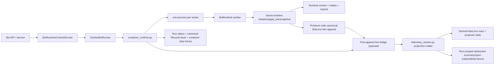

# Bot Runtime Service Architecture

## Documentation Header

- `Component`: Bot runtime service orchestration
- `Owner/Domain`: Bot Runtime / Portal Backend
- `Doc Version`: 4.2
- `Related Contracts`: [[BOT_RUNTIME_DOCS_HUB]], [[BOT_STARTUP_LIFECYCLE_CONTRACT]], [[01_runtime_contract]], [[BOT_RUNTIME_ENGINE_ARCHITECTURE]], [[BOT_RUNTIME_SYMBOL_SHARDING_ARCHITECTURE]], `portal/backend/service/bots/runtime_control_service.py`, `portal/backend/service/bots/runner.py`, `portal/backend/service/bots/container_runtime.py`

## 1) Problem and scope

This document describes the current service-layer architecture that starts, stops, and supervises bot runtime execution.

In scope:
- API/service validation before launch,
- runner target resolution,
- docker container launch model,
- container runtime responsibilities,
- persistence and telemetry boundaries.

Non-goals:
- per-bar strategy execution details,
- indicator/runtime engine internals,
- UI rendering details beyond emitted service payloads and diagnostics projections.

Deep execution semantics live in [[BOT_RUNTIME_ENGINE_ARCHITECTURE]].
Deep event and wallet contracts live in [[RUNTIME_EVENT_MODEL_V1]] and [[WALLET_GATEWAY_ARCHITECTURE]].

## 2) Current service topology

## 3) Service entrypoints

Current entrypoints:
- `portal/backend/service/bots/runtime_control_service.py`: API-facing start/stop and watchdog status surface.
- `portal/backend/service/bots/runner.py`: runner abstraction plus `DockerBotRunner`.
- `portal/backend/service/bots/container_runtime.py`: launched process that owns symbol sharding, worker supervision, symbol-scoped BotLens fact emission, and container-level status/step traces.
- `portal/backend/service/bots/telemetry_stream.py`: ingest/projection hub for BotLens run summary, open-trades, symbol-detail materialization, and live rebroadcast.

Current target support:
- only `BOT_RUNTIME_TARGET=docker` is implemented.

## 3.1) Runtime composition root

Runtime API-facing service wiring now flows through `portal/backend/service/bots/runtime_composition.py`.

- `RuntimeComposition` assembles stream manager, config service, runtime control service, storage gateway, and watchdog.
- `RuntimeMode` (default from `BOT_RUNTIME_MODE`) selects a composition branch so backtest/paper/live can evolve without pushing mode switches into service leaf modules.
- `bot_service.py` consumes this composition via `get_runtime_composition()` instead of module-level singleton construction.
- Runtime control storage writes (`upsert_bot`) are injected as a collaborator boundary, reducing hidden deep imports in service methods.
- Worker runtime construction uses `build_bot_runtime_deps()` to pass portal-owned adapters into the canonical engine instead of letting engine modules import portal services directly.

This keeps start/stop behavior stable while making runtime wiring explicit and testable.

## 4) Start flow

`BotRuntimeControlService.start_bot(bot_id)` now delegates to `BotStartupOrchestrator`.

Backend-owned startup order:
1. Load the bot record.
2. Generate the backend-owned `run_id`.
3. Record `start_requested`.
4. Create the run row immediately so run ownership exists before launch.
5. Record `validating_configuration`.
6. Resolve one startup snapshot through `prepare_startup_artifacts(...)`:
   - normalized wallet config,
   - strategy snapshot,
   - runtime readiness/profile facts,
   - symbol list for startup planning.
7. Record `resolving_strategy`.
8. Record `resolving_runtime_dependencies`.
9. Record `preparing_run` and persist the startup snapshot into `portal_bot_runs`.
10. Record `stamping_starting_state` and persist bot status/runner ownership.
11. Record `launching_container`.
12. Launch the runtime container through `DockerBotRunner.start_bot(bot=..., run_id=...)`.
13. Record `container_launched`.
14. Register the bot with the watchdog.
15. Record `awaiting_container_boot`.
16. Return the projected bot state with `active_run_id` and lifecycle detail.

If startup fails before the container boot contract is handed off:
- the backend persists `startup_failed`,
- the backend preserves the `run_id`,
- `last_run_artifact.error` carries the failed phase/message payload,
- the failed lifecycle state is broadcast instead of leaving the bot vaguely `starting`.

## 5) Docker runner contract

`DockerBotRunner` currently enforces:
- `BOT_RUNTIME_IMAGE` must be set,
- `BOT_RUNTIME_NETWORK` must resolve to an existing docker network,
- `PROVIDER_CREDENTIAL_KEY` must be present in backend env,
- `snapshot_interval_ms` must be configured on the bot before launch,
- backend-owned `run_id` must be supplied to `start_bot(...)`.

The runner passes through:
- `PG_DSN`,
- `PROVIDER_CREDENTIAL_KEY`,
- `BOT_ID`,
- `RUN_ID`,
- snapshot cadence env vars,
- BotLens stream sizing env vars,
- step-trace buffer env vars,
- optional `bot_env` overrides from bot config.

The launched process is:
- `python -m portal.backend.service.bots.container_runtime`

## 6) Container runtime responsibilities

`container_runtime.py` is the service-layer runtime supervisor. It is responsible for:
- loading the bot row and its strategy id,
- claiming the backend-injected `run_id`,
- enforcing strategy symbol limits,
- assigning symbols to worker processes,
- creating the shared-wallet multiprocessing proxy,
- supervising child workers,
- reporting startup checkpoints back into the lifecycle tables,
- maintaining per-series startup progress metadata,
- bridging committed per-series bootstrap/fact-batch telemetry envelopes across the process boundary,
- emitting lifecycle/process bridge events over a priority control lane separate from bulky runtime fact traffic,
- detecting bridge backpressure and forcing rebootstrap instead of inventing continuity,
- collecting explicit worker terminal status reports before resolving final lifecycle outcome,
- writing bot runtime status and container step traces.

The worker runtime now also owns a minimal indicator guard at the indicator execution boundary:

- per-indicator execution time is measured per bar,
- per-indicator overlay point count and serialized payload bytes are measured when overlays are requested,
- repeated soft-budget breaches become structured runtime warnings,
- optional hard overlay budgets suppress only that indicator's overlay emission for the current bar,
- and trading/decision outputs remain untouched.

Supporting helpers are split explicitly:
- `container_runtime_projection.py`: compact view-state shaping plus worker/runtime payload merge helpers.
- `container_runtime_telemetry.py`: bounded outbound telemetry emission and message-context helpers.

Worker startup identity contract:
- the container supervisor injects a backend-owned `run_id` and `worker_id` into every child config before `warm_up()`,
- the worker runtime materializes that data into a `StartContext`,
- `StartContext` is the only pre-run identity surface allowed during warm-up/bootstrap append,
- and `RunContext` is still created later, inside live `start()`, when wallet-backed runtime execution actually begins.

### BotLens ingest transport note

The runtime container now owns one long-lived outbound telemetry websocket per container supervision session.

- The previous bad behavior was lifecycle delivery bypassing the queued emitter and using an ephemeral connect/send/close helper, which reintroduced per-message websocket churn on the ingest path.
- The steady-state model is now queue-first for lifecycle, bootstrap, and runtime facts alike: payloads enqueue into `TelemetryEmitter`, the worker drains them over one healthy websocket, and successful sends do not close the socket.
- Reconnect happens only after initial connect failure, send failure, remote close, or explicit runtime shutdown. A failed send closes the poisoned socket, leaves the queued message in place, and retries after the configured backoff.
- Bridge session resets still create a new bootstrap envelope and `bridge_session_id`, but they do not force a websocket reconnect unless the transport itself failed.
- Canonical BotLens fact capture no longer depends on websocket delivery: worker/runtime code persists compact BotLens domain rows for committed producer-owned fact batches first, then emits transport payloads carrying the committed `run_seq`.
- Startup bootstrap is appended once at origin and may be replayed over a new bridge session without re-appending canonical truth.
- The worker-to-supervisor bridge has separate in-process lanes: lifecycle/control payloads (`worker_phase`, startup bootstrap, first runtime facts observed, continuity gap, worker terminal/error) use the priority control queue, while bulky live runtime facts use the bounded data queue.
- The container supervisor always drains the control queue before the data queue and caps each data-drain pass, so lifecycle progress cannot be stranded behind hot backtest fact traffic.
- Startup-live readiness is reconciled from canonical runtime events, not from bridge delivery alone: a series counts live only after a post-bootstrap canonical `CANDLE_OBSERVED` exists for that series (`seq > bootstrap_seq`), so bootstrap candles cannot accidentally satisfy live readiness.
- The `runtime_facts_started` bridge event and periodic supervisor checks both trigger the same canonical reconciliation path; if bridge delivery misses the transition, the supervisor logs `bot_runtime_live_reconciled_from_canonical_facts` with the observed series and committed seqs.
- The run-level `RUN_READY` lifecycle fact is appended once when all planned series report their first live snapshot; later facts stay on the same websocket session and do not duplicate that durable lifecycle transition.
- The run-level terminal lifecycle fact is no longer inferred from “all child processes exited.” Each worker reports an explicit terminal runtime status to the container supervisor, and the supervisor resolves the final durable lifecycle state from that complete worker terminal set.

Important current limits:
- default maximum symbols per strategy is 10,
- one worker process is required per symbol,
- startup fails loudly if `BOT_SYMBOL_PROCESS_MAX < symbol_count`.

Container startup is now decomposed into explicit functions:
- `load_container_startup_context()`
- `spawn_workers()`
- `supervise_startup_and_runtime()`

These functions consume the backend-owned contract instead of inventing run ownership locally.

## 7) Worker model

Each child worker process:
- receives exactly one symbol shard,
- receives the shared `run_id`,
- constructs a `BotRuntime` with `degrade_series_on_error=True` and an explicit `BotRuntimeDeps` bundle,
- forces `series_runner="inline"`,
- resolves the attached indicator set into a dependency-closed runtime graph,
- computes typed indicator outputs, indicator-owned overlays, strategy decisions, and trades on the same series timeline,
- applies a lightweight indicator guard that detects repeated slow indicators and bulky overlays before they silently poison runtime transport,
- emits one `botlens_runtime_bootstrap_facts` bridge payload after warm-up,
- appends canonical BotLens fact families before any bridge emission and stamps the committed `run_seq` onto both bootstrap and live payloads,
- emits ordered `botlens_runtime_facts` bridge payloads from the runtime subscriber queue after canonical append succeeds,
- uses explicit subscriber gap signaling when BotLens transport consumers fall behind,
- marks the runtime `degraded` when a series is degraded inside the worker runtime,
- emits `worker_error` messages when runtime execution fails or finishes degraded.

Indicator-guard warnings stay run-scoped and bounded:

- warnings are grouped by warning type, indicator id, and symbol scope,
- repeated occurrences increment `count` and update `last_seen_at`,
- the runtime snapshot carries those grouped rows,
- and BotLens projects them into summary health rather than creating a separate observability channel.

The parent process treats worker failures as degraded-symbol events:
- failed worker symbols are added to `degraded_symbols`,
- healthy workers continue,
- telemetry is marked degraded,
- container execution only hard-fails on parent-level exceptions.
- if no series ever reached `live`, final supervision resolves to `startup_failed` instead of `degraded`.

Worker failure checkpoints now include structured failure detail when available:
- worker id and symbol,
- exit code,
- exception type,
- traceback,
- owner / phase / reason code,
- optional component / operation / path / errno when the worker can classify the failure source.

`bot_run_diagnostics_projection.py` derives a frontend-ready diagnostics contract from the raw lifecycle trail so the UI can render root cause, last successful checkpoint, worker breakdown, and the supporting event trail without reinterpreting backend semantics client-side.
The projector prefers the first concrete structured worker failure over later generic terminal summaries such as container-level degraded completion text.

Dependency semantics:
- attached indicators are the root set for the series,
- explicit indicator-instance dependency bindings are followed transitively,
- upstream dependencies do not need to be reattached manually if they are already referenced by a dependent indicator,
- and runtime initialization fails loud if a dependency binding is missing, ambiguous, or points to the wrong indicator type.

## 8) Persistence boundaries

The service/runtime split is important.

Worker runtime persistence:
- trade rows via `BotRuntimeDeps.record_bot_trade(...)`,
- trade-event rows via `BotRuntimeDeps.record_bot_trade_event(...)`,
- worker run artifacts via `BotRuntimeDeps.update_bot_run_artifact(...)`,
- worker report bundles via `BotRuntimeDeps.build_run_artifact_bundle(...)`,
- runtime step traces via `BotRuntimeDeps.record_bot_run_steps_batch(...)`.

Worker runtime execution events still exist in memory and in the report artifact bundle, but they are no longer written into `portal_bot_run_events` as BotLens ledger truth.

Run artifact ownership is split intentionally:
- each symbol worker writes only worker-scoped intermediate artifact state under a worker spool namespace,
- workers persist explicit runtime failure payloads before exiting,
- and the container parent performs the single run-level artifact finalize pass after worker supervision resolves terminal status.

This prevents shared-spool cleanup races and keeps summary/manifest/zip work run-owned instead of worker-owned.

Container/runtime telemetry persistence:
- run status via `update_bot_runtime_status(...)`,
- lifecycle authority via `record_bot_run_lifecycle_checkpoint(...)`, which appends canonical lifecycle domain rows into `portal_bot_run_events`,
- synchronized helper rows in `portal_bot_run_lifecycle` / `portal_bot_run_lifecycle_events` for convenience reads and diagnostics compatibility only,
- container loop step traces via `record_bot_run_step(...)`,
- append-only BotLens domain events via `record_bot_runtime_events_batch(...)` with:
  - `event_type=botlens_domain.run_*`
  - `event_type=botlens_domain.candle_observed`
  - `event_type=botlens_domain.signal_emitted`
  - `event_type=botlens_domain.decision_emitted`
  - `event_type=botlens_domain.trade_execution_observed`
  - `event_type=botlens_domain.diagnostic_recorded`
  - `event_type=botlens_domain.health_status_reported`
  - `event_type=botlens_domain.fault_recorded`

Important semantics:
- startup truth now lives in the lifecycle tables first, not in container inference or Docker inspect,
- BotLens lifecycle diagnostics and chart/runtime state are derived from the same transport intake path but persisted as domain events,
- BotLens read APIs treat `botlens_domain.*` rows as the live durable truth path and do not fall back to `runtime.*` rows for in-scope chart/forensic reads,
- but live execution never reads DB-backed BotLens projections back into the worker timeline.
- report/deepdive rebuilding remains deferred; this cleanup pass does not redefine report reads.

## 8.1) Indicator-owned analytics and report capture

Indicator-derived analytics are now owned by indicators on the canonical runtime timeline.

- backend OHLCV persistence does not enqueue candle-stats or regime-stats background work,
- `candle_stats` and `regime` run only when those indicators are attached to the active series,
- report capture records indicator outputs from the same runtime frames that drove decisions and overlays,
- and post-run reporting may enrich that bundle with DB-derived trades and trade events, but not alternate indicator-history tables.

This preserves the system contract:
- one runtime state-engine timeline,
- no alternate reconstruction path for bot execution artifacts,
- no async stats lag leaking into live execution semantics,
- and clear provenance between runtime-emitted artifacts and post-run DB enrichments.

## 9) Telemetry contract

The service stack now separates bridge transport from canonical BotLens truth.

Supervisor/worker bridge envelope types:
- `botlens_runtime_bootstrap_facts`
- `botlens_runtime_facts`
- `botlens_lifecycle_event`

Bridge payload ownership:
- runtime owns BotLens fact batches whose canonical truth families are `candle_upserted`, `trade_opened`, `trade_updated`, `trade_closed`, and `decision_emitted`, while `runtime_state_observed`, `log_emitted`, `series_stats_updated`, and `overlay_ops_emitted` stay derived/projector-facing,
- runtime emits `trade_closed` only from explicit closed trade payloads that carry `closed_at`; a `status=closed` snapshot without closing fields is invalid,
- runtime treats `signal_id` and `decision_id` as separate identities; `SIGNAL_EMITTED` facts and persisted rows must not alias them,
- runtime health facts are semantically coalesced before transport: repeated warning-count churn does not emit a new health fact every candle, but condition-set changes and bounded heartbeat refreshes still do,
- supervisor/container runtime attaches transport metadata such as `bridge_session_id` and `bridge_seq`,
- backend projects canonical BotLens state from bootstrap plus fact batches, then persists only BotLens domain events as ledger truth, including bounded overlay render payloads needed for debugger recovery,
- backend active-run projectors tail committed series domain rows after run-live
  and dedupe by `event_id`, so bridge data-queue overflow cannot leave the live
  chart stuck when the durable ledger is still advancing,
- backend maps runtime health fact causes into `HEALTH_STATUS_REPORTED.context.trigger_event` so the inner lifecycle cause is distinct from the outer event envelope name,
- backend rejects malformed BotLens domain rows that are missing required series identity or use unsupported decision states,
- backend assigns run-scoped BotLens ordering for summary/open-trade/detail delivery.

Transport:
- websocket push to `BACKEND_TELEMETRY_WS_URL` when configured,
- terminal lifecycle payloads use a direct delivery attempt before falling back to the normal queued telemetry sender, so terminal truth is not stranded behind hot fact traffic,
- `TelemetryEmitter` reserves a dedicated control/bootstrap queue for `botlens_runtime_bootstrap_facts` and lifecycle payloads, separate from the general runtime-facts queue,
- the control/bootstrap lane is always drained ahead of the general runtime-facts lane so selected-symbol/bootstrap UX is not trapped behind routine fact backlog,
- bounded in-memory queueing inside `TelemetryEmitter`, the parent control bridge queue, and the parent runtime-facts data bridge queue,
- the parent supervisor drains control bridge messages before data bridge messages and only drains a bounded number of data messages per loop,
- in-memory snapshot hydration plus bounded typed delta replay for viewer recovery when live transport is interrupted.

Service split:
- `telemetry_stream.py`: ingest routing, projector orchestration, live snapshot access for active runs, and viewer session coordination.
- `botlens_run_stream.py`: run-scoped websocket viewer attachment, selected-symbol fanout, and bounded replay for reconnect continuity.
- `botlens_chart_service.py`: range-based chart retrieval from durable BotLens truth.
- `botlens_forensics_service.py`: forensic event-truth and causal-chain retrieval.
- `botlens_retrieval_queries.py`: internal domain-row query traversal for retrieval services.

Request-path rule:
- the old anti-pattern was request-path replay / reconstruction fallback from fleet/bot HTTP reads into `rebuild_run_projection_snapshot(...)`,
- fleet/bot API reads (`GET /api/bots`, `GET /api/bots/{id}`, `GET /api/bots/stream`, run-list summaries, lifecycle diagnostics summaries) read already-available projector snapshots only,
- those request paths do not call ledger replay helpers as a fallback,
- when a live/projector snapshot is absent they return lifecycle/container truth plus explicit degraded telemetry availability (`available=false`, `reason=snapshot_unavailable` or `no_active_run`),
- and they must not fabricate counts, seq, worker state, or health timestamps from missing projector state.

Durability:
- telemetry transport is supplemental,
- `botlens_domain.*` rows in `portal_bot_run_events` are the durable BotLens truth ledger,
- runtime-event persistence keeps the seq-guard correctness check but removes the hot-path `event_id` existence-check `SELECT` in favor of `INSERT .. ON CONFLICT DO NOTHING`,
- backend intake now batches same-context BotLens runtime-event writes up to `128` rows or `10ms` before one `record_bot_runtime_events_batch(...)` call,
- hot retrieval dimensions now live on typed ledger columns only for filtered reads (`event_name`, `series_key`, `correlation_id`, `root_id`, `bar_time`, `instrument_id`, `symbol`, `timeframe`, `signal_id`, `decision_id`, `trade_id`, `reason_code`),
- active BotLens bootstrap/resume uses in-memory projector snapshots plus the live stream cursor,
- BotLens forensic pagination uses the persisted row identity together with `seq` so shared-seq domain siblings still make forward progress,
- BotLens forensic filters are applied to the filtered result stream before page slicing so callers do not silently skip later matching rows,
- selected-symbol replay now uses the typed `(bot_id, run_id, series_key, seq, id)` index surface,
- chart history now uses the typed candle window index on `(bot_id, run_id, series_key, bar_time, seq, id)` scoped to `event_name = 'CANDLE_OBSERVED'`,
- BotLens truth does not persist `runtime.*` or `series_bar.*` rows,
- per-bar telemetry fact batches and bridge metadata are transport-only and are not durable BotLens ledger truth,
- chart retrieval is range-based and does not read projector memory or transport snapshots,
- signal forensics are domain-led from `SIGNAL_EMITTED` / `DECISION_EMITTED` rows rather than from a legacy `StrategySignal` rebuild path,
- in-scope BotLens chart/forensic reads do not consume durable `runtime.*` rows as a fallback truth path,
- run projection does not infer missing trade closes or silently clear stale open trades; a completed run with remaining `open_trades` is an explicit contract violation,
- runtime/trade/status/step-trace rows remain the rest of the durable execution record.

Replay ownership:
- `botlens_event_replay.py` is the canonical ledger reconstruction module,
- `RunProjector` / `SymbolProjector` own initial replay when projector state must be hydrated,
- BotLens bootstrap/debugger flows may ask projector/bootstrap infrastructure to ensure that state,
- but request-path bot/fleet projection code is not a replay owner and must never invoke reconstruction directly.

### 9.1) BotLens ordering and recovery semantics

Canonical projection ordering and live websocket delivery are separate concerns.

Required semantics:
- `bridge_seq` is emitted in ascending order per `run_id` / `series_key` / `bridge_session_id`,
- the bridge preserves FIFO order,
- a failed send does not advance the queue head,
- bootstraps define the current snapshot baseline for a symbol, but they do not redefine durable BotLens ordering,
- the backend continues advancing canonical BotLens state from accepted bootstrap and fact batches instead of latching symbol state behind transport continuity,
- after live, the projector registry tails the durable BotLens series ledger as
  a backpressure recovery path after resolving `RUN_READY` or terminal state
  from durable ledger rows; bridge-delivered and ledger-tailed events share the
  same `event_id` identity and are applied once,
- BotLens websocket subscribe attaches to the run with `stream_session_id` plus `resume_from_seq` and receives forward deltas from that cursor when the replay window is still available,
- symbol switching updates viewer subscription state instead of tearing down the websocket,
- selected-symbol hydration for live viewers uses one projector-backed snapshot plus websocket deltas; polling is not part of the live contract,
- if the requested replay window has expired or the stream session has rolled, the server emits `botlens_live_reset_required` and the client must rebootstrap,
- and any backlog must be surfaced as explicit backpressure rather than silent compaction.

### 9.2) Producer backpressure

Producer backpressure means per-series update production is forced to observe transport capacity instead of overwriting undelivered messages.

In the current service implementation this entails:
- `TelemetryEmitter` has a bounded general queue plus a reserved bounded control/bootstrap queue,
- worker processes publish supervisor control messages into a bounded parent control queue and bulky runtime facts into a separate bounded parent data queue,
- the parent control queue is drained first and the data queue is drained in bounded batches so hot backtest fact payloads cannot delay `live`, degraded, or terminal lifecycle truth,
- runtime subscriber queues may signal a gap instead of crashing runtime execution,
- `send_message(...)` blocks up to `BOT_TELEMETRY_EMIT_QUEUE_TIMEOUT_MS` when the selected lane queue is full,
- if capacity does not free within that window before `live`, the worker bridge may still schedule startup bootstrap,
- once a run reaches `live`, the bridge must not schedule or emit cold-start bootstrap again and instead raises an explicit continuity-gap/degraded signal,
- container runtime transitions `live -> degraded` for post-live continuity gaps and only returns `degraded -> live` when useful runtime facts resume,
- `TelemetryEmitter` suppresses duplicate bootstrap payloads only inside one `bridge_session_id`, so a new bridge session always emits its required bootstrap boundary even when facts match byte-for-byte,
- `TelemetryEmitter` also suppresses short-lived identical large runtime-fact payloads only inside one `bridge_session_id`, so session rollover and forward progress changes are never hidden by large-payload dedupe,
- run-health domain persistence fingerprints health status on semantic health content rather than `known_at`, including degraded/churn/pressure/terminal state, `last_useful_progress_at`, and recent transitions, so durable history keeps meaningful health changes while ignoring transport timestamp churn,
- rejected runtime-state transitions are persisted as lifecycle fault truth with explicit `from_state`, `attempted_to_state`, `transition_reason`, and `source_component`,
- container/runtime observability snapshots carry total queue depth plus per-lane control/general queue depth, queue age, retry state, payload bytes, send latency, and duplicate-suppression counters,
- and operators can inspect queue depth, retry timing, payload size, send latency, and degraded transition reasons through BotLens diagnostics plus backend observability.

Backpressure is therefore an explicit signal that:
- per-series update cadence is too aggressive,
- payloads are still too large,
- or the transport path is too slow.

It is not a license to silently skip state.

### 9.3) Startup bootstrap vs post-live recovery

Startup bootstrap and post-live recovery are separate contracts.

Startup bootstrap:
- is valid only while runtime state is `initializing` or `awaiting_first_snapshot`,
- is admitted from one canonical runtime-state inference rule shared by container runtime, intake router, run projector, and symbol projector,
- seeds the initial projector baseline,
- rides the reserved control/bootstrap lane so bootstrap visibility is not delayed behind non-essential runtime fact backlog,
- dedupes only within one `bridge_session_id`,
- and may advance runtime state to `awaiting_first_snapshot`.

Post-live continuity recovery:
- must not transition `live -> awaiting_first_snapshot`,
- must not reset run/symbol projector scope as if the run restarted,
- must not resend giant identical bootstrap payloads as a substitute for continuity,
- maps transport/backpressure gaps to `degraded`,
- and returns to `live` from real forward runtime facts rather than from replayed startup bootstrap.

Viewer bootstrap/reconnect uses one canonical flow:
- the client bootstraps the run once and receives `base_seq` plus `stream_session_id`,
- the client may receive the selected-symbol base state in that same bootstrap or fetch one selected-symbol snapshot on explicit symbol selection/cache miss,
- the client opens the run websocket with `resume_from_seq`,
- reconnect attempts resume from the last applied `stream_seq`,
- selected-symbol switch messages carry `resume_from_seq` / `base_seq` and `stream_session_id`; the server changes the selected-symbol subscription before replaying any symbol messages after that cursor,
- the client rejects stale selected-symbol snapshots and applies selected-symbol deltas only after that symbol has an initialized base state,
- and only a `botlens_live_reset_required` response forces a fresh bootstrap.

The websocket does not replay a selected-symbol base state, does not smuggle chart/detail payloads through live transport, and does not depend on a separate resync event to unblock projection. Normal selected-symbol reads consume canonical run/symbol projector snapshots; only projector/bootstrap or explicit debugger/detail flows may reconstruct state. The ingest websocket is now projector/read-model fanout only for BotLens fact families that were already committed at origin.

### 9.4) Important non-goal

The telemetry queue is not the durable execution record.

It exists only to preserve transport continuity for the BotLens live inspection path.
Authoritative execution history still lives in durable runtime events, trades, artifacts, and derived BotLens view-state persistence.

## 10) Run Duration and Overlay Logging

Runtime benchmark summaries must name their duration basis precisely:

- `user_wall_clock_seconds`: outer runtime start/end wall clock recorded by the running process,
- `runtime_loop_duration_seconds`: time spent inside the walk-forward execution loop,
- `db_run_started_ended_seconds`: persisted run start/end timestamp span when both values exist,
- `async_projection_flush_drain_seconds`: post-loop persistence/step-trace flush drain work, when present.

Reports and dashboards must not collapse these into a vague "run duration" claim.
If async drain work continues after the loop appears finished, it must be surfaced
as drain time rather than hidden inside benchmark prose.

Indicator overlay suppression warnings are throttled by run/series/indicator/reason.
The first occurrence is logged, repeated hot-path occurrences are grouped, and
a final summary reports the count suppressed during the window with first/last
seen time, overlay size, point count, and suppression reason. DEBUG overlay
attempt logs should be emitted only when an overlay delta is actually sent.

## 11) Run-level and series-level status semantics

Two status surfaces exist and should not be conflated.

Persisted service status:
- `running`
- `stopped`
- `failed`

Runtime payload status inside a per-series BotLens projection:
- `running`
- `completed`
- `stopped`
- `error`
- `degraded`

Current nuance:
- if any workers are still active, run-level status may remain `running` even when one series is degraded,
- degraded state is surfaced through runtime warnings, per-series payload state, and telemetry continuity signals,
- the persisted bot runtime status row does not currently store a separate `degraded` terminal state.

## 12) Stop and watchdog flow

`BotRuntimeControlService.stop_bot(bot_id)`:
- resolves the runner,
- removes the docker container,
- unregisters the bot from the watchdog,
- updates bot status to `stopped`,
- clears `runner_id`,
- persists and broadcasts the new bot state.

The watchdog remains responsible for:
- stale-heartbeat scans,
- container ownership verification,
- marking orphaned/crashed bots failed,
- reporting current watchdog status.

## 13) Strict contract

- Service start/stop must remain explicit and auditable.
- Runtime readiness validation happens before container launch, not lazily inside UI paths.
- The shared `run_id` belongs to the whole container run and is propagated to all symbol workers.
- Container runtime owns symbol sharding, run/series sequencing, and per-series BotLens transport; worker runtimes own execution semantics and canonical runtime events.
- Failures must be surfaced either as explicit bot/container failure or explicit symbol degradation. No silent success state may be invented.
