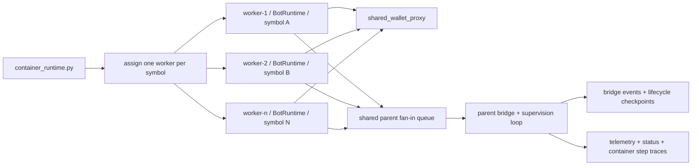

# Bot Runtime Symbol Sharding Architecture

## Documentation Header

- `Component`: Bot runtime symbol sharding and merged view-state
- `Owner/Domain`: Bot Runtime / Container Runtime
- `Doc Version`: 2.0
- `Related Contracts`: [[BOT_RUNTIME_DOCS_HUB]], [[BOT_RUNTIME_ENGINE_ARCHITECTURE]], [[BOT_RUNTIME_SERVICE_ARCHITECTURE]], [[WALLET_GATEWAY_ARCHITECTURE]], [[RUNTIME_EVENT_MODEL_V1]], `portal/backend/service/bots/container_runtime.py`

## 1) Problem and scope

This document describes how the current container runtime fans one bot run out across symbols while keeping one shared wallet and one supervisor bridge for BotLens/runtime facts.

In scope:
- symbol-to-worker assignment,
- shared-wallet multiprocessing state,
- worker-to-parent event flow,
- merged runtime payload semantics,
- degrade behavior.

Non-goals:
- cross-bot portfolio sharing,
- dynamic worker rebalancing,
- re-running execution semantics from merged view-state alone.

This document only covers multi-symbol runtime fanout and merge behavior.
Execution semantics stay in [[BOT_RUNTIME_ENGINE_ARCHITECTURE]]. Event and wallet truth stay in [[RUNTIME_EVENT_MODEL_V1]] and [[WALLET_GATEWAY_ARCHITECTURE]].

## 2) Topology

## 3) Sharding rules

Current assignment rules in `container_runtime.py`:
- one bot container run maps to one strategy,
- strategy symbols are loaded from `StrategyLoader.fetch_strategy(...)`,
- one symbol is assigned to one worker process,
- startup fails if the configured worker ceiling is below the symbol count,
- no in-run rebalancing or multi-symbol worker packing is performed.

Current limits:
- `_MAX_SYMBOLS_PER_STRATEGY = 10`
- `_MAX_SYMBOL_WORKERS = 8` default floor for worker capacity calculation

## 4) Shared wallet proxy

All workers receive the same multiprocessing-backed `shared_wallet_proxy`.

Current proxy contents:
- `runtime_events`: shared append-only list of serialized runtime events,
- `runtime_event_seq`: shared integer counter,
- `reservations`: shared reservation map,
- `lock`: shared process lock.

Bootstrap behavior:
- the parent process seeds `runtime_events` with a serialized `WALLET_INITIALIZED` event at `seq=0`,
- all worker runtimes receive the same `run_id`,
- each worker attaches `SharedWalletGateway(shared_wallet_proxy)` inside `_build_run_context()`.

Why this matters:
- wallet availability is projected from canonical runtime events plus active reservations,
- workers do not own independent balance copies,
- cross-worker over-allocation is prevented at the wallet gateway boundary.

## 5) Worker runtime contract

Each worker process receives:
- `run_id`
- `bot_id`
- `strategy_id`
- exactly one symbol in `runtime_symbols`
- the shared wallet proxy

Each worker forces these runtime settings:
- `degrade_series_on_error=True`
- `series_runner="inline"`
- degraded worker-runtime completion is terminal and must not be reported as `completed`

Each worker emits messages back to the parent over an `mp.Queue`:
- `botlens_runtime_bootstrap_facts` / `botlens_runtime_facts`: canonical BotLens bridge payloads
- `worker_error`: explicit worker failure payload
- `startup_status`: explicit worker lifecycle/status payloads

## 6) Supervisor bridge model

The parent process is no longer the canonical BotLens read-model owner.

Instead it keeps only lightweight operational state needed to:
- supervise workers,
- track startup/live/degraded process status,
- bridge worker BotLens payloads across the process boundary,
- emit lifecycle/process events,
- and seed fresh BotLens bootstraps for newly attached viewers.

Important boundary:
- the parent may keep transient compact snapshots to seed the next bridge bootstrap,
- but backend `telemetry_stream.py` owns canonical BotLens ordering and projection semantics.

## 7) Runtime status semantics

Merged `runtime.status` is derived from worker payloads plus container health.

Current logic:
- `running` if any child workers are still active,
- `degraded` if no workers remain active and `degraded_symbols` is non-empty,
- `completed` if all worker runtime payloads report completed and no workers are active,
- `error` if worker payloads report failure and no workers are active,
- `stopped` otherwise.

Current nuance:
- a partially degraded bot still reports merged `runtime.status=running` while healthy workers continue,
- degradation is primarily signaled by `degraded_symbols` and a synthetic warning entry,
- parent-level persisted status is still written separately as `running`, `stopped`, or `failed`.

## 8) Persistence boundaries

Authoritative persistence is still worker-owned for execution semantics:
- worker runtimes persist canonical runtime events,
- worker runtimes persist trade rows and trade-event rows,
- worker runtimes persist run artifacts and reports,
- worker and container code persist step traces.

Container-owned persistence:
- `update_bot_runtime_status(...)`
- `record_bot_run_step(...)`

Current non-persistence:
- supervisor-local bridge state is not durably stored by the parent process,
- the parent does not own durable BotLens latest-state truth,
- backend view-state persistence is the only canonical BotLens projection cache.

## 9) Failure and degrade behavior

There are two layers of failure handling.

Series-level in worker runtime:
- `_safe_step(...)` degrades the series when `degrade_series_on_error=True`,
- the worker emits `SYMBOL_DEGRADED` runtime events and runtime warnings for degraded series,
- the worker runtime status becomes `degraded`, so the worker cannot terminate as `completed` after a degraded series.

Worker-process level in container runtime:
- `worker_error` messages on the shared parent fan-in queue mark the worker's symbols degraded,
- non-zero worker exit codes also mark symbols degraded,
- healthy workers continue running,
- parent runtime only moves to `failed` on supervisor-level exceptions.

This is degrade-isolated, not self-healing:
- failed symbols are not restarted automatically,
- no symbol is silently treated as healthy once degraded.

## 10) Why this architecture exists

- One worker per symbol gives the clearest failure boundary.
- One shared wallet proxy preserves capital safety across workers.
- One supervisor bridge with a shared fan-in queue keeps worker/runtime execution decoupled from backend projection ownership without forcing per-worker drain order.
- Keeping supervisor state ephemeral avoids conflating process transport with execution truth.

## 11) Strict contract

- Symbol sharding must not create an alternate execution semantics path; worker runtime events remain the source of truth.
- Shared wallet checks must happen against the shared runtime-event/reservation model, not worker-local mutable balances.
- The parent process may bridge events and emit lifecycle/process metadata, but it must not invent fills, decisions, wallet transitions, or durable BotLens projection state.
- Degradation must be explicit through degraded-symbol tracking, warnings, and runtime events.
