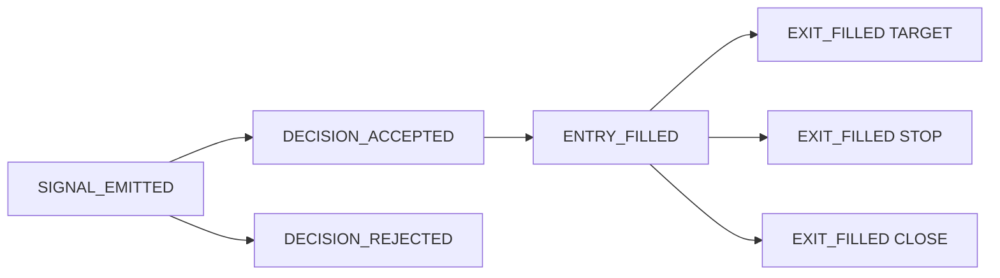
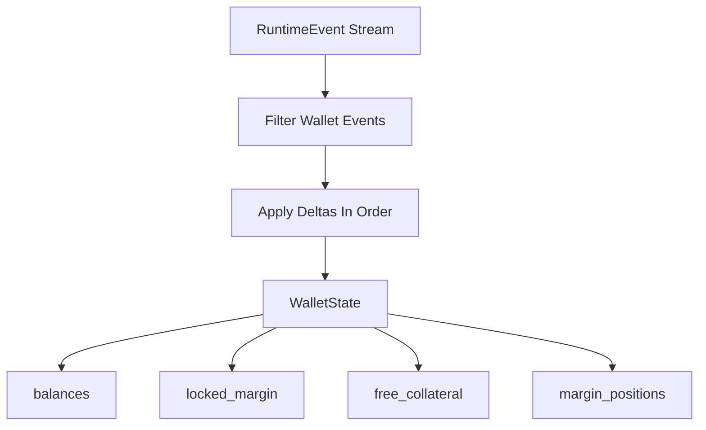

# Runtime Event Model V1

## Documentation Header

- `Component`: Canonical runtime event model
- `Owner/Domain`: Bot Runtime / Event Contracts
- `Doc Version`: 2.0
- `Related Contracts`: [[BOT_RUNTIME_DOCS_HUB]], [[BOT_RUNTIME_ENGINE_ARCHITECTURE]], [[WALLET_GATEWAY_ARCHITECTURE]], `src/engines/bot_runtime/core/runtime_events.py`, `portal/backend/db/models.py`, `portal/backend/service/storage/repos/runtime_events.py`, `portal/backend/service/storage/storage.py`

## 1) Problem and scope

This model defines one canonical append-only event stream for bot-run causality, deepdive, and deterministic reconstruction.

In scope:
- runtime event envelope and taxonomy,
- causality and parent/root semantics,
- wallet projection from runtime events.

### Non-goals

- snapshot-only runtime truth,
- multi-ledger overlapping taxonomies,
- silent context coercion of invalid event data.

Upstream assumptions:
- runtime producers provide required identifiers and correlation fields.

## 2) Architecture at a glance

Boundary:
- inside: runtime event creation, validation, persistence, replay projections
- outside: UI rendering and external analytics consumers

See the event-flow diagrams in the detailed sections below.

## Mentor Notes (Non-Normative)

- Read the stream as the runtime narrative: each event adds one causal fact.
- `event_id` protects idempotency; `seq` (or ordered append) protects replay order.
- Parent/root links are the explanation graph for why outcomes happened.
- Derived views are convenience layers; they should not become alternate truth systems.
- This section is explanatory only.
- If this conflicts with Strict contract, Strict contract wins.

## 3) Inputs, outputs, and side effects

- Inputs: strategy/risk decisions, fill outcomes, wallet operations, runtime exceptions.
- Dependencies: runtime event schema validator, storage write path, reason code taxonomy.
- Outputs: persisted bot-run ledger rows, derived wallet projection state, derived decision traces, derived per-series state views.
- Side effects: append-only writes to `portal_bot_run_events`, post-write read-model derivation, runtime logging.

## 4) Core components and data flow

- Runtime creates validated immutable `RuntimeEvent` envelopes with typed `context`.
- Runtime derives per-series analytical state snapshots on the same timeline.
- BotLens projects UI/debugger state from the same runtime timeline.
- Runtime event persistence is event-only; projections are built downstream from the stored stream.
- Causality links (`root_id`, `parent_id`, `correlation_id`) encode chain structure.
- Consumers/replay build wallet and decision views from the canonical stream.

## 5) State model

Authoritative state:
- bot-run ledger in `portal_bot_run_events`.

Derived state:
- wallet state, decision trace views, report exports, and BotLens latest-state caches.

Persistence boundaries:
- persisted: canonical events and run metadata.
- in-memory: replay intermediates and transient producer state.

## 6) Why this architecture

- Single bot ledger removes drift across multiple ledgers.
- Causality fields preserve explainability and traceability.
- Deterministic replay enables audit and runtime recovery paths.

## 7) Tradeoffs

- Strict context validation can fail event emission early.
- Parent-resolution logic adds complexity at emission time.
- High event volume requires careful retention/indexing strategy.

## 8) Risks accepted

- Parent missing fallbacks can reduce chain completeness.
- Invalid producer context can halt emission for affected events.
- Retention limits bound guaranteed audit horizon.

## 9) Strict contract

- `portal_bot_run_events` is the canonical bot deepdive ledger.
- Runtime events remain the canonical execution-truth family inside that ledger.
- Retry/idempotency semantics: at-least-once producer behavior with idempotency by unique `event_id`.
- Storage write contract: runtime-event persistence may precheck logical `seq`, but `event_id` dedupe is authoritative at insert time via `ON CONFLICT DO NOTHING` rather than a standalone existence-check `SELECT`.
- Hot-column contract: repeated query dimensions (`event_name`, `series_key`, `correlation_id`, `root_id`, `bar_time`, `instrument_id`, `symbol`, `timeframe`, `signal_id`, `decision_id`, `trade_id`, `reason_code`) are first-class ledger columns even though payload remains the durable event body.
- Time contract:
  - `event_time` is the domain event time,
  - `known_at` is simulated causal availability for backtest/domain facts,
  - `observed_at`/`ingested_at` are wall-clock observation times,
  - `created_at`/`updated_at` are database persistence times.
- BotLens trade events must carry simulated trade `bar_time`; `TRADE_OPENED` uses entry/open bar time and `TRADE_CLOSED` uses exit/close bar time. The trade `event_time`, payload trade timestamp, and hot-column `bar_time` must agree unless an explicit event documents otherwise.
- Rejected decisions must not claim `trade_id` unless a trade was actually opened/persisted. Rejected entry/settlement paths identify the attempt with `attempt_id`, `order_request_id`, `settlement_attempt_id`, or `blocking_trade_id`, and preserve concrete `reason_code` values.
- Degrade state machine:
  - `RUNNING`: event emission and persistence healthy.
  - `DEGRADED`: parent missing fallback or partial symbol degradation while stream continues.
  - `HALTED`: unrecoverable runtime exception or persistence failure.
- In-flight work:
  - in `DEGRADED`, events continue with explicit fallback reason/context;
  - in `HALTED`, no further events are emitted for the halted path.
- Sim vs live differences: no differences in runtime event contract semantics.
- Canonical error codes/reasons when emitted:
  - `RUNTIME_PARENT_MISSING`,
  - `RUNTIME_EXCEPTION`,
  - `SYMBOL_DEGRADED`,
  - `SYMBOL_RECOVERED`,
  - `DECISION_REJECTED_*`.
- Validation hooks (applicable):
  - code: runtime event context validation and reason-code enforcement,
  - logs: emission failures and parent-resolution fallback events,
  - storage: unique `event_id` and unique logical `seq` per bot/run ledger,
  - metrics: event ingest rate, rejected event count, parent-missing count.

## 10) Versioning and compatibility

- `schema_version` is required on every runtime event.
- Additive context evolution is preferred.
- Breaking changes require explicit version bump and compatible deserialization rules.

---

## Detailed Design

## Ledger families

`portal_bot_run_events` now carries three namespaced event families:

- `runtime.*`
  - canonical execution causality (`runtime.signal_emitted`, `runtime.decision_accepted`, `runtime.entry_filled`, ...)
- `series_bar.*`
  - runtime-owned per-series analytical state snapshots persisted on the runtime timeline
  - current contract starts with `series_bar.telemetry`
- `botlens.*`
  - debugger/view artifacts (`botlens.series_bootstrap`, `botlens.series_delta`)

The storage table stays structurally generic.
Meaning lives in `event_type` plus the typed JSON event envelope.

The hot read path is no longer payload-only:

- typed ledger columns are written once from the canonical payload at persist time,
- replay-safe payload semantics remain unchanged,
- filtered hot reads do not fall back to payload extraction when a typed hot column is `NULL`,
- chart/history reads can now push typed `bar_time` windows down into the ledger query shape,
- the legacy payload `series_key` expression index is retired,
- and future index tuning should target the typed columns rather than new JSON-expression indexes.

For BotLens durable domain rows inside that ledger, hot payloads now follow a
runtime-truth-first boundary:

- `CANDLE_OBSERVED` keeps irreducible OHLCV truth only,
- `SERIES_STATS_REPORTED` keeps compact top-level summary metrics only,
- `HEALTH_STATUS_REPORTED` keeps compact warning/state summaries rather than expanded warning blobs,
- `TRADE_OPENED` and `TRADE_CLOSED` keep simulated `bar_time`/`event_time`, plus available `strategy_id`, `signal_id`, and `decision_id` lineage,
- and `OVERLAY_STATE_CHANGED` keeps bounded render geometry plus compact overlay summaries so committed ledger rows can recover drawable overlays when live bridge delivery lags.

Overlay geometry remains bounded by the BotLens overlay point budget before it
enters the hot runtime-event row.

Producer-side BotLens append writes these compact domain rows before live
transport fanout for committed fact batches. Active BotLens projectors may tail
the same ledger rows after run-live with a `(seq, row_id)` cursor, so durable
replay order remains the recovery boundary when bridge fact delivery falls
behind.

## What This Is
Runtime V1 uses one canonical append-only bot ledger.

Every important runtime fact (signal, decision, fills, runtime errors) is written as a `RuntimeEvent` and persisted under a `runtime.*` ledger event type in `portal_bot_run_events`.

Per-series runtime telemetry is also persisted to that same table under `series_bar.*`.

Wallet state is not stored as a separate canonical ledger anymore. It is derived by replaying runtime events.

## Why This Exists
The previous model had multiple overlapping ledgers:
- decision ledger events
- trade event rows
- wallet ledger events

That made causality hard to follow and created taxonomy drift.

V1 keeps one bot ledger and derives views from it.

## Canonical Event Contract
`RuntimeEvent` envelope fields:
- `schema_version` (int, starts at `2`)
- `event_id` (uuid string)
- `event_ts` (UTC datetime)
- `event_name` (`RuntimeEventName` enum)
- `root_id` (chain root)
- `parent_id` (immediate parent)
- `correlation_id` (opaque caller-supplied chain key)
- `context` (typed runtime event model selected by `event_name`)

Common runtime `context` fields:
- `run_id`
- `bot_id`
- `strategy_id`
- `symbol` (optional)
- `timeframe` (optional)
- `bar_ts` (optional; bar being processed)
- `category` (`RuntimeEventCategory`)
- `reason_code` (`ReasonCode`, required for rejection/error/degrade events)
- `parent_missing`
- `missing_parent_hint`

## Top-Level Event Names
Business events are top-level taxonomy (`event_name`):
- `SIGNAL_EMITTED`
- `DECISION_ACCEPTED`
- `DECISION_REJECTED`
- `ENTRY_FILLED`
- `EXIT_FILLED`
- `WALLET_INITIALIZED`
- `WALLET_DEPOSITED`
- `RUNTIME_ERROR`
- `SYMBOL_DEGRADED`
- `SYMBOL_RECOVERED`

## Context Rules
Contexts are validated on event creation.

Required context highlights:
- `SIGNAL_EMITTED`: `signal_type`, `direction`, `signal_price`
- `DECISION_ACCEPTED`: `decision`
- `DECISION_REJECTED`: `decision`, `message` + `reason_code`
- `ENTRY_FILLED`: `trade_id`, `wallet_correlation_id`, `side`, `qty`, `price`, `notional`, `wallet_delta`
- `EXIT_FILLED`: `trade_id`, `wallet_correlation_id`, `side`, `qty`, `price`, `notional`, `exit_kind`, `wallet_delta`
- `WALLET_INITIALIZED`: `balances`, `source` (full run-start snapshot)
- `WALLET_DEPOSITED`: `asset`, `amount` (delta, non-negative)
- `RUNTIME_ERROR`: `exception_type`, `message`, `location` + `reason_code`

`wallet_delta` fields:
- `collateral_reserved`
- `collateral_released`
- `fee_paid`
- `balance_delta` (optional)

Wallet delta invariants:
- `collateral_reserved >= 0`
- `collateral_released >= 0`
- `fee_paid >= 0`

## Causality Rules
Causality is encoded directly on each event (`root_id`, `parent_id`), and parent lookup is derived from the existing event stream.

Runtime default correlation helper:
- `correlation_id = "{run_id}:{symbol}:{timeframe}:{bar_ts_iso_utc_ms}"`

The envelope treats `correlation_id` as opaque caller-supplied data. Runtime currently uses the helper above for its own producers.

Lifecycle linking:
- `SIGNAL_EMITTED`: `root_id = event_id`, `parent_id = null`
- `DECISION_*`: parent = matching signal event for correlation
- `ENTRY_FILLED`: parent = accepted decision for same correlation/trade
- `EXIT_FILLED`: parent = entry event for `trade_id`

Parent-missing behavior:
- Runtime/system events (`RUNTIME_ERROR`, `SYMBOL_DEGRADED`, `SYMBOL_RECOVERED`) can emit with `parent_id = null`.
- If parent resolution fails for business events, runtime still emits with:
  - `parent_id = null`
  - `root_id = event_id` (or nearest resolvable root)
  - context flags: `parent_missing = true`, `missing_parent_hint = "..."`
  - `reason_code = RUNTIME_PARENT_MISSING`

## Wallet As Projection
Wallet state is reconstructed by replaying runtime events in order.

Wallet-affecting events:
- `WALLET_INITIALIZED`
- `WALLET_DEPOSITED`
- `ENTRY_FILLED`
- `EXIT_FILLED`

Replay protections/invariants:
- replay is idempotent by `event_id` (duplicate event IDs are ignored)
- locked margin cannot go negative
- per-trade reserved margin cannot go negative
- release cannot exceed reserved margin for that trade
- free collateral must equal `balances - locked_margin`

Projection output:
- balances
- locked margin
- free collateral
- margin positions (per trade)

In shared multi-process runtime mode, all symbol workers project from one shared canonical runtime-event stream. Wallet validation uses that projection plus shared reservations.

## Persistence Model
Single write path in runtime:
- `BotRuntime._persist_runtime_event(...)`
- implementation location: `src/engines/bot_runtime/runtime/mixins/runtime_events.py`

Storage target:
- table: `portal_bot_run_events`
- storage column `event_type` stores `event_name` values (naming mismatch is historical)
- `event_id` is unique at DB level
- row `payload` = serialized `RuntimeEvent` envelope (`context` nested inside the envelope)
- append-only writes

## Run Artifact Outputs
Runtime artifact now includes:
- `runtime_event_stream` (canonical)
- `decision_trace` (derived view built after event persistence, never inline with event writes)
- `wallet_state` (derived by replay)
- `wallet_ledger` (derived wallet-event slice for compatibility)

## Known Tradeoffs
- Event contexts are now strict; invalid emission fails fast.
- Parent resolution is strict but fail-open for logging continuity (`RUNTIME_PARENT_MISSING` fallback).
- Shared runtime throughput depends on reservation lock contention and runtime-event append cadence.
